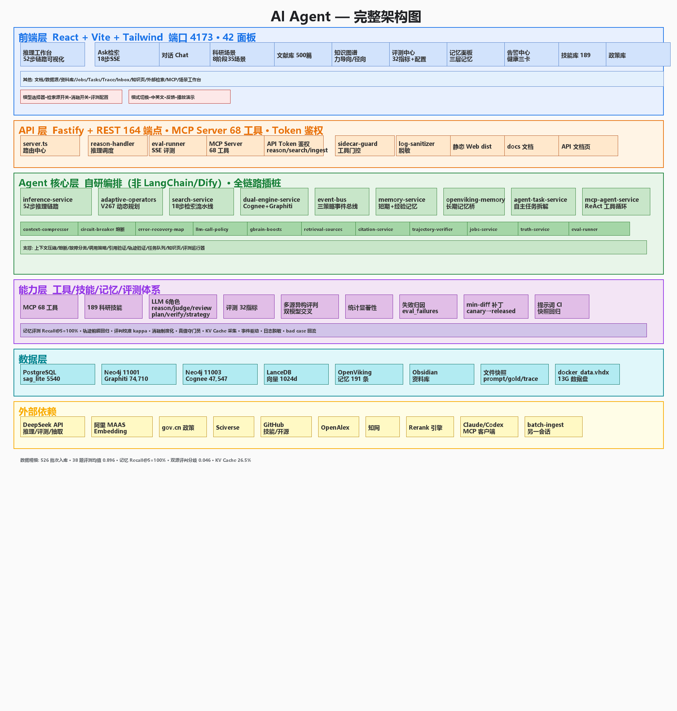

# MarxSphere 项目概述（产品视角）

## 1. 项目概述

### 目标用户

| 用户群体 | 场景 |
|---|---|
| 马克思主义理论研究者（研究生/学者） | 文献研读、理论溯源、论文选题与写作 |
| 政经/农经方向科研人员 | 实证分析（问卷/回归）、政策研究 |
| 课程教学人员 | AI+教育辅导、学习规划 |
| AI Agent 开发者 | 接入 MarxSphere 推理/检索能力（MCP/API） |

### 场景痛点

- **文献浩繁**：500+ 篇论文、十万级切片，人工检索耗时且易遗漏跨文献关联
- **理论溯源难**：概念演变、学者观点对比、经典文本互文需要跨文献图谱而非单篇检索
- **论文写作效率低**：选题、框架、论证、格式各环节缺乏方法论工具
- **实证分析门槛高**：问卷设计、信效度检验、回归建模需要统计专业能力
- **Agent 与知识库割裂**：通用 Agent 无法直接检索领域知识库

### 核心功能

1. **52 步深度推理链路**：问题分类 → 大纲 → 17 路粗检索 → Graphiti 精炼 → 超边三路检索 → 融合生成 → 自评自愈
2. **Ask 18 步检索流水线**：多臂召回 → 加权 RRF → Boost 链 → 重排，全程可视化
3. **三库知识图谱**：Graphiti（社区/超边）+ Cognee（实体/切片）+ PG pgvector（向量）
4. **65 个科研场景**：选题构思 → 文献调研 → 证据检索 → 数据分析 → 论文写作 → 图表制作 → 评审发表 → 系统自动化
5. **AI Agent 子系统**：50+ 能力项、25+ 工具、自主研究、多 Agent 协作、记忆层
6. **实证研究工作台**：问卷生成/信效度/诊断/插补/回归/证据账本/质量闸门
7. **桌面端**：Electron + NSIS 安装包，首次启动全量引导

### Agent 设计思路

- **决策循环**：规划 → 选工具 → 执行 → reflect → replan（最多 3 轮）
- **工具注册表**：25+ 工具统一 schema 校验、白名单审批、超时熔断、重试退避
- **权限分级**：reader/analyst/manager/admin 四级 + 人工审批门
- **记忆层**：短期（会话上下文+投毒审查）/ 长期（OpenViking 偏好经验）/ 任务状态持久化
- **自主研究**：每日巡检失败任务/评测回退/热点 → 生成研究假设 → 发起任务

### 技术路线

- **全栈 TypeScript**：Fastify 5 后端 + React 19/Vite 8 前端 + Electron 桌面
- **数据层**：PostgreSQL 16 + pgvector（向量 1024 维）+ Neo4j（图谱）
- **模型层**：OpenAI 兼容协议（DeepSeek/通义/自定义均可），LLM + Embedding + Rerank 三通道
- **检索**：17 路粗召回（Cognee HYBRID/Graphiti 社区/超边/PG 向量/词法 BM25）→ RRF 融合 → 重排

### 创新点

1. **事件中心检索结构**：`chunk → event → entities`，多跳召回优于纯向量（基准 Recall@2 79.30%，较 HippoRAG 2 提升 11.16pp）
2. **三库异构图谱融合**：Graphiti 社区 + Cognee 实体 + PG 向量统一查询面
3. **52 步可解释推理**：每步 token/检索来源可视化，非黑箱
4. **评测驱动自愈闭环**：反思 → 归因 → 最小 diff 补丁 → bad case 回流
5. **马理论领域方法论沉淀**：65 场景 + C 刊选题方法论 + 学者范式提取

### 应用价值

- 研究效率：文献调研从"天"级缩短到"分钟"级
- 理论深度：跨文献实体关系推理揭示单篇阅读看不到的关联
- 教学辅助：AI 辅导 + 学习规划
- 生态价值：对外 MCP/API，可接入 Claude Code/Codex 等任意 Agent

---

## 2. 使用说明

### 运行环境

| 组件 | 要求 |
|---|---|
| Node.js | ≥ 20 |
| PostgreSQL | 16 + pgvector（docker compose 一键） |
| Python（可选） | 3.12 + venv（MCP 池/实证） |
| Neo4j（可选） | Graphiti 11001 / Cognee 11003 |

### 部署方式

```bash
git clone <repo-url> && cd SAG-main
cp .env.example .env        # 填 LLM/Embedding keys
docker compose up -d        # PostgreSQL
npm install && npm run db:setup
npm run dev                 # 开发: http://localhost:5173
npm run build && npm start  # 生产: http://localhost:4173
```

桌面端：`npm run build:desktop` → 安装 `release/MarxSphere Setup <ver>.exe`，首次启动引导配置

### 账号权限

- 默认本地运行无需登录；启用 `SAG_AUTH_ENABLED=true` 后：注册/登录（JWT）
- 角色：普通用户 / admin（运营管理面板）；Agent 任务四级权限（reader→manager）
- 对外 API：`sag_xxx` Bearer 令牌（reason/search/ingest 粒度），localhost 豁免

### 操作流程（输入样例）

**① 文档入库**

```bash
curl -X POST http://localhost:4173/ingest \
  -H 'Content-Type: application/json' \
  -d '{"sourceId":"proj-1","title":"资本论节选","content":"商品是资本主义生产方式占统治地位的社会的财富元素形式。","extract":true}'
```

**② 检索问答**

```bash
curl -X POST http://localhost:4173/api/search \
  -H 'Content-Type: application/json' \
  -d '{"query":"剩余价值是如何产生的？","sourceIds":["proj-1"],"strategy":"multi","searchMode":"fast","topK":5,"returnTrace":true}'
```

**③ Agent 任务**

```bash
curl -X POST http://localhost:4173/api/agent/tasks \
  -H 'Content-Type: application/json' \
  -d '{"goal":"分析剩余价值率的历史演变","projectId":"proj-1"}'
```

**④ 实证分析**（WebUI 实证工作台：上传问卷 → 生成/信效度 → 回归 → 证据账本）

### 输出说明

- 检索/推理返回**结构化 JSON**（答案 + 编号引用 + 分数 + trace）
- SSE 流式输出（进度逐步推送，前端逐步点亮）
- 评测输出 32 项指标报告（JSON/Markdown）

### 注意事项

- ⚠️ AI 生成内容可能幻觉，**结论须核验原始文献**
- ⚠️ 依赖商业 API 按 token 计费，成本实时可见
- ⚠️ 未配置 API key 时本地 fallback 质量显著下降
- ⚠️ 图谱未就绪时推理自动降级 PG 向量

---

## 3. 技术架构

### 模型选择

| 通道 | 默认模型 | 可替代 |
|---|---|---|
| LLM | qwen-plus / deepseek-v4-flash | 任意 OpenAI 兼容 |
| Embedding | text-embedding-v4（1024 维） | 同维度兼容模型 |
| Rerank | qwen3-rerank | OpenAI 兼容重排 |

### Agent 架构

```
┌─ 用户/外部Agent ─┐
│  HTTP / MCP / SSE │
└────────┬─────────┘
         ▼
┌─ Agent 编排层 ──────────────────────────┐
│ 规划(LLM拆解) → 工具注册表 → 执行队列     │
│ reflect → replan(≤3轮) → 审批门(人工)   │
│ 记忆层(短期/长期) / 轨迹span树 / checkpoint│
└────────┬──────────────────────────────┘
         ▼
┌─ 工具层(25+) ──────────────────────────┐
│ 检索/推理/实证/代码沙箱/网页/PDF/音频/图片 │
└────────┬──────────────────────────────┘
         ▼
┌─ 数据层 ───────────────────────────────┐
│ PG+pgvector │ Neo4j(Graphiti/Cognee)   │
└────────────────────────────────────────┘
```

### 工具调用方式
- 工具注册表统一管理：schema 校验 → 权限白名单 → 超时熔断(30s) → 重试退避 → 失败回流
- 外部调用：HTTP REST + MCP Server（stdio）+ SSE 流式

### 知识库/RAG 设计
- 构建：分块 → 事件/实体抽取 → 三库同步
- 检索：17 路召回 → 加权 RRF → Cosine 重打分 → LLM 重排
- 引用：答案编号 → 原始切片可追溯

### 多轮对话与上下文
- 短期记忆（会话摘要注入）+ 长期记忆（偏好/经验）+ 记忆投毒审查
- 会话历史持久化，可清空/删除

### 工作流编排
- 任务 DAG（依赖关系）→ 队列并发（信号量限流）→ 进度 SSE → 失败重试/回流

### 数据处理流程
```
上传 → 分块 → 事件抽取 → 实体抽取 → 向量化 → 三库入库
  → 检索时: 查询 → 17路召回 → 融合 → 重排 → 生成 → 引用标注
  → 评测时: 32指标 → 反思 → 归因 → 补丁 → 回流
```

### 系统架构图



（更多架构细节：`ARCHITECTURE.md` / `docs/AGENT-CAPABILITIES.md` / `docs/AGENT-ARCHITECTURE-NEXT.md`）
