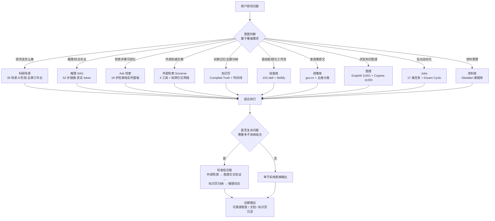

## 使用边界与示例（自动补全）

Use when 需马理论研究的统一入口调度（推理/检索/场景/图谱）。

Don't use when 仅需单步问答（用 Ask 更快）、无需多系统调度、或延迟敏感时。

Example: 输入“分析剩余价值率” → 自动调度推理+检索+场景工作台。

Cost: 约 3-8 分钟/次，成本约 $0.1-0.5。

# marx-agent — 马理论 AI Agent 总入口 V2

马理论/政治经济学/工商资本与农业农村研究的**统一 AI 助手入口**。当你面对一个研究问题时，本 skill 负责判断"该用哪个子系统"，并引导你完成从"问题"到"带证据的答案/文档"的完整链路。

> **定位一句话**：你不是在问"哪个工具"，而是把研究问题交给一个懂你全部能力的调度者。

## 统一工作台能力地图（V262 现状）

```
用户研究问题
  │
  ├─ 需要研究开展步骤 → 【科研场景】35 场景 8 阶段 + 全屏步骤向导（选题→文献→分析→写作→评审）
  ├─ 需要推理/综合论证 → 【推理】52 步链路（分类→大纲→Cognee17路→Graphiti精炼→超边→融合→自评）
  ├─ 需要检索步骤可视化 → 【Ask检索】18 步检索栈实时面板（多臂→RRF→Boost→重排）
  ├─ 需要外部权威文献 → 【外部检索】Sciverse（4工具+知网引文网络）
  ├─ 需要长期记忆/主题归纳 → 【知识页】Compiled Truth + 时间线 + TruthDiff
  ├─ 需要查技能/固化工作流 → 【技能】103 skill + Skillify + 健康检查 + GitHub发现
  ├─ 需要查政策原文 → 【政策库】gov.cn 检索 + 五维分类
  ├─ 需要浏览知识图谱 → 【图谱】双视图（径向/力导向）+ 关系查询 + 快速建联
  ├─ 需要后台自动化 → 【Jobs】17 类任务 + Dream Cycle 自整理
  └─ 需要资料管理 → 【资料库】Obsidian 课题库 + 【文档管理】批量入库
```

## 统一工作台调度流程图

研究问题进来先做**意图判断**，按需求类型路由到 10 个子系统；单点问题由单子系统直接输出，复杂问题走组合执行链，最终统一以**带证据的产出**结束：



配套判断表见下一节"调度决策"；组合链的逐步操作见"组合执行流程详解"。

## 调度决策（用户提问时先判断）

| 用户需求 | 用哪个 | 理由 |
|---|---|---|
| "资本下乡对集体经济的机制" | 推理（52步） | 需要综合论证 + 证据链 |
| "这个研究该怎么做" | 科研场景（工作台） | 35 场景步骤向导引导 |
| "帮我找最新英文文献" | 外部检索（Sciverse） | 外部权威证据 |
| "整理一个研究主题的记忆" | 知识页（Compiled Truth） | 长期记忆 + 时间线 |
| "写文献综述" | 科研场景 S05 + 推理 | 场景步骤 + 综述流程 |
| "查某项政策原文" | 政策库 | gov.cn + 本地政策树 |
| "固化我的检索流程" | 技能（Skillify） | 生成可复用 skill |
| "看研究领域全景" | 图谱 | 双图谱可视化 |
| "后台跑任务" | Jobs | 17 类自动化 |
| "评测检索质量" | SAG eval-22metrics | 32 指标评测 |

## 前置依赖总览与自检

marx-agent 是总入口，**路由正确的前提是知道每个子系统当前是否可用**。接到问题先按本表快速自检相关子系统；用户报障时逐项排查。自检不过的子系统自动降级（见文末降级策略），不阻塞入口。

| 子系统 | 核心依赖 | 一行自检命令 | 通过标准 |
|---|---|---|---|
| 推理（SAG） | PostgreSQL 5540 + Neo4j 11001/11003 + DeepSeek Key + 前端 4173 | `docker ps --format "{{.Names}} {{.Ports}}" \| grep -e 5540 -e 11001 -e 11003 && curl -s http://localhost:4173/health` | 三个端口容器都在 + health 返回正常 |
| Ask 检索 | 同推理（走 SAG API，无独立依赖） | `curl -s http://localhost:4173/health` | health 返回正常 |
| 科研场景 | 纯前端页面，无独立依赖 | `curl -s -o /dev/null -w "%{http_code}" http://localhost:4173/` | 200（浏览器直接访问 4173） |
| 外部检索（Sciverse） | SCIVERSE_BASE_URL + API Key | `grep -E "SCIVERSE_BASE_URL\|SCIVERSE_API_KEY" %USERPROFILE%/SAG-main/.env \| sed "s/=.\*/=***/"` | 两项均有值；无 key 自动走 mock |
| 知识页 | PostgreSQL 5540 + truth_pages 表 | `docker exec $(docker ps -qf "publish=5540") psql -U postgres -d sag -c "SELECT count(*) FROM truth_pages;"` | 返回数字（库名/用户按实际配置替换） |
| 技能库 | ~/.claude/skills/ 目录 | `ls ~/.claude/skills/ \| wc -l` | 返回 103 |
| 政策库 | gov.cn 可访问 + 本地政策库目录 | `curl -s -o /dev/null -w "%{http_code}" https://www.gov.cn && test -d "E:/1.Obsidian Vault/课题研究" && echo OK` | gov.cn 200 + 本地目录存在 |
| 图谱 | Neo4j 双实例 11001/11003 | `curl -s -o /dev/null -w "%{http_code}" http://localhost:11001; curl -s -o /dev/null -w "%{http_code}" http://localhost:11003` | 均返回 401（服务存活，需认证即正常） |
| Jobs | PostgreSQL 5540 + minion_jobs 表 + worker | `docker exec $(docker ps -qf "publish=5540") psql -U postgres -d sag -c "SELECT count(*) FROM minion_jobs;"` | 返回数字 + worker 进程存活 |
| 资料库 | E:\1.Obsidian Vault 目录 | `test -d "E:/1.Obsidian Vault" && ls "E:/1.Obsidian Vault" \| head -5` | 目录存在且能列出内容 |

**说明与降级策略**：

- 本地政策库目录：`E:\1.Obsidian Vault\课题研究\1.农业农村现代化进程中规范与引导工商资本路径研究\著作、政策、会议\`（317 文件 13 目录，按五维度分类）
- 图谱实例分工：11001 = Graphiti（实体 21,337 / 关系 166,631），11003 = Cognee（实体 31,253 / 关系 248,417）；自检只验存活，具体数据量见"三库知识图谱"表
- **任一依赖缺失不阻塞入口**：图谱未起 → 推理自动降级只走 PG 本地补漏（诚实标注"未覆盖图谱"）；Sciverse 无 key → 提示走 mock 并说明局限；4173 未起 → 告知启动方式（build 后访问 4173），不硬报错
- 自检命令中 `-U postgres -d sag` 若与实际 PG 配置不符，按 `docker exec <pg容器> env` 里的实际用户名/库名替换

## 三库知识图谱（V262 数据）

| 库 | 存储 | 数据 | 定位 |
|---|---|---|---|
| Graphiti | Neo4j 11001 | 实体 21,337 · 关系 166,631 · 超边 11,702 · 社区 1,085 · 切片 39,499 | 中层精炼 |
| Cognee | Neo4j 11003 + LanceDB | 实体 31,253 · 关系 248,417 · 切片 11,550 | 底层粗检 17 路 |
| PG | PostgreSQL 5540 | 文献 500 · 切片 2,232 | 本地补漏 |

## 科研场景（V255-256 新增）

35 个场景按 8 大阶段分组：选题构思(4) → 文献调研(8) → 证据检索(5) → 数据分析(4) → 论文写作(4) → 图表制作(2) → 评审发表(4) → 系统自动化(4)。

每个场景有**全屏工作台**：左侧研究步骤向导（5-8 步可勾选进度）+ 右侧工具操作指引（用哪个工具/怎么做/一键跳转）。

### 35 场景速查表（按阶段）

| 阶段 | 场景 | 工作台步骤示例 |
|---|---|---|
| 选题构思 | S01 研究方向生成 | 梳理领域→生成候选→五维评估→查证→交叉验证→沉淀 |
| 选题构思 | S02 科学头脑风暴 | 定义问题→多视角发散→批判质疑→检索佐证→收敛假设 |
| 选题构思 | S03 研究设计规划 | 操作化假设→选设计→算样本量→因果策略→预注册 |
| 选题构思 | S04 开题报告规划 | 文献查全→梳理脉络→定位缺口→设计框架→撰写→预演评审 |
| 文献调研 | S05 文献综述 | 拆解问题→多路检索→提取论点→交叉验证→组织框架→生成全文 |
| 文献调研 | S06 系统性检索 | 确定策略→本地查全→外部补充→引文滚雪球→查全率→导出清单 |
| 文献调研 | S07 外部学术检索 | 语义→结构化→引文→读全文→沉淀知识页 |
| 文献调研 | S08 研究证据包 | 梳理命题→收集证据→时间线→Compiled Truth→矛盾检测→归纳桥 |
| 文献调研 | S09 论文对比矩阵 | 筛选→读摘要→对比范式→定位分歧→沉淀 |
| 文献调研 | S10 引文溯源 | 检索→看溯源→回链原文→超边验证→记录 |
| 文献调研 | S11 文献关系图谱 | 径向展开→力导向→关系查询→事件下钻→建联 |
| 文献调研 | S12 政策文本检索 | gov.cn检索→存入库→浏览树→定位条文→政策关联 |
| 证据检索 | S13 科学问答 | 输入问题→18步链路→引用证据→溯源验证→追问→沉淀 |
| 证据检索 | S14 多跳推理链 | 提交问题→分类→三阶段检索→展开步骤→评估→消融 |
| 证据检索 | S15 教学答疑 | 提问→通俗解答→概念溯源→生成讲义→练习题 |
| 证据检索 | S16 全文证据查找 | 检索片段→定位论文→看原文→对照摘要→引用存档 |
| 证据检索 | S17 趋势扫描 | 年份分布→主题演进→学者分析→引文扫描→趋势报告 |
| 数据分析 | S18 计量实证 | 准备数据→M1-M6→机制→稳健→异质性→出版级输出 |
| 数据分析 | S19 因果推断 | 识别策略→平行趋势→DID→Bacon→安慰剂→交叉验证 |
| 数据分析 | S20 宏观经济建模 | 搭框架→数值求解→脉冲响应→校准→可视化 |
| 数据分析 | S21 统计推断 | 描述统计→诊断→差异检验→生存分析→报告 |
| 论文写作 | S22 学术论文 | 启动流水线→深度研究→写作→完整性→评审→修订 |
| 论文写作 | S23 综述写作 | 检索→阅读→结构→写作→核验→格式化 |
| 论文写作 | S24 润色改写 | 上传→语体校准→中英润色→逻辑优化→对比确认 |
| 论文写作 | S25 引用管理 | 收集元数据→BibTeX→核验→格式→全库核对 |
| 图表制作 | S26 科研图表 | 规划→动机图→方法图→结果图→QC审计 |
| 图表制作 | S27 可视化幻灯片 | 可视化→规划→生成→讲稿→海报 |
| 评审发表 | S28 同行评审 | 提交→适配→同行→魔鬼→修改→复评 |
| 评审发表 | S29 投稿前检查 | 完整性→清单→伦理→自审→格式定稿 |
| 评审发表 | S30 审稿回应 | 整理→逐条→反驳→修订→重投策略 |
| 评审发表 | S31 基金申报 | 分析指南→规划→立项依据→预算→评审要点→模拟评审 |
| 系统自动化 | S32 外部入库 | 转PDF→解析→清洗→三库入库→监控→验证 |
| 系统自动化 | S33 知识库自动化 | 了解任务→批量入库→向量化→清洗→Dream Cycle→详情 |
| 系统自动化 | S34 Obsidian管理 | 目录树→md预览→PDF预览→Office下载→定位 |
| 系统自动化 | S35 文档管理 | 上传→状态→重命名→归档→删除 |

## 详细工作流（复杂研究问题的完整链路）

### 场景 A：文献综述（最常用）

```
1. 引导用户进科研场景 S05（文献综述工作台）
2. 第1步：推理工作台拆解综述问题 → 得到子问题框架
3. 第2步：52 步链路全库检索（Cognee 17路+Graphiti精炼+超边）
4. 第3步：Ask 逐子问题检索 → 带引用证据
5. 第4步：推理交叉验证共识与分歧
6. 第5步：literature-review 技能组织综述框架
7. 第6步：academic-paper 技能生成带引用全文
8. 结果：完整综述 + 引用核验
```

### 场景 B：研究选题评估

```
1. 引导进 S01（研究方向生成工作台）
2. research-ideation 生成候选方向
3. idea-evaluator 五维评估每个方向
4. Ask 检索查证领域现状
5. 推理验证选题价值
6. 知识页沉淀选题档案
```

### 场景 C：论文写作全流程

```
1. 引导进 S22（学术论文工作台）
2. academic-pipeline 启动 10 阶段流程
3. deep-research 深度研究（13 智能体）
4. academic-paper 生成初稿（11 模式）
5. academic-paper-reviewer 5 视角评审
6. content-refinement-agent 迭代修订
7. 输出 LaTeX/DOCX/PDF
```

## 组合执行流程详解（复杂问题完整链路）

复杂问题的标准组合链是四段式：**外部检索 → 图谱交叉验证 → 知识页归纳 → 推理综合**。每一段职责明确、产出可溯源，段与段之间由本 skill（调度者）衔接。

| 环节 | 子系统 | 做什么 | 产出 |
|---|---|---|---|
| ① 外部检索 | Sciverse / cnki / 政策库 | 拿最新权威外部证据（英文文献 / 知网全文 / 政策原文） | 带来源的候选文献、条文与要点 |
| ② 图谱交叉验证 | 图谱（Cognee 17 路 + Graphiti 精炼） | 用本地 500 篇库验证外部证据，找出共识与分歧 | 实体关系验证 + 本地切片引用 |
| ③ 知识页归纳 | 知识页（Compiled Truth） | 新旧证据写入长期记忆，时间线 + 矛盾检测 | Compiled Truth 条目（可复现引用） |
| ④ 推理综合 | 推理（SAG 52 步） | 融合全部证据做综合论证 | 带引用的最终答案 |

### 示例 1：实证机制问题——"资本下乡对农村集体经济组织收入的作用机制"

1. **意图判断**：复杂论证 + 需要外部证据 → 走完整四段链
2. **① 外部检索**：sciverse 语义检索 `capital going to countryside rural collective economy income mechanism`，取 5-8 篇英文文献的摘要与结论，记录 DOI 与关键论断（如"入股分红""资产盘活""公司+集体"模式）
3. **② 图谱交叉验证**：Cognee 17 路检索 `资本下乡`、`集体经济组织收入`，再经 Graphiti 精炼扩展实体；本地图谱命中 `三变改革`、`股份合作`、`土地经营权入股` 等实体，验证与外部文献的共识；同时发现分歧——东部"公司+集体"带动模式与中西部差异在本地库中证据更充分
4. **③ 知识页归纳**：将外部 + 本地证据写入知识页主题条目，生成时间线（土地承包法 45 条流转 → 三变改革试点 → 集体经济组织法施行），跑矛盾检测，输出 Compiled Truth
5. **④ 推理综合**：SAG 52 步——分类（实证机制类）→ 大纲（外部证据 / 本地证据 / 分歧 / 结论四段）→ 融合检索 → COT 推理 → LLM Judge 自评 → V80 自愈闭环
6. **证据输出**：机制结论 + 每条断言带 `[外部 DOI]` 或 `[本地切片 id]` 引用，附分歧说明

### 示例 2：政策边界问题——"《农村集体经济组织法》对工商资本入股的政策边界"

1. **意图判断**：政策条文 + 学术讨论结合 → 政策库优先 + 图谱验证 + 推理
2. **① 外部检索**：政策库 gov.cn 检索《农村集体经济组织法》原文，定位涉"工商资本"条款（入股、土地经营权流转、收益分配限制等），与本地政策库五维分类核对，记录 gov.cn 原文链接
3. **② 图谱交叉验证**：图谱关系查询 `集体经济组织法` 关联实体（`成员资格`、`股份合作`、`收益分配`），找出本地论文中对条文的解读与案例
4. **③ 知识页归纳**：新建主题"集体经济组织法 - 工商资本"，收录条文要点 + 学术解读 + 实践案例
5. **④ 推理综合**：52 步把条文原文 + 学术解读 + 案例综合成"政策边界"回答：**允许**什么 / **限制**什么 / **争议**在哪里
6. **证据输出**：条文原文引用（带 gov.cn 链接）+ 学术解读引用 + 争议点清单

### 示例 3：文献综述——"工商资本下乡研究的文献综述"

1. **意图判断**：综述 = 科研场景 + 四段链组合 → 引导进 S05 工作台
2. **① 外部检索**：Sciverse 扫近 5 年英文文献，cnki 抓中文引文网络（参考文献 / 引证 / 共引）滚雪球补漏
3. **② 图谱交叉验证**：图谱径向展开看"资本下乡"子图，事件下钻定位本地 500 篇核心论文与观点阵营（"公司带动" vs "资本排斥"之争）
4. **③ 知识页归纳**：按子主题整理 Compiled Truth + 分歧点 + 时间线
5. **④ 推理综合**：S05 工作台步骤推进——推理交叉验证共识与分歧 → literature-review 组织综述框架 → academic-paper 生成带引用全文
6. **证据输出**：完整综述（引文核验过）+ 查全率报告

## 检索架构（V262）

- **Ask 18 步**：向量化→别名消解→实体抽取→多臂召回→加权RRF→Boost链(Compiled Truth×2.0)→Cosine重打分→LLM重排→回取切片
- **推理 52 步**：分类→意图→术语变体→大纲→Cognee 17 路→Graphiti 精炼→超边三路→三臂RRF→HyDE→COT→假设→LLM Judge自评→V80 自愈
- **真实 token**：每步 LLM 调用从 usage 采集，写入 retrieve_steps.parameters，前端显示 tok 徽章

## 关键配置（踩坑铁律）

- **改 LLM/embedding 配置必须改数据库 ai_provider_settings 表**，改 .env 不生效
- LLM 走 DeepSeek 原生 API（便宜够用），Embedding 走 MAAS text-embedding-v4（1024d）
- **LLM 超时 300s**（长文档抽取需要，60s 会 abort 死循环）
- 运行模式：preview（省内存无 MCP 池）/ full（MCP 池 10 实例）
- 入库幂等：findDocumentByTitle + upsert + 唯一索引三重保障

## 关联 skill 分工

| skill | 职责 |
|---|---|
| **marx-agent（本）** | 总入口调度 |
| **marx-sag** | 推理工作台（52 步 + 真实 token + 评测）|
| **marx-cognee / marx-graphiti** | 本地双知识图谱 |
| **sciverse / sciverse-zhs** | 外部学术检索 |
| **cnki** | 知网中文全文下载 |
| **marx-ingest-all** | 三库联动入库 |
| **md-clean / pdf2obsidian** | 文献清洗/解析 |
| **marx-cognee-ingest / marx-graphiti-ingest** | 批量入库监控 |
| **教育 Agent（SAG 内）** | 8 工具教学闭环（V384-V393）：自适应学习/作业辅导/学情诊断/备课辅助/学习陪伴 — 教育面板 #education |

## Notes for Claude

- **先判断再行动**：接到研究问题时，先用本 skill 的能力地图确定子系统，不要盲目调工具
- **组合优于单点**：复杂问题鼓励"外部检索 → 本地图谱交叉验证 → 知识页归纳 → 推理综合"的完整链路
- **证据优先**：所有产出必须可溯源（这是整个体系的设计原则）
- **诚实边界**：本地图谱无内容时明说"未找到"，Sciverse 无 key 时提示走 mock
- **架构参考**：`%USERPROFILE%\SAG-main\ARCHITECTURE-20260806.md`（完整五层架构图）
- **经验参考**：`%USERPROFILE%\SAG-main\EXPERIENCE-LOG-20260806.md`（10 会话审计 + 18 条踩坑大全）
