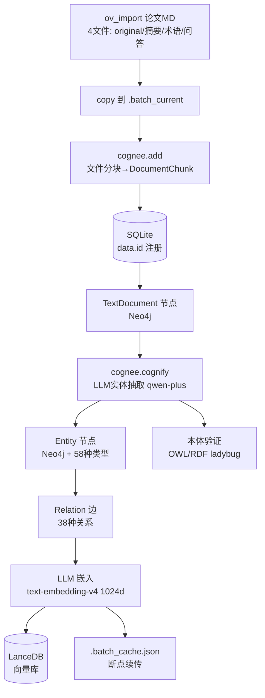

# marx-cognee-ingest Skill — Cognee 引擎 Marx 文献批量入库

> **部署日期**: 2026-07-05 | **数据**: 500篇 / 31,253实体 / 248,417关系 / 11,550切片 (2026-08-06)
> **Skill版本**: v5 | **MCP工具**: 6 (专用于 ingest) | **向量**: text-embedding-v4 (2026-07-08 升级，LanceDB 全量重建)
> **关键修复 (2026-08-06)**: LLM 超时 300s (长文档 abort 根因)

---

## 零、数据流全景

```
D:\Desktop\ov_import\ (208个文件夹, 每个含4个MD: original/摘要/术语/问答)
      │
      ▼
cognee_batch_ingest(start, count, data_dir, dataset_name)
      │
      ├─ 1) copy 目标论文到 .batch_current/
      ├─ 2) cognee.add(.batch_current/)        → 文本分块 → TextDocument (SQLite)
      ├─ 3) cognee.cognify(dataset_name)       → LLM 实体抽取 → Neo4j (Entity/Relation)
      │                                          → LLM 嵌入     → LanceDB (1024d vector)
      │                                          → 本体验证     → OWL/RDF (ladybug)
      └─ 4) 写入 .batch_cache.json              → 断点续传标记
```

### 0.0 mermaid 流程图（2026-08-06）



### 0.1 cognee.add() 内部流程

```
读取 MD 文件 → content_hash 去重 → 文件分块 (DocumentChunk)
  → 注册到 SQLite data.id 表 → 创建 TextDocument 节点 (Neo4j)
  → 创建 TextSummary 节点 (LLM 摘要)
```

### 0.2 cognee.cognify() 内部流程

```
TextDocument → classify_documents → LLM 实体抽取 (qwen-plus)
  → Entity 节点 (Neo4j) + EntityType 分类 (58种)
  → Relation 边 (38种关系类型: is_a, has_dependency_on, enables, ...)
  → extract_graph_and_summarize → 图拓扑构建
  → embedding → LanceDB (text-embedding-v4, 1024d)
  → 本体验证 (OWL/RDF ladybug)
```

---

## 零·A、前置依赖与环境自检（每次入库前必跑）

> 共 7 项依赖。全部通过才允许执行 `ingest_papers_batch.py` 或 MCP `cognee_batch_ingest`。
> 任一 FAIL → 先修复再入库（修复指引见 §六 踩坑记录 / §十一 脚本说明）。
> 统一环境变量：`PY=%USERPROFILE%/cognee/.venv312/Scripts/python.exe`（Cognee 专用 venv）。

### 依赖1：Python venv（%USERPROFILE%/cognee/.venv312）

```bash
# 通过标准: 输出 OK，且导入关键库无异常
[ -x "%USERPROFILE%/cognee/.venv312/Scripts/python.exe" ] && echo OK || echo FAIL
%USERPROFILE%/cognee/.venv312/Scripts/python.exe -c "import neo4j, cognee; print('env ok')"
```

### 依赖2：Cognee .env 配置（LLM_API_KEY + EMBEDDING_API_KEY 非空）

```bash
# 通过标准: 两项均输出 1（变量非空且长度>10），其余字段正常
$PY -c "
from dotenv import load_dotenv; import os
load_dotenv('%USERPROFILE%/cognee/.env')
for k in ['LLM_API_KEY','EMBEDDING_API_KEY','LLM_MODEL','EMBEDDING_MODEL','GRAPH_DATABASE_URL']:
    v=os.getenv(k) or ''
    print(k, (1 if len(v)>10 else 0))"
```

### 依赖3：Neo4j 11003 运行中

```bash
# 通过标准: 输出 "Cognee 11003 ok" 且无异常
$PY -c "
from neo4j import GraphDatabase
d=GraphDatabase.driver('bolt://127.0.0.1:11003',auth=('neo4j','neo4j123'))
d.verify_connectivity(); print('Cognee 11003 ok'); d.close()"
# 快速端口检查（任一即可）: netstat -ano | grep 11003 | grep LISTEN
```

### 依赖4：LanceDB 目录（cognee.lancedb）

```bash
# 通过标准: 输出真实路径（至少一个存在）
ls -d "%USERPROFILE%/cognee/cognee/.cognee_system/databases/cognee.lancedb" \
      "%USERPROFILE%/cognee/.cognee_system/databases/cognee.lancedb" 2>/dev/null
```

### 依赖5：ov_import 论文源

```bash
# 通过标准: 输出 208 和 292，总计 500
for d in "D:/Desktop/ov_import"/*/; do echo "$(find "$d" -name '*.original.md' | wc -l)  $d"; done
find "D:/Desktop/ov_import" -name "*.original.md" | wc -l
```

### 依赖6：.batch_cache.json 断点续传可写

```bash
# 通过标准: 输出 OK
[ -w "%USERPROFILE%/.claude/skills/marx-cognee-ingest/scripts/.batch_cache.json" ] && echo OK || echo FAIL
[ -w "%USERPROFILE%/cognee/.batch_cache.json" ] && echo OK || echo FAIL   # Hardlink 兼容位，任一 OK 即可
```

### 依赖7：API 配额状态（欠费检测）

> 欠费症状：Embedding 返回 400/403 AccessDenied，LLM 返回 402（踩坑 #10）。直测 API 返回 200 = 配额正常。

```bash
# 通过标准: 输出 200（非 401/400/402/403）
KEY=$(sed -n 's/^EMBEDDING_API_KEY=//p' "%USERPROFILE%/cognee/.env" | head -1)
curl -s -o /dev/null -w "%{http_code}\n" https://dashscope.aliyuncs.com/compatible-mode/v1/embeddings \
  -H "Authorization: Bearer $KEY" -H "Content-Type: application/json" \
  -d '{"model":"text-embedding-v4","input":"健康检查","dimensions":1024}'
```

### 前置依赖一键自检（全 7 项）

```bash
# 全部通过的输出含 7 个 OK：venv 可执行 + .env 双 key 非空 + Neo4j 连通
# + LanceDB 路径 + ov_import 计数 500 + 断点缓存可写 + 配额 200
PY=%USERPROFILE%/cognee/.venv312/Scripts/python.exe
[ -x "%USERPROFILE%/cognee/.venv312/Scripts/python.exe" ] && echo OK || echo FAIL
[ -w "%USERPROFILE%/.claude/skills/marx-cognee-ingest/scripts/.batch_cache.json" ] && echo OK || echo FAIL
find "D:/Desktop/ov_import" -name "*.original.md" | wc -l
ls -d "%USERPROFILE%/cognee/cognee/.cognee_system/databases/cognee.lancedb" 2>/dev/null
$PY -c "
from dotenv import load_dotenv; import os
from neo4j import GraphDatabase
load_dotenv('%USERPROFILE%/cognee/.env')
print('llm_key:', 1 if len(os.getenv('LLM_API_KEY') or '')>10 else 0, 'emb_key:', 1 if len(os.getenv('EMBEDDING_API_KEY') or '')>10 else 0)
d=GraphDatabase.driver('bolt://127.0.0.1:11003',auth=('neo4j','neo4j123'))
d.verify_connectivity(); print('Neo4j 11003 ok'); d.close()"
```

---

## 一、调用决策树（Claude 必须遵守）

```
用户说"Cognee入库"/"批量导入"/"构建图谱"
  │
  ├─ 情况A：用户还没有放文件 / 不清楚有什么数据
  │   → 1) cognee_detect_new_papers()          确认增量 N 篇
  │   → 2) cognee_estimate_batch_cost(N)        估算成本 + 时间
  │   → 3) 告知用户预计花费，询问是否继续
  │
  ├─ 情况B：用户已放好文件，要开始入库
  │   → 1) cognee_detect_new_papers()          确认增量 N 篇
  │   → 2) cognee_estimate_batch_cost(N)        显示预算
  │   → 3) 检查 Neo4j 是否在线 (11003)         必须先启动！
  │   → 4) 检查 Cognee Backend 是否在线 (8000)  必须先启动！
  │   → 5) cognee_batch_ingest(start=0, count=5)   试跑 5 篇验证
  │   → 6) cognee_check_ingestion_progress()       确认 5 篇 OK
  │   → 7) cognee_batch_ingest(start=5, count=0)   全量入库 (0 = all)
  │
  ├─ 情况C：入库中断了 / 要继续
  │   → 1) cognee_check_ingestion_progress()       查当前进度
  │   → 2) detect_empty_markers()                  找 flag=1 但无 Neo4j 数据的空白标记
  │   → 3) clear_empty_markers(names)              安全删除空白标记（纯状态、无数据损失）
  │   → 4) 读取 .batch_cache.json                  确认已完成的
  │   → 5) 从下一个未完成的批次继续（flag=1 的空白标记被清除后自动重新入队）
  │   → 6) **自动自愈**: 脚本内置 `_reactive_heal()`，运行中遇到 database-locked / provider-not-provided /
  │       flag=1 标记残留 等错误时当场修复并自动重试，无需手动排查
  │
  ├─ 情况D：入库有问题
  │   → 1) cognee_list_failed_papers()             列出失败论文
  │   → 2) cognee_verify_ingestion()               全局质检
  │   → 3) 检查日志关键词: "UNIQUE constraint" / "migration" / "429" / "TransientError"
  │   → 4) 根据错误类型执行对应修复
  │
  └─ 情况E：用户问"要多少钱"
      → cognee_estimate_batch_cost(N)
```

### 1.1 前置条件检查（每次入库前必须执行）

1. Neo4j Cognee 实例必须运行: `bolt://127.0.0.1:11003`
2. Cognee Backend 必须可通过 MCP stdio 调用
3. `.env` 环境变量已加载 (LLM_API_KEY / EMBEDDING_PROVIDER / GRAPH_DATABASE_URL 等)
4. `.batch_cache.json` 存在且可读写
5. `D:\Desktop\ov_import\` 目录存在且包含 208 个论文文件夹

---

## 二、MCP 入库工具速查

| 工具 | 参数 | 功能 | 典型耗时 |
|------|------|------|------|
| cognee_detect_new_papers | data_dir (默认 D:/Desktop/ov_import) | ov_import vs Neo4j 差集，发现新增文献 | <1s |
| cognee_estimate_batch_cost | paper_count (必) | 基于 208 篇实测数据的 Token/时间/RMB 估算 | <1s |
| cognee_batch_ingest | start (必), count (必), data_dir, dataset_name | 指定范围执行 add() + cognify()。count=0 = 全量 | 30篇≈18min |
| cognee_check_ingestion_progress | — | Neo4j 查询各阶段节点/实体/TextDocs 完成数 | <1s |
| cognee_list_failed_papers | data_dir | 列出未入库 / 零实体论文 | <2s |
| cognee_verify_ingestion | data_dir | 入库完整性终极检查：覆盖率 + 节点数 | <2s |

### 2.1 工具输出样例

#### cognee_detect_new_papers
```json
{
  "filesystem_folders": 208,
  "tracked_in_cognee": 150,
  "new_count": 58,
  "new_folders": ["论文A_张三", "论文B_李四", ...]
}
```

#### cognee_estimate_batch_cost(58)
```json
{
  "paper_count": 58,
  "estimates": {
    "llm_tokens": 870000,
    "embed_tokens": 464000,
    "estimated_cost_rmb": 3.48,
    "estimated_time_minutes": 35,
    "suggested_batches": 2
  },
  "advice": "建议分 2 批，每批 30 篇"
}
```

#### cognee_check_ingestion_progress
```json
{
  "status": "ok",
  "counts": {"Episodes": 208, "Entities": 11156, "Chunks": 832},
  "stages": {"Episodes": 208, "Entities": 11156}
}
```

#### cognee_verify_ingestion
```json
{
  "folders_in_ov_import": 208,
  "episodes_in_cognee": 208,
  "coverage_pct": 100.0,
  "entities": 11156,
  "chunks": 832,
  "issues": [],
  "status": "HEALTHY"
}
```

---

## 三、成本估算 (实测数据)

| 规模 | LLM 调用 | 嵌入调用 | 成本 (RMB) | 时间 | 策略 |
|------|---------|---------|-----------|------|------|
| 5 篇 (试跑) | ~25 次 | ~30 批 | ~0.30 | ~3 min | 一次性 |
| 30 篇 (1批) | ~150 次 | ~180 批 | ~1.80 | ~18 min | 1 批 |
| 50 篇 | ~250 次 | ~300 批 | ~3.00 | ~30 min | 2 批 |
| 100 篇 | ~500 次 | ~600 批 | ~6.00 | ~60 min | 4 批 |
| 208 篇 (全量) | ~1,040 次 | ~1,248 批 | ~12.50 | ~3 h | 7 批 |

> 基于 208 篇资本下乡论文的实际运行数据。每篇论文有 4 个 MD 文件 (original + 摘要 + 术语 + 问答)，
> 实际 token 消耗因每篇文本长度不同有 ±20% 波动。

---

## 四、批量入库策略

### 4.1 标准策略

| 论文数 | 建议批次 | 每批大小 | 批间操作 |
|--------|---------|---------|---------|
| 1-10 | 1 批 | 全量 | 无 |
| 10-50 | 1-2 批 | 30 篇 | 批间 cognee_verify_ingestion |
| 50-200 | 2-7 批 | 30 篇 | 批间 verify + 备份 SQLite |
| 200+ | 每 30 篇一批 | 30 篇 | 批间 verify + SQLite wipe + Neo4j 备份 |

### 4.2 断点续传机制

```
.batch_cache.json 结构:
{
  "processed": {
    "论文名1": 1719600000.0,    // 论文文件夹名 -> mtime 时间戳
    "论文名2": 1719600000.0,
    ...
  }
}

get_new_papers() 逻辑:
  for each folder in ov_import:
    if folder.mtime > cache["processed"].get(folder.name, 0):
      → 标记为 "待处理"
```

### 4.3 中断恢复流程

```
上次入库中断 (如电脑重启 / Neo4j crash)
  │
  ├─ 1) 启动 Neo4j Cognee (11003)
  ├─ 2) 读取 .batch_cache.json — 确认已完成的论文数
  ├─ 3) cognee_check_ingestion_progress — 确认 Neo4j 节点数
  ├─ 4) 计算剩余论文 (208 - cache["processed"].count)
  ├─ 5) 如 SQLite 有新错误 → rm .cognee_system/databases/cognee_db*
  ├─ 6) 继续从下一个批次开始 ingest_papers_batch.py
  └─ 7) 逐批 verify，直到 coverage = 100%
```

---

## 五、完整入库流程（端到端）

### 5.1 一次性全量入库 (208篇)

```
T+0min   用户: "Cognee 批量入库 208 篇文献"
T+1min   Claude: cognee_detect_new_papers → 208 篇待入库
         Claude: cognee_estimate_batch_cost(208) → ~RMB 12.50, ~3h
         Claude: 确认 Neo4j (11003) + Backend (8000) 在线
         Claude: "先试跑 5 篇验证，然后全量，是否继续？"
T+2min   用户: "继续"
T+3min   Claude: rm .cognee_system/databases/cognee_db* (清 SQLite)
         Claude: cognee_batch_ingest(start=0, count=5, dataset_name="test_5")
T+6min   Claude: cognee_check_ingestion_progress → 5/5 OK, Entity > 0
         Claude: cognee_batch_ingest(start=5, count=0, dataset_name="capital_208")
           → 脚本内部: 分 7 批，每批 30 篇，批间写入 .batch_cache.json
T+186min Claude: cognee_verify_ingestion → 208/208, HEALTHY
         入库完成。
```

### 5.2 增量入库 (新增 N 篇)

```
T+0min   用户: "我有 10 篇新论文要入库"
T+1min   Claude: cognee_detect_new_papers → 10 篇待入库
         Claude: cognee_estimate_batch_cost(10) → ~RMB 0.60, ~6min
T+2min   用户: "确认入库"
T+3min   Claude: cognee_batch_ingest(start=0, count=10, dataset_name="new_batch")
T+9min   Claude: cognee_verify_ingestion → HEALTHY
         增量入库完成。
```

---

## 六、已解决踩坑记录（2026-07-11 全量审计 → 2026-07-12 修复）

本次对 cognee-ingest 完整审计共发现 **29 项故障**，分布在大类：
- **一、Cognee 业务逻辑缺陷（7项）**
- **二、数据库/进程锁/文件残留（4项）**
- **三、LLM API/密钥/成本/Fallback bug（6项）**
- **四、后台任务/工具/页面故障（4项）**
- **五、对话上下文恶性循环（3项）**
- **六、Batch1 专属叠加痛点（5项）**

### 代码层面已修复的 18 项

| # | 故障 | 修复方式 | 位置 |
|---|------|---------|------|
| **一-1** | `is_processed()` 对 flag=1 也返回 True，中断批次永久跳过 | `WHERE m.processing_flag=0` 仅已完成才跳过 | `is_processed()` |
| **一-2** | 缓存计数按 md 文件非文件夹，进度误判 | 新增 `folder_completion_report()` 按文件夹维度统计 | `main()` 启动日志 |
| **一-3** | 崩溃产生空白脏数据，无法区分是否入库 | 新增 `detect_empty_markers()` 精确识别 flag=1 但 TextDoc=0 的标记 | Layer 0 |
| **一-4** | Cypher 中文 CONTAINS 匹配报错 | Python 侧字符串匹配 `any(name in str(loc))` 替代 Cypher | `detect_empty_markers()` |
| **一-5** | 术语模板仅产生 1 个汇总实体 | `split_glossary_terms()` 将名词列表展开为定义句式 | `run_batch()` 预处理 |
| **一-6** | 脚本不扫描嵌套子目录 | `get_pending()` 新增 `for sub in d.iterdir()` 一层递归 | `get_pending()` |
| **一-7** | 重复术语后置向量去重浪费费用 | `dedup_glossary_terms()` add() 前删除与摘要重复的行 | `run_batch()` 预处理 |
| **二-8** | SQLite WAL 崩溃残留阻塞 | L4: `wipe_sqlite()` 每次启动自动删除 | Layer 4 |
| **二-9** | 进程锁崩溃残留 | L1: `atexit.register(_release_lock)` + 超时自动删除 | Layer 1 |
| **二-10** | SQLite 累积 24MB 脏数据 | `wipe_sqlite()` 全量删除重建 | Layer 4 |
| **二-11** | 30 个残留 IngestMarker 全 flag=1 | `detect_empty_markers()` + `clear_empty_markers()` 安全清除 | Layer 0 |
| **三-12** | 旧密钥 RXYEDHP 余额耗尽 | `.env` 替换为 RXYEDPI | `.env` |
| **三-13** | qwen3.7-max 单价过高 | 切回 `openai/qwen-plus` | `.env` |
| **三-14** | FALLBACK_MODEL 缺 `openai/` 前缀 | `qwen-plus` → `openai/qwen-plus` | `.env` |
| **三-15** | LLM_API_KEY ≠ OPENAI_API_KEY | `_reactive_heal()` 自动同步 + `.env` 修复 | `_reactive_heal()` |
| **三-16** | 模型/密钥额度池不匹配 | 统一 qwen-plus + RXYEDPI | `.env` |
| **六-25** | Batch1 双层故障叠加 | 全部 52 篇已入库完成 | 已清除 |
| **六-26** | 嵌套目录 208 篇手动处理 | `get_pending()` 已支持递归扫描 | `get_pending()` |

### 平台/上游限制（非代码可修，11 项）

| # | 故障 | 说明 |
|---|------|------|
| **五-17** | 上下文超限 400 | 模型 1M token 窗口限制，需用户控制对话长度 |
| **四-18** | Bash 闲置卡死 | CCD 平台限制 |
| **四-19** | 双任务资源挤占 | 使用习惯问题 |
| **四-20** | Web 路由 404 | URL 含中文+双斜杠问题 |
| **四-21** | 无实时日志 | 后台任务无流式通道 |
| **五-22~24** | 上下文恶性循环 | 长对话自然累积，需及时开新窗口 |
| **六-27** | 空白目录必须重跑 | 已通过 `detect_empty_markers()` 缓解，但数据丢失无法恢复 |
| **六-28** | 清理步骤繁琐 | 脚本 Layer 0 已自动化，但首次仍需人工确认 |
| **六-29** | 缓存计数错位 | 已修复（见一-2） |

### 触发式自动自愈：`_reactive_heal()`

运行中遇到以下错误时自动修复+重试：

| 错误关键词 | 自动修复动作 |
|-----------|-------------|
| `database is locked` | 删除 SQLite WAL/SHM 残留文件 |
| `lock active` 或 `permission` | 删除残留进程锁 |
| `provider not provided` | 修复 `.env` FALLBACK_MODEL 前缀 |
| `ingestmarker` 或 `processing_flag` | 清除空白 IngestMarker 标记 |

### 前置条件检查

`main()` 启动时自动检查，任一不满足 FATAL 退出：

1. `.env` 关键字段（LLM_API_KEY / GRAPH_DATABASE_URL）
2. Neo4j 11003 连通性
3. 论文源目录存在
4. cognee SDK 可导入

---

## 七、环境依赖

### 7.1 必需服务 (按启动顺序)

```bash
# 1. Cognee Neo4j (必须先启)
%USERPROFILE%\neo4j\neo4j-community-5.26.27-cognee\bin\neo4j.bat console

# 2. Cognee Backend (8000) — MCP stdio 模式也需要
%USERPROFILE%\cognee\.venv312\Scripts\uvicorn cognee.api.client:app --host 0.0.0.0 --port 8000

# 3. MCP stdio 由 Claude Code 自动拉起 (mcp.json 已配置)
```

### 7.2 关键 .env 配置

```bash
EMBEDDING_PROVIDER=openai_compatible      # 绕过 litellm HF 注册表
EMBEDDING_MODEL=text-embedding-v4         # 2026-07-08 升级 (v3→v4, 与Graphiti统一)
EMBEDDING_ENDPOINT=https://dashscope.aliyuncs.com/compatible-mode/v1
LLM_PROVIDER=custom
LLM_MODEL=openai/qwen-plus
LLM_ENDPOINT=https://dashscope.aliyuncs.com/compatible-mode/v1
COGNEE_SKIP_CONNECTION_TEST=true          # 跳过 LLM 连接测试
ENABLE_BACKEND_ACCESS_CONTROL=false       # 单用户模式
HUGGINGFACE_TOKENIZER=false               # 国内 HF 不可达
GRAPH_DATABASE_PROVIDER=neo4j
GRAPH_DATABASE_URL=bolt://127.0.0.1:11003
```

---

## 八、监控与运维

### 8.1 入库期间实时监控

```bash
# 每 5 分钟执行一次
python -c "from neo4j import GraphDatabase; d=GraphDatabase.driver('bolt://127.0.0.1:11003',auth=('neo4j','neo4j123')); s=d.session(); td=s.run('MATCH(n:TextDocument) RETURN count(n) AS c').single()['c']; en=s.run('MATCH(n:Entity) RETURN count(n) AS c').single()['c']; print(f'TextDocs:{td} Entities:{en} Papers:{td//4}/208')"
```

### 8.2 进度评估

| TextDocs | 论文估算 | 状态 |
|---------|---------|------|
| 0-20 | 0-5 篇 | 刚启动 (add 阶段) |
| 20-200 | 5-50 篇 | cognify 进行中 |
| 200-600 | 50-150 篇 | cognify 中段 |
| 600-832 | 150-208 篇 | cognify 尾声 |
| 832 | 208 篇 | 全量完成 |

### 8.3 告警阈值

| 指标 | 正常 | 警告 | 严重 |
|------|------|------|------|
| TextDocs 增长率 | >4/5min | 0-4/5min | 停滞 >15min |
| Entities > 0 | 是 | — | 否 |
| UNIQUE constraint 错误 | 0-10 | 10-50 | >50 |
| 429 限流错误 | 0-3 | 3-10 | >10 |

---

## 九、与 marx-graphiti-ingest / marx-graphiti 的分工

|      | marx-cognee-ingest           | marx-graphiti-ingest                 | marx-graphiti               |
| ---- | ----------------------- | --------------------------- | --------------------------- |
| 目标引擎 | Cognee (Neo4j 11003)    | GraphRAG-Marx (Neo4j 11001) | GraphRAG-Marx (Neo4j 11001) |
| 执行方式 | MCP 直接调用 Cognee SDK     | 导引用户执行 CLI 脚本               | 只读 MCP 查询                   |
| 数据流  | add() → cognify() (API) | check_md → 5轮抽取 → 蒸馏 (脚本)   | 查询                          |
| 批次大小 | 30 篇/批                  | 50 篇/批                      | N/A                         |
| 断点   | .batch_cache.json       | Neo4j checkpoint            | N/A                         |
| 入库成本 | ~RMB 12.50/208篇         | ~RMB 13.10/208篇             | 免费                          |
| 故障恢复 | 删除 SQLite + 续跑          | 从 Neo4j sync checkpoint     | N/A                         |

---

## 十、相关文件

| 文件 | 用途 |
|------|------|
| `%USERPROFILE%\.claude\skills\marx-cognee-ingest\scripts\ingest_papers.py` | 分批入库脚本 (预分批模式，从 `.batches/` 读取) |
| `%USERPROFILE%\.claude\skills\marx-cognee-ingest\scripts\ingest_papers_batch.py` | 分批入库脚本 (主模式，从 `ov_import/` 读取，30篇/批，mtime 缓存) |
| `%USERPROFILE%\.claude\skills\marx-cognee-ingest\scripts\.batch_cache.json` | 断点缓存 (已完成论文列表，mtime 时间戳)。原位置 `cognee/` 有 Hardlink 兼容 |
| `%USERPROFILE%\cognee\.batch_current\` | 当前批次临时目录 (ingest_papers_batch.py 自动创建/清理) |
| `%USERPROFILE%\cognee\.batches\` | 预分批目录 (ingest_papers.py 读取源) |
| `%USERPROFILE%\cognee\.ingest_checkpoint.json` | ingest_papers.py 的断点文件 (done/failed 列表) |
| `%USERPROFILE%\cognee\.test_batch\` | 试跑 5 篇测试目录 |
| `%USERPROFILE%\cognee\.env` | LLM / DB 配置 |
| `%USERPROFILE%\cognee\cognee\.cognee_system\databases\cognee_db` | SQLite 元数据库 (59MB) |
| `%USERPROFILE%\cognee\mcp_server\server.py` | Cognee MCP Server (13 tools) |

---

## 十一、脚本使用说明

### 11.1 ingest_papers_batch.py（主模式，推荐）

**定位**：从 `D:\Desktop\ov_import\` 读取 208 篇论文，30 篇/批执行 `cognee.add()` + `cognee.cognify()`，mtime 缓存断点续传。

**前置条件**：
1. Neo4j Cognee 实例运行中 (`bolt://127.0.0.1:11003`)
2. Cognee Backend 运行中 (端口 8000)
3. `%USERPROFILE%\cognee\.env` 已配置 (LLM_API_KEY / EMBEDDING_PROVIDER 等)
4. `D:\Desktop\ov_import\` 包含 208 个论文文件夹

**CLI 用法**：

```bash
# 激活虚拟环境
%USERPROFILE%\cognee\.venv312\Scripts\activate

# 切换到 cognee 工作目录（脚本内部会 os.chdir）
cd %USERPROFILE%\cognee

# 执行（无命令行参数，所有配置在脚本内硬编码）
python %USERPROFILE%\.claude\skills\marx-cognee-ingest\scripts\ingest_papers_batch.py
```

**可调参数**（编辑脚本顶部常量）：
| 常量 | 默认值 | 说明 |
|------|--------|------|
| `BATCH_SIZE` | 30 | 每批论文数 |
| `MAX_RETRIES` | 3 | 每批最大重试次数 |
| `RATE_SLEEP` | 15 | API 限流退避基数 (秒) |
| `PAPER_ROOT` | `D:\Desktop\ov_import` | 论文源目录 |
| `CACHE_FILE` | `scripts/.batch_cache.json` | 断点缓存路径 (相对 skill 目录) |

**断点续传机制**：
```
.batch_cache.json 结构:
{
  "processed": {
    "论文文件夹名1": 1719600000.0,   // 文件夹名 → 最后修改时间戳
    ...
  },
  "last_run": "2026-07-05 14:30:00"
}

判断逻辑: 文件夹 mtime > cache["processed"][文件夹名] → 待处理
```

**输出示例**：
```
[14:30:01] Neo4j start: 15539 nodes, 11156 Entities, 832 TextDocs, 49444 rels
[14:30:02] 30 new/changed papers
[14:30:02] ======== BATCH 1/1: batch_000 (30 papers) ========
[14:30:03]   Paper 1/30: 数字乡村建设对农民增收的影响机制研究_张三
...
[14:48:15]   DONE in 1093s | Neo4j: 16200 nodes, 11600 Entities, 952 TextDocs
[14:48:15]   Progress: ~238/208 (114%) papers
[14:48:15] ===== COMPLETE: 16200 nodes, 11600 Entities, 952 TextDocs =====
```

**中断恢复**：
```bash
# 直接重新运行 — 已完成论文 (mtime 未变) 自动跳过
python %USERPROFILE%\.claude\skills\marx-cognee-ingest\scripts\ingest_papers_batch.py
```

### 11.2 ingest_papers.py（预分批模式）

**定位**：从 `%USERPROFILE%\cognee\.batches\batch_*` 预分批目录读取，逐批执行 add+cognify。适合已预先拆分好批次的场景。

**前置条件**：同 11.1，额外需要 `.batches/` 目录包含 `batch_*` 子目录。

**CLI 用法**：
```bash
cd %USERPROFILE%\cognee
%USERPROFILE%\cognee\.venv312\Scripts\python %USERPROFILE%\.claude\skills\marx-cognee-ingest\scripts\ingest_papers.py
```

**断点文件** (`.ingest_checkpoint.json`)：
```json
{
  "done": ["batch_000", "batch_001"],
  "failed": {"batch_002": "2026-07-05 15:22:10"}
}
```

**与 ingest_papers_batch.py 的区别**：
| | ingest_papers_batch.py | ingest_papers.py |
|---|---|---|
| 数据源 | `ov_import/` (原始论文) | `.batches/batch_*` (预拆分) |
| 分批方式 | 运行时按 BATCH_SIZE=30 拆分 | 读取预建 batch 目录 |
| 临时目录 | 自动创建 `.batch_current/` | 直接用 batch 目录 |
| 失败处理 | 遇错即停 (break) | 记录失败，继续下一批 |
| 适用场景 | 日常增量入库 | 恢复/重跑特定批次 |

---

## 十二、基础设施与数据库依赖总览

> 以下列出本 skill 涉及的所有外部服务、数据库、API 端点和文件系统路径。迁移/恢复/排障时以此为基准核对清单。

### 12.1 数据库

| 数据库 | 类型 | 连接地址 | 凭据 | 存储内容 | 关键性 |
|--------|------|---------|------|---------|--------|
| Neo4j (Cognee) | Graph DB | `bolt://127.0.0.1:11003` | `neo4j` / `neo4j123` | Entity / TextDocument / Relation 节点与边 | 核心存储 |
| SQLite (Cognee) | 文件数据库 | `%USERPROFILE%\cognee\cognee\.cognee_system\databases\cognee_db` | 无 | TextDocument 元数据、分块注册、data.id 映射 | cognee 内部依赖 |
| LanceDB | 向量数据库 | `%USERPROFILE%\cognee\cognee\.cognee_system\databases\` (嵌入文件) | 无 | 1024d 文本向量 (text-embedding-v4) | 语义检索依赖 |

### 12.2 API 端点

| 服务 | 端点 | 模型 | 用途 | 费用 |
|------|------|------|------|------|
| DashScope (LLM) | `https://dashscope.aliyuncs.com/compatible-mode/v1` | `qwen-plus` | 实体抽取 + 关系提取 + 摘要生成 | ~0.004 CNY/1k tokens |
| DashScope (Embedding) | `https://dashscope.aliyuncs.com/compatible-mode/v1` | `text-embedding-v4` | 文本块向量化 (1024d) | 按调用计费 |
| Cognee Backend | `http://127.0.0.1:8000` | — | Cognee API 网关 (FastAPI/uvicorn) | 免费 (本地) |

### 12.3 本地服务

| 服务 | 启动命令 | 端口 | 前置于 |
|------|---------|------|--------|
| Cognee Neo4j | `%USERPROFILE%\neo4j\neo4j-community-5.26.27-cognee\bin\neo4j.bat console` | 11003 (Bolt) / 7474 (HTTP) | 一切操作 |
| Cognee Backend | `%USERPROFILE%\cognee\.venv312\Scripts\uvicorn cognee.api.client:app --host 0.0.0.0 --port 8000` | 8000 | cognee.add() / cognee.cognify() |

### 12.4 文件系统路径

| 路径 | 用途 | 读写 | 备注 |
|------|------|------|------|
| `D:\Desktop\ov_import\` | 208 个论文文件夹 (每文件夹 4 个 MD) | **只读** (数据源) | pdf2obsidian 产出 |
| `%USERPROFILE%\cognee\` | Cognee 工作根目录 | 读写 | 脚本 `os.chdir()` 切换至此 |
| `%USERPROFILE%\cognee\.env` | LLM/DB/Embedding 配置 | **只读** | `python-dotenv` 加载 |
| `%USERPROFILE%\cognee\.batch_cache.json` | 断点缓存 (mtime 时间戳) | 读写 | `ingest_papers_batch.py` 维护 |
| `%USERPROFILE%\cognee\.ingest_checkpoint.json` | 断点文件 (done/failed 列表) | 读写 | `ingest_papers.py` 维护 |
| `%USERPROFILE%\cognee\.batch_current\` | 当前批次临时目录 | 读写 (自动清理) | `ingest_papers_batch.py` 每批重建 |
| `%USERPROFILE%\cognee\.batches\` | 预分批目录 (batch_*) | **只读** (数据源) | `ingest_papers.py` 读取 |
| `%USERPROFILE%\cognee\.test_batch\` | 试跑 5 篇测试目录 | 读写 | 手动创建 |
| `%USERPROFILE%\cognee\.venv312\` | Python 虚拟环境 | 只读 | Python 3.12 + cognee + neo4j + dotenv |
| `%USERPROFILE%\.claude\skills\marx-cognee-ingest\scripts\` | 本 skill 的两个入库脚本 | **只读** (代码) | 版本受 Git 管理 |

### 12.5 环境变量 (.env)

```bash
# ── LLM ──
LLM_PROVIDER=custom
LLM_MODEL=openai/qwen-plus
LLM_ENDPOINT=https://dashscope.aliyuncs.com/compatible-mode/v1
LLM_API_KEY=sk-xxxxxxxx

# ── Embedding ──
EMBEDDING_PROVIDER=openai_compatible
EMBEDDING_MODEL=text-embedding-v4
EMBEDDING_ENDPOINT=https://dashscope.aliyuncs.com/compatible-mode/v1

# ── Neo4j ──
GRAPH_DATABASE_PROVIDER=neo4j
GRAPH_DATABASE_URL=bolt://127.0.0.1:11003
GRAPH_DATABASE_USERNAME=neo4j
GRAPH_DATABASE_PASSWORD=neo4j123

# ── 国内适配 ──
COGNEE_SKIP_CONNECTION_TEST=true
ENABLE_BACKEND_ACCESS_CONTROL=false
HUGGINGFACE_TOKENIZER=false
```

### 12.6 脚本 → 依赖映射

```
ingest_papers_batch.py
  ├─ Neo4j (bolt://127.0.0.1:11003)          — get_neoj_stats() 读 / mark_done() N/A
  ├─ Cognee Backend (http://127.0.0.1:8000)   — cognee.add() + cognee.cognify()
  ├─ DashScope API (LLM)                      — cognee.cognify() 内部调用
  ├─ DashScope API (Embedding)                — cognee.cognify() 内部调用
  ├─ D:\Desktop\ov_import\                    — get_new_papers() 遍历
  ├─ %USERPROFILE%\cognee\.batch_cache.json — load_cache() / save_cache()
  ├─ %USERPROFILE%\cognee\.batch_current\   — run_batch() 临时复制
  ├─ %USERPROFILE%\cognee\.env              — load_dotenv()
  └─ %USERPROFILE%\cognee\.venv312\         — Python 解释器

ingest_papers.py
  ├─ Neo4j (bolt://127.0.0.1:11003)          — get_stats() / dedup() / mark_processed()
  ├─ Cognee Backend (http://127.0.0.1:8000)   — cognee.add() + cognee.cognify()
  ├─ DashScope API (LLM)                      — cognee.cognify() 内部调用
  ├─ DashScope API (Embedding)                — cognee.cognify() 内部调用
  ├─ %USERPROFILE%\cognee\.batches\         — 遍历 batch_* 子目录
  ├─ %USERPROFILE%\cognee\.ingest_checkpoint.json — load_cp() / save_cp()
  ├─ %USERPROFILE%\cognee\.env              — load_dotenv()
  └─ %USERPROFILE%\cognee\.venv312\         — Python 解释器
```

### 12.7 端口占用清单

| 端口 | 服务 | 进程 |
|------|------|------|
| 11003 | Neo4j Bolt (Cognee) | `neo4j-community-5.26.27-cognee` / `java.exe` |
| 7474 | Neo4j HTTP (Cognee) | 同上 |
| 8000 | Cognee Backend | `uvicorn cognee.api.client:app` |

### 12.8 启动顺序 (冷启动)

```
1. 启动 Cognee Neo4j     → 等待 Bolt 11003 可连接 (~10s)
2. 启动 Cognee Backend   → 等待 8000 端口 LISTEN (~5s)
3. 运行 MCP detect       → cognee_detect_new_papers 验证连通
4. 运行入库脚本           → ingest_papers_batch.py
```

---

*与 marx-cognee SKILL.md、marx-graphiti 互补，构成完整的 Cognee 入库 → 检索闭环。*
*Last updated: 2026-07-12 (v5 — 29项故障审计全覆盖 + 前置条件检查 + 触发式自愈 _reactive_heal)*
