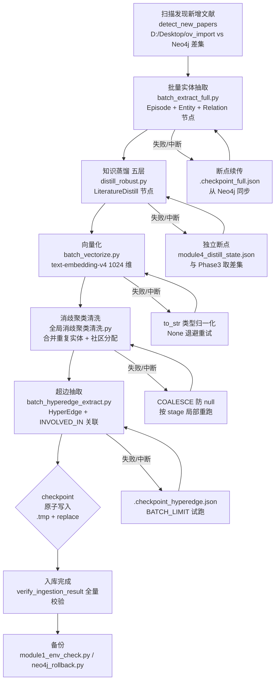
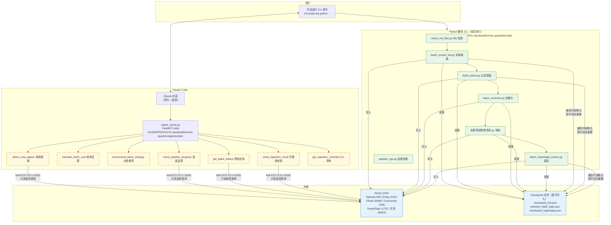

# marx-graphiti-ingest Skill — Graphiti 引擎 Marx 文献批量入库监控

> **定位**：方案 B — Python 脚本执行入库，MCP 只做**导引和监控**。不启动子进程，不代替用户执行 CLI。所有入库步骤由用户手动运行脚本，MCP 工具负责：发现新增文献、估算成本时间、推荐分批策略、跟踪各阶段进度、检测失败论文、最终完整性校验。
> **数据 (2026-08-06)**: 500 Episode / 21,337 Entity / 39,499 Chunk / 500 Distill / 1,085 Community / 11,702 HyperEdge / 166,631 关系

## 一、调用决策

```
用户说"入库""导入新论文""添加文献"
  │
  ├─ 情况 A：用户还没有放文件
  │   → recommend_batch_strategy(N)  告诉用户要准备什么
  │   → get_ingestion_checklist      给出完整 CLI 清单
  │
  ├─ 情况 B：用户已放好文件，要开始入库
  │   → 1) detect_new_papers        确认新增 N 篇
  │   → 2) estimate_batch_cost(N)   估算成本和时间
  │   → 3) marx-graphiti 的 check_md_integrity  验证 MD 格式
  │   → 4) 输出"请执行以下 CLI 命令" 分步清单
  │   → 5) 用户每跑完一步，调用 check_pipeline_progress 确认
  │
  ├─ 情况 C：用户问"进度怎么样"
  │   → check_pipeline_progress
  │
  ├─ 情况 D：用户说"入库有问题"
  │   → get_failed_folders          列出 zero-entity / 缺蒸馏
  │   → verify_ingestion_result     全局质检
  │
  └─ 情况 E：用户问"要多少钱"
      → estimate_batch_cost(N) / recommend_batch_strategy(N)
```

## 一·5、入库流程图（6 阶段）



> 说明：G 是贯穿全程的横切机制——每个脚本在**每篇论文处理完**后写 checkpoint，先写 `.tmp` 再 `replace()`（原子替换，防断电损坏）；启动时若 checkpoint 损坏/为空则自动 `unlink` 并以 Neo4j 现有数据重新初始化。六阶段只进不退：某阶段失败从该阶段继续，不断从头来。

## 二、工具速查

| 工具 | 参数 | 功能 | 耗时 |
|---|---|---|---|
| `detect_new_papers` | — | ov_import 与 Neo4j 差集，发现新增文献 | <1s |
| `estimate_batch_cost` | `paper_count`(必) | 基于 208 篇实测数据估算 Token/时间/RMB | <1s |
| `recommend_batch_strategy` | `total_new_papers`(必) | 推荐分批方案+CLI 命令序列+预算建议 | <1s |
| `check_pipeline_progress` | `batch_tag`(可选) | Neo4j 查询各阶段实体/蒸馏/向量完成数 | <1s |
| `get_failed_folders` | `batch_tag`(可选) | 列出 zero-entity/null-field/缺蒸馏论文 | <2s |
| `verify_ingestion_result` | — | 入库完整性终极检查：覆盖率+孤节点+向量率 | <2s |
| `get_ingestion_checklist` | — | 返回完整 8 步检查表（phase 0-7） | <1s |

## 三、工具输出样例

### detect_new_papers
```json
{"filesystem_folders": 258, "tracked_in_neo4j": 208, "new_count": 50,
 "new_folders": ["论文A_张三", "论文B_李四", ...],
 "action": "发现 50 篇新文献。...执行:\n  cd C:\\Users\\HUAWEI\\.claude\\skills\\marx-graphiti\\scripts\n  python robust_pipeline_v3.py\n  ..."}
```

### estimate_batch_cost(100)
```json
{"paper_count": 100,
 "estimates": {"llm_tokens": "1,248,900", "llm_calls": 140, "estimated_cost_rmb": 13.1, "estimated_time_hours": 0.1, ...},
 "budget": {"status": "GREEN", "advice": "预算充足，可以入库。"},
 "cli_commands": {"step1_extract": "python robust_pipeline_v3.py", ...}}
```

### check_pipeline_progress
```json
{"batch_tag": "v3_incremental_20260701", "new_entities": 150, "new_episodes": 10,
 "vectorized": 120, "distilled": 8,
 "stages": {"entity_extraction": "DONE", "distillation": "DONE (8/10)", "vectorization": "DONE (120/150)"},
 "next_steps": ["向量化待执行: python run_module3.py"]}
```

### verify_ingestion_result
```json
{"folders_in_ov_import": 258, "episodes_in_neo4j": 258, "coverage_pct": 100.0,
 "entities": 3500, "vectorized": 3500, "vector_pct": 100.0,
 "distills": 258, "issues": [], "status": "HEALTHY"}
```

## 四、入库全流程（端到端，含时序与回退）

### 4.1 流程总览

```
Phase 0       Phase 1       Phase 2       Phase 3         Phase 4       Phase 5       Phase 6       Phase 7
放置文献  →  MD检测  →  环境校验  →  实体关系抽取  →  知识蒸馏  →  向量化  →  消歧清洗  →  备份
(手动)      (2s)         (5s)         (30-60min)       (20min)       (5min)        (10min)       (手动)
              │              │              │               │             │             │             │
              └──────────────┴──────────────┴───────────────┴─────────────┴─────────────┴─────────────┘
                                              │
                                         每步失败 → 诊断 → 修复 → 从当前步继续（不断从头来）
```

### 4.2 各阶段详细说明

| 阶段      | CLI 命令                              | 输入                        | 输出                                    | 耗时         | 失败会怎样                                                       | 验证方法                                          |
| ------- | ----------------------------------- | ------------------------- | ------------------------------------- | ---------- | ----------------------------------------------------------- | --------------------------------------------- |
| 0. 放置   | 手动                                  | PDF→pdf2obsidian→MD       | ov_import/{文件夹}/4个MD                  | 视PDF数量     | —                                                           | `detect_new_papers` 能看到新文件夹                   |
| 1. MD检测 | `python check_md_files.py --json`   | ov_import 全部文件夹           | `.md_reports/*.json`                  | 2s         | 有空/缺/乱码文件→**停止**，修复MD后重跑                                    | 输出 `complete_4of4` 应为 208+N                   |
| 2. 环境校验 | `python module1_env_check.py --all` | Neo4j + API               | `.env_check_ok.timestamp`             | 5s         | API欠费→换密钥；Neo4j不在→启动Neo4j；**不停机继续＝后续全失败**                   | `run_env_check` 的 `all_passed=true`           |
| 3. 实体关系 | `python robust_pipeline_v3.py`      | MD文件→DeepSeek             | Entity节点+Relation边+Community+Conflict | 50篇≈30min  | JSON截断→实体=0（坑4/14）；checkpoint破坏→进度丢失（坑7）；进程残留→端口占用（坑13）     | `check_pipeline_progress` 实体数>0               |
| 4. 知识蒸馏 | `python distill_robust.py`          | Episode+Entity节点→DeepSeek | LiteratureDistill节点（五层JSON）           | 50篇≈20min  | 重复节点（坑16）；LIMIT语法破坏（坑18）；成本记错类型（坑20）                        | `check_pipeline_progress` distilled数=episode数 |
| 5. 向量化  | `python run_module3.py`             | 全部Entity节点→Qwen Embedding | 1024维向量写入entity_vector属性              | 2839条≈5min | batch_size超限→10条/批（坑19）；MAAS端点不通→DashScope标准端点（坑19）                              | `verify_ingestion_result` vector_pct=100%     |
| 6. 消歧清洗 | `python 全局消歧聚类清洗.py`                | 全部Entity→Qwen Max         | 合并重复实体+社区分配+清洗                        | ≈10min     | 消歧错误合并→人工审核；`id()`废弃→elementId()（坑9）；`length()`→size()（坑10） | `run_quality_check` all_passed=true           |
| 7. 备份   | `python module1_env_check.py --all` | Neo4j data目录              | `neo4j_backups/neo4j_backup_*`        | ≈30s       | 磁盘不足→清理旧备份                                                  | `list_backups` 能看到新条目                         |

### 4.3 失败后的回退流程

```
Phase 3 失败（实体抽取）—— 最常发生
  ├─ 现象A：某篇论文实体=0
  │   → 1) get_failed_folders 定位到具体文件夹
  │   → 2) 检查该文件夹的MD是否完整、是否乱码
  │   → 3) 单篇重抽：python robust_pipeline_v3.py  # 带 checkpoint 自动跳过已成功的
  │   → 4) check_pipeline_progress 确认修复
  │
  ├─ 现象B：checkpoint丢失/损坏（148→2条）
  │   → python pipeline_ops.py --sync-checkpoint  # 从Neo4j重新同步
  │   → 重跑 robust_pipeline_v3.py
  │
  ├─ 现象C：python进程残留
  │   → python pipeline_ops.py --kill-zombies
  │   → 重启Neo4j
  │
  └─ 现象D：API 400/Timeout
      → python pipeline_ops.py --check-api  # 诊断
      → 换备用密钥 或 等API恢复
      → 从checkpoint继续

Phase 4 失败（知识蒸馏）
  ├─ 单篇蒸馏失败 → get_failed_folders定位 → distill_robust.py（有独立checkpoint自动跳过）
  └─ 全量重复节点 → python pipeline_ops.py --clean-duplicates

Phase 5 失败（向量化）
  └─ 缺向量 → python pipeline_ops.py --fix-vectors

Phase 6 失败（消歧清洗）
  └─ 只执行需要的stage：python 全局消歧聚类清洗.py --stage disambiguate,clean
```

### 4.4 完整时序示例（50篇新文献）

```
T+0min   用户：把50个文件夹放入 ov_import
T+1min   Claude：detect_new_papers → 50篇确认
         Claude：estimate_batch_cost(50) → RMB 6.55, ~1h, GREEN
         Claude：marx-graphiti check_md_integrity → 258/258 complete
         Claude：输出分步命令
T+2min   用户执行：python check_md_files.py --json → OK
T+3min   用户执行：python module1_env_check.py --all → OK
T+4min   用户执行：python robust_pipeline_v3.py
T+34min  抽取完成。Claude：check_pipeline_progress → entities>0 ✅
T+35min  用户执行：python distill_robust.py
T+55min  蒸馏完成。Claude：check_pipeline_progress → 50/50 distilled ✅
T+56min  用户执行：python run_module3.py
T+61min  向量化完成。Claude：verify_ingestion_result → 100% vectors ✅
T+62min  用户执行：python 全局消歧聚类清洗.py
T+72min  清洗完成。Claude：run_quality_check → 10/10 PASS ✅
T+73min  用户执行：python module1_env_check.py --all   # 创建备份
T+75min  Claude：verify_ingestion_result → HEALTHY ✅
         入库完成。258篇入库，图谱健康。
```

## 五、CLI 命令全集

```bash
cd %USERPROFILE%\.claude\skills\marx-graphiti\scripts

# 0. 放置新文献到 D:\Desktop\ov_import
#    (每个文件夹含: 摘要.md 术语表.md 问答.md *.original.md)

# 1. MD 完整性检测
python check_md_files.py --json

# 2. 环境检测
python module1_env_check.py --all

# 3. 实体关系抽取（5轮 LLM）
python robust_pipeline_v3.py       # 50篇≈30min, 100篇≈1h

# 4. 知识蒸馏
python distill_robust.py           # 50篇≈20min

# 5. 向量化
python run_module3.py              # 10条/批

# 6. 全局消歧聚类清洗
python 全局消歧聚类清洗.py

# 7. 备份
python neo4j_rollback.py --list
```

## 六、批量入库策略

| 规模 | 策略 | 每批成本 |
|---|---|---|
| 1-50篇 | 一次性跑完全流程 | RMB 6.55 |
| 50-200篇 | 每 50 篇一批，批间质检 | ~RMB 6.55/批 |
| 200-1000篇 | 每 100 篇一批，批间质检+备份 | ~RMB 13/批 |
| 1000+篇 | 每 500 篇一批，先试跑 50 篇 | ~RMB 65/批 |

## 七、入库常见问题与踩坑经验

> 以下所有坑位均来自 208 篇论文的实际入库过程。每条包含现象→诊断→修复→预防。

### 7.1 API 层（3 坑）

**坑1：主密钥欠费 → API 返回 400**
- 现象：`compatible-mode` 返回 `"Access denied, account is not in good standing"`，LLM 调用全部失败
- 诊断：`python pipeline_ops.py --check-api` 看到 DeepSeek 和 Qwen 都 FAIL
- 修复：准备备用密钥 `sk-ws-H.RXMHHLH...`，写入 `pipeline_config.json` 的 `qwen_max.key` 和 `qwen_embedding.key`
- 预防：入库前运行 `python pipeline_ops.py --check-api`，预算告警阈值为 80%

**坑2：备用密钥 compatible-mode 始终 400**
- 现象：换了密钥还是 400，`/compatible-mode/v1/chat/completions` 不通
- 原因：`qwen3.7-max` 是纯推理模型，与 OpenAI-compatible 接口部分不兼容
- 修复：Python SDK (QwenMaxClient) 内部用 compatible-mode 但经过 max_tokens/timeout 修复后可用；curl 直调用原生 DashScope API `/api/v1/services/aigc/text-generation/generation`

**坑3：DeepSeek base_url 错误**
- 现象：模块4调用 DeepSeek 始终失败，但 Qwen 正常
- 原因：`pipeline_config.json` 里 `deepseek.base_url` 写的是 `https://api.deepseek.com/v1`，但 key 实际走阿里云 DashScope
- 修复：统一改为 `https://dashscope.aliyuncs.com/compatible-mode/v1`

### 7.2 模型参数层（2 坑）

**坑4：max_tokens=4096 导致 JSON 被截断 → 实体=0**
- 现象：单篇论文 LLM 调用成功（200 OK），但抽出的实体数为 0（共 45 篇论文受影响）
- 原因：`qwen3.7-max` 是推理模型，`reasoning_tokens` 占 2000-4000 token，4096 减去思考 token 后只剩几百给 JSON 输出，必然截断
- 修复：`max_tokens` → 16384；45 篇受影响论文用 `qwen_full_v4.py` 逐个重抽
- 预防：入库前用 `test_5_papers_v2.py` 验证 max_tokens 配置

**坑5：timeout=120s 不够**
- 现象：`call_json` 返回 None，日志显示 `"Timeout"`
- 原因：qwen3.7-max 思考（2000-4000 tokens）+ 长 prompt（~16000 字符）+ 16384 token 输出，单次调用 60-120 秒，高峰超 120 秒
- 修复：`timeout` → 300 秒

### 7.3 JSON 解析层（1 坑）

**坑6：qwen3.7-max 输出包裹 markdown 代码块**
- 现象：`raw call` 返回有效 JSON，但 `call_json` 返回 None
- 原因：输出格式是 ` ```json\n{...}\n``` ` 而非纯 JSON
- 修复：`call_json` 中先用 `re.sub(r'```json|```', '', text)` 清洗 markdown 标记再 `json.loads`
- 影响范围：所有 `qwen3.7-max` 调用

### 7.4 断点/状态管理层（1 坑）

**坑7：checkpoint 被并发写破坏**
- 现象：checkpoint 从 148 条变成 2 条，进度全部丢失
- 原因：`_kill_old_pipeline()` 杀旧进程时，旧进程正在写 checkpoint，JSON 文件被覆盖为空或残缺。多进程同时写同一 JSON 无锁保护
- 修复：每次启动从 Neo4j 重新同步 checkpoint：
  ```cypher
  MATCH (e:Entity)-[:EXTRACTED_FROM]->(ep:Episode)
  RETURN DISTINCT ep.source_folder AS f
  ```
- 预防：`python pipeline_ops.py --sync-checkpoint` 每次入库前同步一次

### 7.5 文件系统层（2 坑）

**坑8：.obsidian 隐藏文件夹污染**
- 现象：流水线卡在 `".obsidian: 缺失核心文件"` 后退出
- 原因：`ov_import` 目录下存在 Obsidian 配置目录 `.obsidian`，没有有效的摘要/术语 MD 文件
- 修复：遍历 `all_dirs` 时过滤 `not d.name.startswith('.')`

**坑12：Windows GBK 终端中文乱码**
- 现象：CLI 输出中文显示为问号或乱码
- 原因：Windows 终端默认 GBK 编码，Python print 中文时编码不匹配
- 修复：所有 Python 脚本统一 `utf-8` 编码 + `logging` 模块输出；使用 `run_module3.py` 等子进程包装器绕过终端编码问题

### 7.6 Neo4j Cypher 层（3 坑）

**坑9：`id()` 在 Neo4j 5 中已废弃**
- 现象：WARNING `"id is deprecated"`
- 修复：全局替换为 `elementId()`

**坑10：`length()` 用于字符串报错**
- 现象：Neo4j 5 中 `length()` 仅用于 Path 类型
- 修复：字符串改用 `size()`

**坑11：关系类型不加引号被当成变量**
- 现象：`type(r)<>EXTRACTED_FROM` 报错
- 修复：加双引号 `type(r)<>"EXTRACTED_FROM"`

**坑18：LIMIT 语法被字符串替换破坏**
- 现象：Cypher 中出现 `LIMIT 100$limit` 的非法语法
- 修复：手动修复为 `LIMIT 100`

### 7.7 数据质控层（2 坑）

**坑14：45 篇论文实体=0 的根因**
- 同坑4，max_tokens 不足导致批量子集全部截断
- 修复后验证：这批论文单独用 `v3_retry_45_zero_entity` 标签重抽，已全部修复

**坑15：`D:\checkpoints` PermissionError**
- 现象：Windows 根目录无写入权限
- 修复：checkpoint 路径从 `D:\checkpoints` 改为脚本目录下的 `.checkpoints`

### 7.8 知识蒸馏层（3 坑）

**坑16：蒸馏出现重复 LiteratureDistill 节点**
- 现象：同一篇论文有多个蒸馏节点
- 诊断：`MATCH (ld1:LiteratureDistill), (ld2:LiteratureDistill) WHERE ld1.source_folder = ld2.source_folder AND elementId(ld1) < elementId(ld2) RETURN count(ld1)`
- 修复：`DETACH DELETE` 删除 `a.id > b.id` 的同 source_folder 重复节点
- 预防：`python pipeline_ops.py --clean-duplicates`

**坑17：DomainKnowledge 查询 `c.level='一级'` 匹配不到**
- 现象：Cypher 中用 `WHERE c.level = '一级'` 查不到结果
- 原因：Community 节点中没有 `level` 属性，用的是 `parent_community`
- 修复：改为 `WHERE c.parent_community IS NOT NULL`

**坑20：QwenMaxClient 调用成本记到 deepseek**
- 现象：成本报告中 LLM 费用异常，Qwen 消耗被归到 DeepSeek
- 原因：`CostMonitor.add_usage()` 类型参数写死为 `"deepseek"`
- 修复：改为 `"qwen_max"`

### 7.9 向量化层（1 坑）

**坑19：Embedding batch_size=50 超限 + MAAS 端点彻底不通**
- 现象：`text-embedding-v4` API 返回 batch size 错误；更严重的是 MAAS 端点 `ws-4cbe4oorrmbrzdya.cn-beijing.maas.aliyuncs.com` 对 v3/v4 embedding 均返回 `"Access denied, account is not in good standing"`
- 原因：API 限制每批最多 10 条；MAAS 端点不支持 embedding — Graphiti 原配置的 embedding 端点根本调不通
- 修复：`batch_size` 从 50 改为 10；embedding 端点从 MAAS 切换至 DashScope 标准端点 `dashscope.aliyuncs.com` + Cognee 的 key (`sk-ws-H.RXYRPIL...`)。此修复同时影响 graphiti_init.py 和 graphiti_mcp_server.py

**坑21：v4 向量全量重建消耗大量配额** (v4 新增)
- 现象：运行 reembed_chunks_v2.py 时主 key 报 `insufficient_quota`
- 原因：1,167 个 DocumentChunk × 2 次 embedding 调用（初次+断点续存）= ~2,326 次 API 调用。备选 key 配额不足
- 修复：使用主 key (`sk-ws-H.RXYRPIL...`)，确保余额 ≥ 5 RMB。备选 key (`sk-ws-H.RYLILRR...`) 配额有限，不可用于 reembed 任务

### 7.10 进程管理层（1 坑）

**坑13：多个 python 进程残留**
- 现象：Neo4j 连接数超限、端口占用、checkpoint 冲突
- 修复：每次启动前 `taskkill /F /IM python.exe`；或 `python pipeline_ops.py --kill-zombies`

### 坑位速查索引

| # | 分类 | 关键现象 | 一句话修复 |
|---|---|---|---|
| 1 | API | 400 "account not in good standing" | 换备用密钥 |
| 2 | API | 备用密钥 compatible-mode 400 | 原生 DashScope API |
| 3 | API | DeepSeek 调用失败 | base_url → dashscope.aliyuncs.com |
| 4 | 模型 | 实体=0（45篇） | max_tokens → 16384 |
| 5 | 模型 | Timeout | timeout → 300s |
| 6 | JSON | call_json 返回 None | re.sub 清洗 markdown |
| 7 | 断点 | checkpoint 148→2条 | 从Neo4j重新同步 |
| 8 | 文件 | 卡在.obsidian | startswith('.')过滤 |
| 9 | Cypher | id is deprecated | → elementId() |
| 10 | Cypher | length()报错 | → size() |
| 11 | Cypher | 关系类型报错 | 加双引号 |
| 12 | 编码 | 中文乱码 | utf-8 + logging |
| 13 | 进程 | 进程残留 | taskkill / pipeline_ops --kill-zombies |
| 14 | 质控 | 45篇零实体 | 同坑4，已重抽修复 |
| 15 | 文件 | PermissionError | → .checkpoints |
| 16 | 蒸馏 | 重复节点 | DETACH DELETE去重 |
| 17 | Cypher | c.level匹配不到 | → c.parent_community |
| 18 | Cypher | LIMIT语法破坏 | 手动修复 |
| 19 | 向量 | batch_size报错 + MAAS 端点不通 | → 10, 切换 DashScope 标准端点 |
| 20 | 成本 | Qwen记错类型 | add_usage → qwen_max |
| 21 | 配额 | reembed 消耗大量 API 配额 | 用主 key, 余额 ≥ 5 RMB |

## 七·5、前置依赖与环境自检

> 任何入库动作前先跑一遍本节自检。**任一 FAIL 都要先修复再入库**，否则后续阶段必然连锁失败（历史教训：API 欠费导致 345/500 蒸馏中断；checkpoint 损坏导致进度从 148 归零）。

| # | 依赖 | 位置/说明 | 自检命令 | 通过标准 |
|---|------|----------|---------|---------|
| 1 | Python 3.12 venv | `%USERPROFILE%/cognee/.venv312/Scripts/python.exe`（MCP 与 CLI 共用同一解释器，保证 mcp/pipeline 依赖一致） | `%USERPROFILE%/cognee/.venv312/Scripts/python.exe --version` | 输出 `Python 3.12.x` |
| 2 | Neo4j (Graphiti) 运行中 | `bolt://127.0.0.1:11001`，用户 `neo4j` / 密码 `neo4j123`，经 Neo4j Desktop 启动 `marx-graphiti` 实例（端口 11001 Bolt / 7474 HTTP） | `%USERPROFILE%/cognee/.venv312/Scripts/python.exe -c "from pipeline.neo4j import Neo4jConnection; print('OK', Neo4jConnection('bolt://127.0.0.1:11001','neo4j','neo4j123').execute_query('RETURN 1')[0])"` | 输出 `OK [{'1': 1}]`，无超时/拒绝连接 |
| 3 | MAAS API Key | Graphiti server.py 内联（LLM）：`%USERPROFILE%/.claude/skills/marx-graphiti/scripts/graphiti_mcp_server.py` 第 9 行 `API_KEY`；Embedding 走 DashScope 标准端点（第 10-13 行）。入库 CLI 的 key 在 `pipeline_config.json`（**双位置**：`scripts/pipeline_config.json` 与 `marx-graphiti/pipeline_config.json`，须同步） | `%USERPROFILE%/cognee/.venv312/Scripts/python.exe -c "from pipeline.api_client import DeepSeekClient; r=DeepSeekClient().call('hi', timeout=15); print('OK', bool(r))"` | 输出 `OK True`；若 400 `"Access denied, account is not in good standing"` → 欠费，换备用密钥 |
| 4 | 论文源目录 | `D:/Desktop/ov_import`（每篇一个文件夹：`资本下乡（2012—2026年6月）/` 与 `资本规范与引导、资本治理（2012—2026年6月）/` 两个顶层分类，共 500 篇；每篇含 4 个 MD：摘要/术语表/问答/original） | `bash -c "ls -d /d/Desktop/ov_import/*/ | wc -l"` 及 `bash -c "find /d/Desktop/ov_import -name '*.md' | wc -l"` | 文件夹数 ≥ 待入库数（500 篇为全量基准）；MD 文件数合理且无空文件 |
| 5 | checkpoint 文件可写 | 三套断点：`.checkpoint_full.json`（实体，scripts 目录下，原子写入）、`D:/Desktop/执行流程/.checkpoints/module4_distill_state.json`（蒸馏）、`.checkpoint_hyperedge.json`（超边，scripts 目录下） | `ls -l "%USERPROFILE%/.claude/skills/marx-graphiti/scripts/.checkpoint_full.json" "%USERPROFILE%/.claude/skills/marx-graphiti/scripts/.checkpoint_hyperedge.json" "/d/Desktop/执行流程/.checkpoints/module4_distill_state.json"` 并 `touch` 测试可写 | 三个文件均存在且非空；`touch` 后时间戳更新，无 PermissionError（坑15） |
| 6 | 超边抽取脚本 | `%USERPROFILE%/.claude/skills/marx-graphiti/scripts/batch_hyperedge_extract.py`（每篇 1 次 LLM 调用抽取 8-30 条结构化超边 + `INVOLVED_IN` 关联 + 向量化；`BATCH_LIMIT=5` 试跑，`BATCH_LIMIT=0` 全量） | `ls -l "%USERPROFILE%/.claude/skills/marx-graphiti/scripts/batch_hyperedge_extract.py"` 且 `grep -c "INVOLVED_IN"` 该文件 | 文件存在；脚本内含 `INVOLVED_IN` 关联逻辑（≥1 处） |

> **补充自检**（可选但推荐）：
> - 进度基准：`MATCH (ep:Episode) RETURN count(ep)` 应等于 500（全量基准），新批次应在此基础上递增；
> - 完整自检可运行 `python module1_env_check.py --all`（脚本位于 marx-graphiti 的 scripts 目录），输出 `all_passed=true` 视为通过；
> - 冷启动顺序（11.8）：先启 Neo4j（等 Bolt 11001 可连，~10s）→ 再拉 MCP → 再跑 CLI。

## 八、故障处理

### 8.0 MCP Server 自动自愈（ingest_server.py，2026-07-12 新增）

`ingest_server.py` 内置 `_reactive_heal_graphiti_ingest()` 函数，MCP handler 被调用时按需检查：

| 检查项 | 故障现象 | 自愈行为 |
|--------|---------|---------|
| 被监控脚本存在性 | `robust_pipeline_v3.py` / `distill_robust.py` 缺失 | 返回错误信息给调用方 |
| Neo4j 11001 连通性 | MCP 工具调用超时 | 返回"Neo4j 不可达"错误 |
| MCP 日志目录可写 | 日志写入失败 | 返回 FATAL |
| 日志文件过大 | 单文件 >100MB | 告警（不阻塞） |

### 8.1 按症状定位

| 症状 | 诊断 | 修复 CLI |
|---|---|---|
| 某论文实体=0 | `get_failed_folders` | `python robust_pipeline_v3.py` |
| 某论文缺蒸馏 | `get_failed_folders` | `python distill_robust.py` |
| 实体缺向量 | `verify_ingestion_result` | `python run_module3.py` / `python pipeline_ops.py --fix-vectors` |
| 预算不足 | `estimate_batch_cost(N)` | 增加阿里云百炼余额 |
| Neo4j 不可用 | 连接报错 | 启动 Neo4j Desktop |
| 进程残留 | `python pipeline_ops.py --kill-zombies` | taskkill /F |
| checkpoint损坏 | 进度丢失 | `python pipeline_ops.py --sync-checkpoint` (robust_pipeline_v3 已内置 AUTO-HEAL 自动重置) |

### 8.2 示例：诊断并修复 45 篇零实体问题（完整流程）

**背景**：208 篇入库后发现 45 篇论文实体=0

**步骤 1 — 发现**：
```
→ Claude：verify_ingestion_result
  "issues": ["45 orphan episodes (没有实体)"]
```

**步骤 2 — 定位**：
```
→ Claude：get_failed_folders
  "papers_with_zero_entities": ["论文A_张三", "论文B_李四", ...]  (45篇)
```

**步骤 3 — 诊断**：
```
→ 手动：python diagnose_45.py
  读取一篇示例论文，用 QwenMaxClient 尝试实体抽取
  → 发现 LLM 返回的 JSON 被截断，实体数组不完整 → 确认是坑4
```

**步骤 4 — 修复**：
```
→ 修改 pipeline_config.json: max_tokens 4096 → 16384
→ python quick_retry_45.py  (带 v3_retry_45_zero_entity 标签重抽)
  45篇全部修复，新增 573 个实体
```

**步骤 5 — 验证**：
```
→ Claude：get_failed_folders
  "zero_count": 0
→ Claude：verify_ingestion_result
  "status": "HEALTHY"
```

### 8.3 示例：预算超支后的分批恢复

**背景**：计划入库 500 篇，但 `estimate_batch_cost(500)` 显示 RMB 65.5，当前预算余额仅 RMB 72.72

**操作**：
```
→ Claude：recommend_batch_strategy(500)
  strategy: "分 5 批，每批 100 篇（~RMB 13.1/批）"
  batches:
    batch 1/5: papers 1-100
    batch 2/5: papers 101-200, etc.

→ 用户：python robust_pipeline_v3.py   # batch 1
→ Claude：check_pipeline_progress → 100篇实体抽取完成
→ Claude：estimate_batch_cost(400)      # batch 2-5 重新估算
  budget.status: "GREEN"                # 剩余 RMB 59 → 够用
→ 继续 batch 2/5 ... 直至全部完成
→ Claude：verify_ingestion_result → HEALTHY
```

## 九、与 marx-graphiti 的关系

| | marx-graphiti-ingest | marx-graphiti |
|---|---|---|
| 用途 | 入库监控 | 知识检索 |
| 模式 | 导引 CLI 执行 | 只读查询 |
| 工具数 | 7 | 17 |
| 写操作 | 不写（用户 CLI） | 全部只读 |
| 典型耗时 | <2s（纯监控） | <1s |

## 十、MCP 入库监控服务 (ingest_server.py)

本 skill 的核心 MCP 服务位于 `%USERPROFILE%/.claude/skills/marx-graphiti-ingest/scripts/ingest_server.py`。

### 10.1 架构

```
ingest_server.py (FastMCP, stdio 传输)
  ├─ 7 个 MCP 工具 (detect_new_papers / estimate_batch_cost / check_pipeline_progress 等)
  ├─ Neo4j 连接: bolt://127.0.0.1:11001 (只读监控)
  ├─ Pipeline Root: %USERPROFILE%\.claude\skills\marx-graphiti\scripts (CLI 脚本所在目录)
  └─ 日志: %USERPROFILE%\.claude\skills\marx-graphiti\scripts\.mcp_logs\marx_ingest_mcp.log
```

### 10.2 定位：方案 B

此服务遵循**方案 B** 设计原则：**Python 脚本执行入库，MCP 只做导引和监控**。它不启动子进程，不代替用户执行 CLI。所有入库步骤由用户手动运行脚本，MCP 工具负责：

- 发现新增文献 (`detect_new_papers`)
- 估算成本和时间 (`estimate_batch_cost`)
- 推荐分批策略 (`recommend_batch_strategy`)
- 跟踪各阶段进度 (`check_pipeline_progress`)
- 检测失败论文 (`get_failed_folders`)
- 最终完整性校验 (`verify_ingestion_result`)
- 输出完整 CLI 清单 (`get_ingestion_checklist`)

### 10.3 启动方式

由 Claude Code 通过 `mcp.json` 自动拉起（stdio 模式），无需手动启动。配置示例：

```json
{
  "marx-graphiti-ingest": {
    "command": "%USERPROFILE%/cognee/.venv312/Scripts/python.exe",
    "args": ["%USERPROFILE%/.claude/skills/marx-graphiti-ingest/scripts/ingest_server.py"]
  }
}
```

### 10.4 关键常量

| 常量 | 值 | 说明 |
|------|------|------|
| `_PIPELINE_ROOT` | `%USERPROFILE%\.claude\skills\marx-graphiti\scripts` | CLI 脚本所在目录 |
| `_IMPORT_DIR` | `D:\Desktop\ov_import` | 论文源目录 |
| Neo4j URI | `bolt://127.0.0.1:11001` | Graphiti Neo4j 实例 |
| `_LOG_DIR` | `%USERPROFILE%\.claude\skills\marx-graphiti\scripts\.mcp_logs` | MCP 服务日志目录 |

### 10.5 BENCHMARK 常量（成本估算基准）

基于 208 篇论文实测数据，编辑脚本可调：

| 常量 | 默认值 | 说明 |
|------|--------|------|
| `tokens_per_paper` | 12489 | 单篇 LLM token 消耗 |
| `llm_calls_per_paper` | 1.4 | 单篇 LLM 调用次数 (含缓存命中) |
| `embedding_calls_per_paper` | 9 | 单篇嵌入 API 调用次数 |
| `entities_per_paper` | 13.6 | 单篇平均抽取实体数 |
| `relations_per_paper` | 6.1 | 单篇平均关系数 |
| `db_mb_per_paper` | 0.31 | 单篇 Neo4j 存储增量 (MB) |
| `cost_rmb_per_paper` | 0.131 | 单篇 API 成本 (RMB) |

### 10.6 依赖

- Python >= 3.10 + `mcp >= 1.0`
- 项目 pipeline 库：`%USERPROFILE%\.claude\skills\marx-graphiti\pipeline\neo4j.py` (Neo4jConnection)
- Neo4j 实例：`bolt://127.0.0.1:11001` (marx-graphiti 数据库)
- 论文源：`D:\Desktop\ov_import` (每个文件夹含 4 个 MD)

---

## 十·5、整体架构图（方案 B：CLI 执行 + MCP 导引监控）



> 核心分工（方案 B 铁律）：**Python 脚本 CLI 负责全部写操作**（用户手动执行），**MCP 服务只读监控**（发现/估算/推荐/监控/校验），MCP 不启动子进程、不代替用户执行 CLI。Claude 在对话中导引用户按序执行命令，并在每步后用 MCP 工具确认进度。

---

## 十一、基础设施与数据库依赖总览

> 以下列出本 skill 涉及的所有外部服务、数据库、API 端点和文件系统路径。迁移/恢复/排障时以此为基准核对清单。

### 11.1 数据库

| 数据库 | 类型 | 连接地址 | 凭据 | 存储内容 | 关键性 |
|--------|------|---------|------|---------|--------|
| Neo4j (Graphiti) | Graph DB | `bolt://127.0.0.1:11001` | `neo4j` / `neo4j123` | Episode / Entity / Relation / LiteratureDistill / DomainKnowledge / Community / Conflict | 核心存储 |
| SQLite (进度) | 文件数据库 | `%USERPROFILE%\.claude\skills\marx-graphiti\scripts\.mcp_db\ingest_state.db` | 无 | 批次进度、失败记录、checkpoint 同步状态 | MCP 内部使用 |

### 11.2 API 端点

| 服务 | 端点 | 模型 | 用途 | 费用 |
|------|------|------|------|------|
| DashScope (LLM 主) | `https://dashscope.aliyuncs.com/compatible-mode/v1` | `qwen3.7-max` | 实体抽取 + 知识蒸馏 (deepseek 兼容模式) | ~0.131 CNY/篇 |
| DashScope (Embedding) | `https://dashscope.aliyuncs.com/compatible-mode/v1` | `text-embedding-v4` | 实体向量化 (1024d) | 按调用计费 |
| DashScope (原生) | `https://dashscope.aliyuncs.com/api/v1/services/aigc/text-generation/generation` | `qwen3.7-max` | 备用：compatible-mode 400 时的回退端点 | — |
| DeepSeek (备用) | `https://api.deepseek.com/v1` | `deepseek-chat` | 蒸馏备用 (坑3：实际已改用 DashScope 端点) | 已弃用 |

### 11.3 本地服务

| 服务 | 启动命令 | 端口 | 前置于 |
|------|---------|------|--------|
| Neo4j (Graphiti) | 通过 Neo4j Desktop 启动 `marx-graphiti` 实例 | 11001 (Bolt) / 7474 (HTTP) | `robust_pipeline_v3.py` / `distill_robust.py` / 一切 CLI |

### 11.4 ingest_server.py 文件系统路径

| 路径 | 用途 | 读写 | 备注 |
|------|------|------|------|
| `%USERPROFILE%\.claude\skills\marx-graphiti-ingest\scripts\ingest_server.py` | MCP 服务脚本 | **只读** (代码) | 本 skill 唯一脚本 |
| `%USERPROFILE%\.claude\skills\marx-graphiti\scripts\` | CLI 脚本根目录 | **只读** (Python 代码路径) | `sys.path.insert(0, ...)` |
| `%USERPROFILE%\.claude\skills\marx-graphiti\pipeline\neo4j.py` | Neo4jConnection 封装 | **只读** (库) | ingest_server.py 导入依赖 |
| `%USERPROFILE%\.claude\skills\marx-graphiti\scripts\.mcp_logs\marx_ingest_mcp.log` | MCP 运行日志 | 写入 | logging.FileHandler |
| `D:\Desktop\ov_import\` | 论文源 (每文件夹 4 个 MD) | **只读** | `_IMPORT_DIR` |

### 11.5 CLI 入库管线文件系统路径

| 路径 | 阶段 | 说明 |
|------|------|------|
| `%USERPROFILE%\.claude\skills\marx-graphiti\scripts\check_md_files.py` | Phase 1 (MD 检测) | MD 完整性校验 |
| `%USERPROFILE%\.claude\skills\marx-graphiti\scripts\module1_env_check.py` | Phase 2 (环境校验) | Neo4j + API 连通性 |
| `%USERPROFILE%\.claude\skills\marx-graphiti\scripts\robust_pipeline_v3.py` | Phase 3 (实体抽取) | 5 轮 LLM 实体/关系抽取 |
| `%USERPROFILE%\.claude\skills\marx-graphiti\scripts\distill_robust.py` | Phase 4 (知识蒸馏) | 五层文献蒸馏 |
| `%USERPROFILE%\.claude\skills\marx-graphiti\scripts\run_module3.py` | Phase 5 (向量化) | 批量 entity_vector 写入 |
| `%USERPROFILE%\.claude\skills\marx-graphiti\scripts\全局消歧聚类清洗.py` | Phase 6 (消歧清洗) | 实体合并 + 社区分配 |
| `%USERPROFILE%\.claude\skills\marx-graphiti\scripts\pipeline_ops.py` | 运维工具 | checkpoint 同步 / zombie 清理 / 去重 |
| `%USERPROFILE%\.claude\skills\marx-graphiti\scripts\neo4j_rollback.py` | Phase 7 (备份) | Neo4j 备份管理 |
| `%USERPROFILE%\.claude\skills\marx-graphiti\scripts\pipeline_config.json` | 配置 | API 密钥、模型名称、端口 |
| `%USERPROFILE%\.claude\skills\marx-graphiti\pipeline\config.py` | 配置库 | Python 配置加载 |

### 11.6 ingest_server.py → 依赖映射

```
ingest_server.py (FastMCP, stdio, 7 tools)
  │
  ├─ detect_new_papers()
  │   ├─ _IMPORT_DIR (D:\Desktop\ov_import) — 遍历文件夹
  │   └─ _get_neo4j() → Neo4jConnection (bolt://127.0.0.1:11001) — MATCH (ep:Episode)
  │
  ├─ estimate_batch_cost(paper_count)
  │   └─ BENCHMARK 常量 (纯计算, 无外部调用)
  │
  ├─ recommend_batch_strategy(total_new_papers)
  │   └─ estimate_batch_cost() (同上)
  │
  ├─ check_pipeline_progress(batch_tag)
  │   └─ _get_neo4j() → MATCH (e:Entity {batch_run}) / (ld:LiteratureDistill) / (ep:Episode)
  │
  ├─ get_failed_folders(batch_tag)
  │   └─ _get_neo4j() → MATCH zero-entity / null-field / no-distill Episodes
  │
  ├─ verify_ingestion_result()
  │   ├─ _IMPORT_DIR — 文件夹计数
  │   └─ _get_neo4j() → 全量 Episode + Entity + Distill + DomainKnowledge + 孤节点检查
  │
  └─ get_ingestion_checklist()
      └─ 纯静态输出, 无外部调用

所有工具中:
  _get_neo4j() → pipeline.neo4j.Neo4jConnection (bolt://127.0.0.1:11001, neo4j/neo4j123)
  logger        → %USERPROFILE%\.claude\skills\marx-graphiti\scripts\.mcp_logs\marx_ingest_mcp.log
```

### 11.7 端口占用清单

| 端口 | 服务 | 进程 |
|------|------|------|
| 11001 | Neo4j Bolt (Graphiti) | `neo4j-community-5.26.27-windows` / `java.exe` |
| 7474 | Neo4j HTTP (Graphiti) | 同上 |

### 11.8 启动顺序 (冷启动)

```
1. 启动 Neo4j Desktop → 启动 marx-graphiti 实例
     → 等待 Bolt 11001 可连接 (~10s)
2. Claude Code 自动拉起 MCP stdio
     → ingest_server.py _get_neo4j() 首次连接
3. 用户执行 CLI 脚本 (cd %USERPROFILE%\.claude\skills\marx-graphiti\scripts && python ...)
     → 各脚本通过 pipeline.neo4j.Neo4jConnection 连接 11001
```

---

## 十二、测试用例

| 输入 | 预期调用 | 预期 |
|---|---|---|
| "我有 50 篇新论文要入库" | detect_new_papers → estimate_batch_cost(50) → check_md_integrity | 输出 CLI 命令清单 |
| "入库进度怎么样了" | check_pipeline_progress | 返回各阶段 DONE/PENDING |
| "入库有什么失败的" | get_failed_folders → verify_ingestion_result | 列出 zero-entity 论文 |
| "1000 篇要多少钱" | estimate_batch_cost(1000) → recommend_batch_strategy(1000) | RMB ~131, 10批 |
| "入库流程是什么" | get_ingestion_checklist | 返回 8 步清单 |

---

---

## 十三、2026-07-14 292篇全量入库踩坑审计 (v5, 17坑位)

> 以下坑位来自 292 篇论文从零入库的全过程（2026-07-12 ~ 2026-07-14），每坑含现象→诊断→修复→预防。

### 13.1 环境层（3坑）

**坑18：DeepSeek API Key 欠费 (Arrearage)**
- 现象：Phase 3 实体抽取完成后，Phase 4 蒸馏跑到一半（345/500）全部返回 `deepseek returned None`
- 诊断：curltest deepseek-v4-pro 返回 400 `"Access denied, account is not in good standing"`, `"Arrearage"`
- 修复：用户提供新 key `sk-ws-H.RXYEDPI.xsax...`，同时更新 deepseek 和 qwen_max 字段（统一为一个 key），覆盖 `pipeline_config.json` 的 deepseek.key
- 预防：入库前用 `curl -s https://dashscope.aliyuncs.com/compatible-mode/v1/chat/completions ...` 直接测试余额状态。Phase 3+4 共用同一把 key，累计消耗约 9.5h × ~3min/篇

**坑19：pipeline_config.json 双位置不同步**
- 现象：改完 `scripts/pipeline_config.json` 后脚本仍用旧 key，API 403
- 原因：`pipeline/config.py` 的加载路径是 `Path(__file__).parent.parent / "pipeline_config.json"` = `marx-graphiti/pipeline_config.json`，并非 `scripts/` 下的同名文件
- 修复：同步复制 `scripts/pipeline_config.json` → `marx-graphiti/pipeline_config.json`
- 预防：脚本启动日志打印 `base_url` 和 `model`，确认读取的是预期配置文件

**坑20：module1_env_check.py MCP 工具 import 失败**
- 现象：`module1_env_check.py` 报 `ModuleNotFoundError: No module named 'pipeline'`
- 原因：`sys.path.insert(0, str(SCRIPT_DIR))` 把 scripts 路径放入 sys.path，但 pipeline 在上级目录
- 修复：未改原脚本，改用手动校验：`python -c "from pipeline.neo4j import Neo4jConnection"` + API curl 测试
- 预防：所有独立脚本统一 `sys.path.insert(0, str(Path(__file__).parent.parent))`（指向 marx-graphiti 根目录）

### 13.2 代码层（8坑）

**坑21：robust_pipeline_v3.py 全局符号替换污染**
- 现象：`NameError: name 'sys' is not defined` / `NameError: name 'json' is not defined`
- 原因：脚本头部 `import sys as _sys`, `import json as _json`，但后续 140+ 行直接使用 `sys.path.insert()` / `json.load()`
- 修复：
  - `sys.path.insert` → `_sys.path.insert`
  - `sys.exit` → `_sys.exit`（5处）
  - `json.load/dumps` → `_json.load/dumps`
  - 删除了前面某次 `replace_all` 残留的 `import _json as __json` 重复定义
- 关键教训：**绝对禁止对脚本全局 `replace_all`**，尤其 `json`→`_json` 会把 `call_json` 也替换成 `call__json`

**坑22：batch_extract_v3.py call_json→call__json 被破坏**
- 现象：`AttributeError: 'DeepSeekClient' object has no attribute 'call__json'`
- 原因：replace_all 把 `call_json(` 全部替换为 `call__json(`
- 修复：逐函数 replace_all 回 `call_json`

**坑23：robust_pipeline_v3.py sys.path 指向 scripts/**
- 现象：`ModuleNotFoundError: No module named 'pipeline'`
- 原因：`sys.path.insert(0, str(SCRIPT_DIR))` = `scripts/`，但 `from pipeline import Neo4jConnection` 需要 `marx-graphiti/`（即 `scripts/..`）
- 修复：`_sys.path.insert(0, str(SCRIPT_DIR.parent))`

**坑24：api_client.py DeepSeekClient max_tokens=4096 导致 JSON 截断**
- 现象：AB 测试阶段 call_json 返回 None，但 curl 拿到 200 且 content 完整
- 原因：`api_client.py` 中 `payload["max_tokens"] = 4096`，deepseek-v4-pro 的 reasoning_tokens（~5000+）占满 4096 后 JSON 输出被截断
- 修复：`max_tokens` 4096 → 16384，`temperature` 0.3 → 0.1
- 预防：新模型入库前做 AB 测试（单篇论文两个模型跑一遍，对比实体数量和解析成功率）

**坑25：api_client.py call_json 缺少 logger import**
- 现象：Phase 6 消歧阶段 `call_json` 抛 `NameError: name 'logger' is not defined`
- 原因：之前修复 call_json 时新增了 `logger.info/warning` 日志，但 `api_client.py` 顶部没有 import logging
- 修复：在 `import requests` 之后新增 `import logging` + `logger = logging.getLogger(__name__)`

**坑26：api_client.py call_json markdown code block 清洗不完整**
- 现象：deepseek-v4-pro 输出 `{"entities":[...]}\n\`\`\`` 格式，原 `re.sub` 只清理了开头和结尾的 code fence，尾随垃圾未被去除
- 修复：新增 `last_brace = content.rfind('}')` 截断尾随垃圾
- 预防：call_json 应在日志中输出 `content_tail`（最后 100 字符），方便诊断解析失败

**坑27：run_module3.py 硬编码路径**
- 现象：`FileNotFoundError: D:\Desktop\执行流程\模块3：向量化（Embedding）.py`
- 原因：`run_module3.py` 写死 `r"D:\Desktop\执行流程\模块3：向量化（Embedding）.py"`
- 修复：改为 `str(Path(__file__).parent / "模块3：向量化（Embedding）.py")`
- 预防：所有脚本使用 `Path(__file__).parent` 相对路径，不硬编码绝对路径

**坑28：全局消歧聚类清洗.py sys.path 指向 scripts/**
- 现象：`ModuleNotFoundError: No module named 'pipeline'`
- 原因：同坑23，`sys.path.insert(0, str(SCRIPT_DIR))` 指向 scripts 而非 parent
- 修复：`sys.path.insert(0, str(SCRIPT_DIR.parent))`

### 13.3 流程层（5坑）

**坑29：后台任务输出空白导致反复重启**
- 现象：Python 后台进程 `run_in_background=true` 运行正常，但输出文件长时间为空，用户误判卡死→kill→重跑
- 原因：Windows bash shell 长命令嵌套引号冲突，`python -c "..."` 内部字符（中文引号、`\n`、`$` 拼接）导致 Shell 语法截断；正常跑的脚本 stdout 缓冲不 flush，文件多分钟无输出
- 修复：
  - 拆分为独立 `.py` 文件（`batch_extract_full.py`），通过 Bash 直接调用 `python xx.py`
  - 关键位置每篇处理添加 `flush=True`
  - 放弃超长 `python -c` 单行命令方式

**坑30：checkpoint JSON 空文件/损坏 → 启动崩溃**
- 现象：`JSONDecodeError: Expecting value: line 1 column 1 (char 0)` 或进程被 kill 后 checkpoint 文件为空
- 修复：
  - 加载时 `try/except` 空文件：`content = CP_FILE.read_text('utf-8').strip(); if content: processed = set(json.loads(content))`；为空或异常时 `unlink(missing_ok=True)` 并用 DB 初始化
  - 写入时原子覆盖：写到 `.tmp` 再 `replace()`，避免中途断电损坏

**坑31：distill checkpoint 与 entity checkpoint 两套体系不互通**
- 现象：Phase 4 的 `distill_robust.py` 使用独立 checkpoint 文件 `module4_distill_state.json`，导致 Phase 3（entity extraction）+ Phase 4（distillation）之间的断点无法对齐
- 修复：以 Phase 3 的 `.checkpoint_full.json` 为权威源，Phase 4 从 Neo4j 取差集（`full_done - distill_in_neo4j`）确定待蒸馏范围
- 预防：所有 Phase 统一使用同一个 checkpoint 文件，通过 Neo4j 日志字段区分阶段

**坑32：vectorize embed_batch 返回 None 导致脚本崩溃**
- 现象：`batch_vectorize.py` 调用 `emb.embed_batch()` 偶发返回 None，直接导致 `zip(ids, vectors)` 崩溃
- 修复：加判空逻辑 `if vectors is None: time.sleep(10); continue`
- 预防：所有 API 调用统一加 None 判断 + 退避重试

**坑33：消歧合并后 source_folder=null → 清洗阶段崩溃**
- 现象：Phase 6 阶段3（一致性清洗）执行 Cypher `MERGE (ep:Episode {source_folder: null})` 抛 `ClientError: Cannot merge node with null property`
- 原因：消歧阶段（阶段1）的 `DETACH DELETE` 删除了被合并的 Entity 及其关联 Episode，连带的 `source_folder` 变为 null
- 修复：清洗阶段用 `COALESCE(e.source_folder, "UNKNOWN")` 防 null；清理后移除 UNKNOWN 标记的孤儿 Episode

### 13.4 数据层（1坑）

**坑34：Entity 字段含 list 类型导致 vectorize 拼接崩溃**
- 现象：`batch_vectorize.py` 第 33 行 `" ".join(filter(None, [row["n"], row["c"], row["s"], row["d"], row["ctx"]]))` 抛 `TypeError` —— `row["c"]` 等字段实际是 list 而非 str
- 修复：新增 `to_str()` 函数，对 list 用 `", ".join()` 转换，数字/None 也兼容
- 预防：vectorize 脚本对 Neo4j 列做类型归一化预处理，不再假设字段都是 str

---

## 十四、2026-07-14 全脚本修复清单

| 文件 | 修复内容 | 坑号 |
|------|---------|------|
| `robust_pipeline_v3.py` | _sys/_json 命名空间修复，sys.path 改 parent，checkpoint 原子写入+损坏修复 | 21,23,30 |
| `batch_extract_full.py` | 新增独立脚本，全量断点续传+flush输出+入 DB checkpoint | 22,29,30 |
| `batch_vectorize.py` | 新增独立脚本，to_str() 类型转换+None 退避重试 | 32,34 |
| `api_client.py` | max_tokens 16384, temperature 0.1, logger import, markdown 尾随截断+call_json 日志 | 24,25,26 |
| `run_module3.py` | 硬编码路径→Path(__file__).parent | 27 |
| `全局消歧聚类清洗.py` | sys.path 改 parent | 28 |
| `pipeline_config.json` | deepseek key 更新为 `sk-ws-H.RXYEDPI...`，budget_limit → 50 | 18,19 |
| `pipeline_config.json` (根目录) | 同步复制 | 19 |
| `distill_robust.py` | 无代码修改（通过 key 更新+checkpoint 逻辑修复后重跑） |   |

### 14.1 新增脚本

| 脚本 | 用途 | 对应 Phase |
|------|------|-----------|
| `batch_extract_full.py` | 实体抽取全量断点续传（取代逐批确认） | Phase 3 |
| `batch_vectorize.py` | 向量化独立脚本（参数类型安全+退避重试） | Phase 5 |

### 14.2 入库完整 CLI（v5）

```bash
cd %USERPROFILE%\.claude\skills\marx-graphiti\scripts

# Phase 1: MD 完整性检测
python check_md_files.py --json

# Phase 2: 环境校验（手动）
python -c "from pipeline.neo4j import Neo4jConnection; print('OK')"   # Neo4j
curl https://dashscope.aliyuncs.com/compatible-mode/v1/chat/completions -H "Authorization: Bearer YOUR_KEY" ...  # API

# Phase 3: 实体+关系抽取（全量，断点续传）
python batch_extract_full.py

# Phase 4: 知识蒸馏
python distill_robust.py

# Phase 5: 向量化
python batch_vectorize.py

# Phase 6: 消歧聚类清洗
python 全局消歧聚类清洗.py

# Phase 7: 备份
python neo4j_rollback.py --list
```

---

## 十五、入库完整性校验（全量 500 篇基准）

> 全量入库完成后的最终验收。**基准值（2026-08-06 v6 实测，Neo4j 11001 实时核对）**：
> Episode **500** / Chunk **39499** / LiteratureDistill **500** / Community **1085** / HyperEdge **11702**（另有 Entity 21337 / INVOLVED_IN 42490 / 关系 166631 作参考）。
> 基准仅对"全量 500 篇"有效；增量入库后应查"大于等于基准"或与新增篇数匹配的差值。

### 15.1 一键全量校验（推荐）

```cypher
// Neo4j Browser (http://localhost:7474) 或 cypher-shell 执行
MATCH (ep:Episode)         RETURN count(ep) AS episode, '500' AS baseline;
MATCH (c:Chunk)            RETURN count(c) AS chunk, '39499' AS baseline;
MATCH (ld:LiteratureDistill) RETURN count(ld) AS distill, '500' AS baseline;
MATCH (com:Community)      RETURN count(com) AS community, '1085' AS baseline;
MATCH (h:HyperEdge)        RETURN count(h) AS hyperedge, '11702' AS baseline;
```

### 15.2 逐项校验命令

```bash
# Episode 数 = 500（每篇论文 1 个 Episode）
%USERPROFILE%/cognee/.venv312/Scripts/python.exe -c "from pipeline.neo4j import Neo4jConnection; print(Neo4jConnection('bolt://127.0.0.1:11001','neo4j','neo4j123').execute_query('MATCH (ep:Episode) RETURN count(ep) AS c')[0]['c'])"
# 预期: 500

# Chunk 数 = 39499（论文切片）
# 同上替换: MATCH (c:Chunk) RETURN count(c) AS c   → 预期 39499

# Distill 数 = 500（五层蒸馏节点，每篇 1 个）
# 替换: MATCH (ld:LiteratureDistill) RETURN count(ld) AS c   → 预期 500

# Community 数 = 1085（社区层级）
# 替换: MATCH (com:Community) RETURN count(com) AS c   → 预期 1085

# HyperEdge 数 = 11702（结构化超边，批量超边抽取产出）
# 替换: MATCH (h:HyperEdge) RETURN count(h) AS c   → 预期 11702
```

### 15.3 关联与质量校验（进阶）

```cypher
// 超边关联数（实体→超边）
MATCH (:Entity)-[:INVOLVED_IN]->(:HyperEdge) RETURN count(*) AS involved_in;   // 基准 42490

// 孤儿检查：有 Episode 无实体（应 = 0）
MATCH (ep:Episode) WHERE NOT (ep)-[:EXTRACTED_FROM]-(:Entity) RETURN count(ep) AS no_entity;

// 缺蒸馏检查：有 Episode 无 LiteratureDistill（应 = 0）
MATCH (ep:Episode) WHERE NOT (ep)<-[:DISTILL_FROM]-(:LiteratureDistill) RETURN count(ep) AS no_distill;

// 向量覆盖：Chunk 带向量占比（应 = 100%）
MATCH (c:Chunk) RETURN count(c) AS total, count(c.chunk_vector) AS with_vec;
```

### 15.4 校验判定

| 检查项 | 基准（全量 500 篇） | 判定 |
|--------|-------------------|------|
| Episode | 500 | 小于基准 → 有篇未入库（查 15.3 孤儿/缺蒸馏定位） |
| Chunk | 39499 | 数量剧变 → 分块配置被改或旧 Chunk 残留（chunk_cleanup.py） |
| LiteratureDistill | 500 | 少 → `distill_robust.py` 补跑（断点续传） |
| Community | 1085 | 少 → `全局消歧聚类清洗.py` 重跑社区分配阶段 |
| HyperEdge | 11702 | 少 → `batch_hyperedge_extract.py` 补跑（checkpoint 续传） |
| INVOLVED_IN | 42490 | 与 HyperEdge 联动，少则重跑超边关联 |
| 孤儿/缺蒸馏 | 0 | 非 0 → `get_failed_folders` 定位后单篇修复 |
| 向量覆盖 | 100% | 少 → `batch_vectorize.py` / `pipeline_ops.py --fix-vectors` |

> 日常增量入库后不必逐项核对全部基准，用 MCP 工具 `verify_ingestion_result` 即可（覆盖率/孤节点/向量率三合一，<2s）；完整基准仅在全量重跑、迁移恢复、版本升级后核对。

