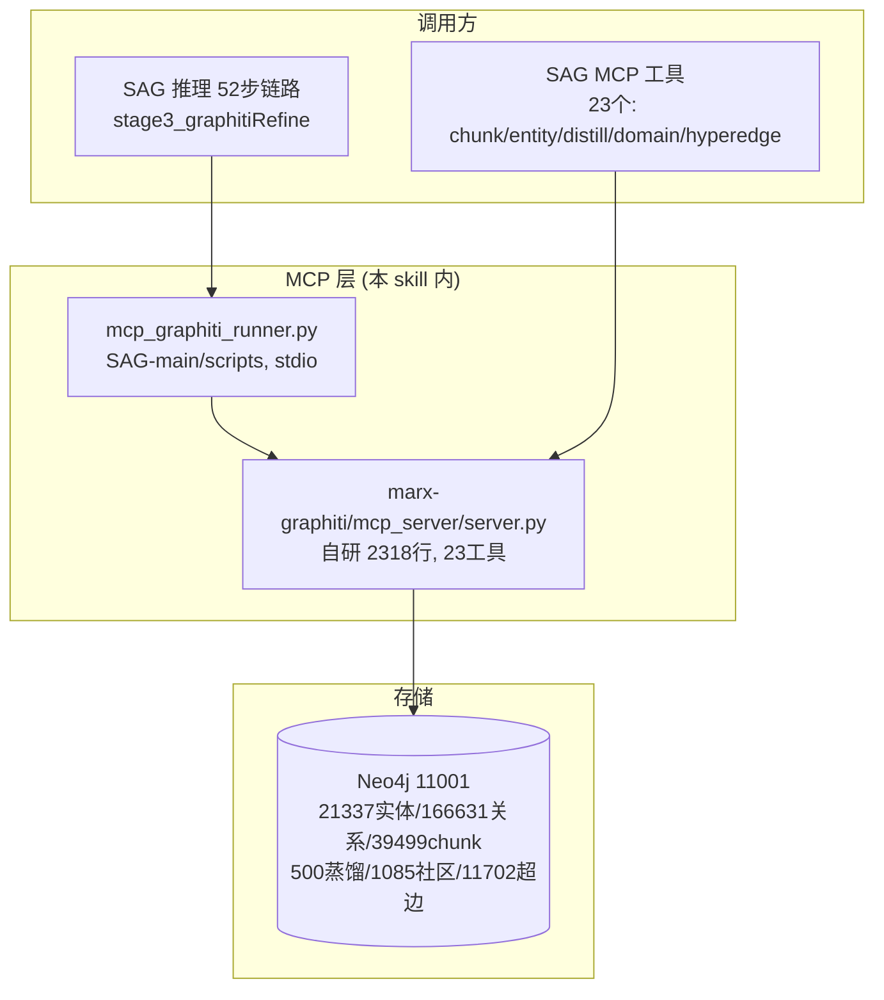

# marx-graphiti Skill — Graphiti 引擎驱动的 Marx 领域知识检索 V28 (模型: qwen3.7-max MAAS + embedding MAAS)

> **最新升级日期**: 2026-08-06 | **版本**: V28 (超边知识层 + LLM超时修复)
> **数据**: 500篇 / 21337 Entity / 39499 Chunk / 500 LiteratureDistill / 5 DomainKnowledge / 1085 Community / 11702 HyperEdge / 166631 关系
> **MCP 工具**: 23个 (marx-graphiti server.py, 2318行)
> **超边层**: search_hyperedges(三路RRF+时间衰减) + get_hyperedge_info — 超越HyperGraphRAG的结构化N元知识片段
> **E2E 质量评分**: 4.96/5.00 (self-judge) | 外部 Judge: F=0.51/R=0.78/A=0.92/O=0.48
> **关键修复 (2026-08-06)**: LLM 超时 60s→300s (callG 360s + llm_timeout_ms 300s, V260)

---

## 零、Graphiti 在 SAG V88D2 检索管道中的定位

### 0.0 架构图（2026-08-06）



### 0.1 全链路位置

Graphiti 是 SAG 四层检索管道中 **Stage3 精炼** 阶段的核心引擎。在 V88D2 版本中:

```
用户 Query
  │
  ├─ Stage0: detectQuestionType
  ├─ Stage1: generateOutline
  ├─ Stage2: Cognee MCP + PG 双路
  │   └─ extractEntityNames → entityNames[30]
  │
  ▼
┌──────────────────────────────────────────────────────────────────────┐
│ Stage3: Graphiti 精炼 (stage3_graphitiRefine)                          │
│                                                                        │
│  输入: entityNames[30] (从 Stage2 提取的实体名列表)                     │
│                                                                        │
│  Phase A (并行, 90s timeout):                                          │
│  ┌────────────────────┐ ┌──────────────────┐                         │
│  │chunk_search_entities│ │search_literature │                         │
│  │单实体名搜索          │ │论文文献检索       │                         │
│  │Neo4j+向量           │ │Neo4j CONTAINS    │                         │
│  └────────────────────┘ └──────────────────┘                         │
│  ┌────────────────────┐ ┌──────────────────┐                         │
│  │get_entity_info      │ │search_by_concept │                         │
│  │实体信息+邻居关系     │ │概念搜索           │                         │
│  │Neo4j 图遍历         │ │Cypher CONTAINS   │                         │
│  └────────────────────┘ └──────────────────┘                         │
│                                                                        │
│  Phase B (并行):                                                       │
│  ┌──────────────────────────────────────────────────────┐            │
│  │hybrid_search_entities (LLM rewrite→vector→BM25→RRF→rerank)│       │
│  │  V26: async/await 修复后 rerank 正常工作               │            │
│  └──────────────────────────────────────────────────────┘            │
│  ┌────────────────────┐ ┌──────────────────────┐                     │
│  │get_distill_content  │ │get_domain_knowledge │                     │
│  │5层文献蒸馏           │ │4层领域知识           │                     │
│  │LiteratureDistill    │ │DomainKnowledge       │                     │
│  └────────────────────┘ └──────────────────────┘                     │
│                                                                        │
│  Phase C (V27 超边知识层):                                              │
│  ┌──────────────────────────────────────────────────────┐            │
│  │search_hyperedges (向量+实体INVOLVED_IN+BM25 → RRF → 时间衰减)  │       │
│  │  N元结构化知识片段: 类型/实体/claims/置信/来源/年份      │            │
│  └──────────────────────────────────────────────────────┘            │
│  ┌────────────────────┐                                               │
│  │get_hyperedge_info  │                                               │
│  │超边详情(成员实体+来源) │                                               │
│  └────────────────────┘                                               │
│                                                                        │
│  产出: refined = { entities, hybridEntities, distills,                  │
│           domain, papers, entityDetail, entityNeighbors }               │
└──────────────────────────────────────────────────────────────────────┘
  │
  ▼
Stage4: SAG 融合生成
  ├─ V85: Graphiti entity → Neo4j EXTRACTED_FROM → paper title → PG ILIKE 补漏
  ├─ V42 fuseResults: Graphiti entities → QUOTA_GRAPHITI (≤1500 chars)
  │                   Graphiti distills → QUOTA_GRAPHITI
  │                   Graphiti domain → QUOTA_GRAPHITI
  │                   Graphiti papers → QUOTA_GRAPHITI
  └─ generateHypothesis
```

### 0.2 V88D2 中 Graphiti 与 SAG 的接口

| SAG 函数 | Graphiti MCP 工具 | 参数 | 超时 | V88D2 新增 |
|---------|------------------|------|------|-----------|
| `callG('chunk_search_entities')` | chunk_search_entities | topEntity, limit=20 | 90s | — |
| `callG('search_literature')` | search_literature | topEntity, limit=10 | 90s | — |
| `callG('get_entity_info')` | get_entity_info | topEntity, limit=5 | 90s | — |
| `callG('search_by_concept')` | search_by_concept | topEntity, limit=10 | 90s | — |
| `callG('hybrid_search_entities')` | hybrid_search_entities | refinedQuery, enable_rerank=true | 90s | V26: rerank 修复后首次正常工作 |
| `callG('get_distill_content')` | get_distill_content | topEntity, limit=3 | 90s | — |
| `callG('get_domain_knowledge')` | get_domain_knowledge | refinedQuery, limit=3 | 90s | — |

### 0.3 Graphiti 实体在 V85 交叉信号中的旅程

```
Stage3 返回:
  refined.entities = [{name: "石狮市港塘村", description: "...", ...}, ...]

Stage4 V85 交叉信号:
  1. 检查 e.source_folder / e.paper_title (两者均为空)
  2. V85 新增: Graphiti Neo4j 直查
     MATCH (e:Entity {name: "石狮市港塘村"})
           -[:EXTRACTED_FROM]->(ep:Episode)
     RETURN ep.title, ep.source_folder
     → 返回: "规范与限制民间标会__合理利用民间资本_蔡云卿"
  
  3. paper title → PG ILIKE:
     SELECT * FROM source_chunks
     WHERE content ILIKE '%规范与限制民间标会__合理利用民间资本_蔡云卿%'
     LIMIT 2
     → 返回: "二、民间标会的现状调查" chunk (含8个村庄列表)
  
  4. 注入 coarse.pgChunks → fuseResults → fusedContext
     → Q26 答对
```

---

## 一、2026-07-28 关键修复详情

### 1.1 _rerank async/await bug

**影响范围**: 全量 3 个月。SAG 每次调用 `hybrid_search_entities` 时，rerank 环节全部失败。所有 hybrid search 结果退化为原始 top-K 候选，**无 cross-encoder 重排**。

**根因**:
```python
# 修复前 — server.py:315-325 (失败版本)
def _rerank(query, candidates, top_k=10):
    import asyncio
    passages = [...]
    ranked = asyncio.run(reranker.rank(query, passages))  # 在已运行的 event loop 中调用 asyncio.run()
    # → RuntimeError: asyncio.run() cannot be called from a running event loop
```

**修复**:
```python
# 修复后 — server.py:315-325 (当前版本)
async def _rerank(query, candidates, top_k=10):
    passages = [...]
    ranked = await reranker.rank(query, passages)  # 直接 await, 不嵌套 event loop
```

**连锁修复**:
```python
# server.py:882 — 调用 _rerank 的函数也需要 async
# 修复前: def hybrid_search_entities(...)
# 修复后: async def hybrid_search_entities(...)

# server.py:1063 — 调用处也改为 await
# 修复前: candidates = _rerank(query, candidates, top_k * 2)
# 修复后: candidates = await _rerank(query, candidates, top_k * 2)
```

### 1.2 TimelineNode 属性名错误

**影响范围**: DomainKnowledge 检索中的 TimelineNode 查询全部返回空属性。`domain_knowledge` 结果缺少理论演变信息和代表人物。

**根因**: 代码使用 `core_theory`/`key_figures`/`representative` 但 Neo4j 实际属性名是:
```cypher
-- Neo4j 实际属性 (通过 MATCH (tn:TimelineNode) RETURN properties(tn) 确认)
{
  core_theories: ['劳动价值论', '分工与市场理论', ...],   -- 不是 core_theory
  representatives: ['威廉·配第', '亚当·斯密', ...],       -- 不是 key_figures 或 representative
  key_events: ['威廉·配第发表《赋税论》', ...],            -- 新字段
  stage_name: '古典政治经济学',
  start_year: 1660,
  logic_relation: '批判扬弃'
}
```

**修复**:
```python
# server.py:523 — 属性声明
"properties": ["stage_name", "start_year", "core_theories", "representatives"]

# server.py:1485-1486 — Cypher 查询
"coalesce(tn.core_theories, tn.description, '') AS theory, "
"coalesce(tn.representatives, tn.key_events, '') AS figures LIMIT 20"
```

### 1.3 API Key 切换

**问题**: Graphiti 的 LLM 调用 (rerank + HyDE 答案生成) 使用硬编码的 RXMHHLH Key, 此 Key 在 2026-07-27 已欠费。

**表现**: SAG 日志中出现:
```
HTTP Request: POST https://dashscope.aliyuncs.com/.../chat/completions "HTTP/1.1 400 Bad Request"
ERROR Error in generating LLM response: Arrearage
WARNING Rerank failed, returning top-K candidates: Arrearage
```

**修复**: server.py 第303行 `api_key=""` → `api_key=""`

---

## 二、Neo4j Graphiti 数据模型

```
Neo4j :11001/11002 (bolt/http)
  ├─ Episode (500) — 论文节点
  │   属性: title, author, year, source_folder, content,
  │         obsidian_uri, historical_period, keywords,
  │         research_methods, doc_type
  │   关系: ← EXTRACTED_FROM (Entity)
  │         ← FROM/BELONGS_TO (Chunk)
  │
  ├─ Entity (21337) — 实体节点
  │   属性: name, category, description
  │   关系: EXTRACTED_FROM → Episode
  │         BELONGS_TO_COMMUNITY → Community
  │         INVOLVED_IN → HyperEdge (显式N元关联)
  │
  ├─ Chunk (39499) — 段落节点
  │   属性: content (论文段落原文)
  │   关系: FROM/BELONGS_TO → Episode
  │
  ├─ Community (1085) — 聚类节点
  │   属性: community_id, parent_community, level
  │
  ├─ LiteratureDistill (500) — 五层蒸馏
  │   关系: DISTILL_FROM → Episode
  │         CORRESPONDS_TO → Entity (概念名+别名匹配)
  │   层级: L1-L5 (详见 §二.5 五层蒸馏详解)
  │
  ├─ HyperEdge (11702) — 结构化超边 (V27 新增)
  │   属性: id, text, type, summary, entities, claims,
  │         source_title, pub_year, confidence
  │   关系: ← INVOLVED_IN (Entity, 显式N元关联)
  │         FROM_EPISODE → Episode
  │   索引: hyperedge_vector_idx (VECTOR)
  │         hyperedge_text_ft (FULLTEXT)
  │   类型: 命题命题定义/理论机制/政策法规/典型案例/
  │         学术争议/研究方法/时间事件/概念辨析/其他 (9种)
  │   (详见 §二.6 超边知识层详解)
  │
  ├─ DomainKnowledge (5) — 领域知识
  │   属性: domain, distill_count, unified_concepts,
  │         timeline_evolution, research_paradigms
  │
  ├─ TimelineNode — 理论时间线
  │   属性: stage_name, start_year, end_year, domain,
  │         core_theories, representatives, key_events,
  │         logic_relation
  │
  └─ Conflict — 讨论矛盾节点
```

---

## 二.5、五层蒸馏 (LiteratureDistill) 详解

> 来源: `scripts/distill_robust.py` (单篇蒸馏, DeepSeek V4 Pro 原生 API, 180s timeout)
> 数据: 500 LiteratureDistill / 500 论文 (每篇1条), 蒸馏向量 1024d

### 层级结构 (L1-L5)

每篇论文由 LLM 按固定五层 JSON Schema 深度蒸馏，五个字段对应五个知识层级：

```json
{
  "core_concept_definition": [
    {"concept_name": "概念名", "concept_alias": ["别名"],
     "concept_connotation": "内涵", "concept_boundary": "边界",
     "source_paragraph": "原文溯源段落"}
  ],
  "theoretical_system_and_innovation": {
    "rely_on_theory": ["依托理论"], "inherit_theory": ["继承理论"],
    "sublate_theory": ["扬弃理论"], "innovation_point": ["创新点"]
  },
  "analysis_paradigm_and_interpretation": {
    "research_perspective": "研究视角", "analysis_framework": "分析框架",
    "demonstration_method": "论证方法", "interpretation_path": "阐释路径"
  },
  "dialectical_logic_chain": [
    {"theory_subject_a": "A", "theory_subject_b": "B",
     "logic_relation_type": "继承/扬弃/超越/批判",
     "causal_background": "因果背景", "dialectical_content": "辩证内容",
     "source_paragraph": "原文溯源段落"}
  ],
  "theoretical_limitation_and_expansion": {
    "interpretation_deficiency": "阐释不足",
    "academic_controversy_unresolved": "未决学术争议",
    "future_theoretical_deepening": "未来理论深化方向",
    "future_practical_extension": "未来实践延伸方向"
  }
}
```

| 层级 | 字段 | 回答的问题 | 检索用途 |
|------|------|-----------|---------|
| L1 概念定义 | `core_concept_definition` | 是什么？内涵/边界/别名 | 概念类查询的精确回答 |
| L2 理论体系与创新 | `theoretical_system_and_innovation` | 依托/继承/扬弃了什么？创新在哪 | 思想史源流、理论创新识别 |
| L3 分析范式与阐释 | `analysis_paradigm_and_interpretation` | 用什么视角/框架/方法论证？ | 方法论类查询 |
| L4 辩证逻辑链 | `dialectical_logic_chain` | 与哪些理论构成何种辩证关系？ | 关系/比较/批判类查询 |
| L5 局限与拓展 | `theoretical_limitation_and_expansion` | 局限在哪？有哪些未决争议？ | 批判视角、未来方向类查询 |

### 蒸馏流程 (per 论文)

```
1. read_paper(folder): 按内容模式匹配 4 个 MD 文件
   (摘要[:1000] + 术语[:1500] + 问答[:1500] + 原文[:8000])
2. 构建五层 JSON prompt → DeepSeekClient.call_json (max_retries=1, timeout=180)
3. 创建节点: CREATE (:LiteratureDistill {id, source_folder, 五层字段, vectorized, created_at})
4. 挂接: MERGE (ld)-[:DISTILL_FROM]->(ep:Episode)
5. 实体链接: 概念名+别名 → MATCH (e:Entity) MERGE (ld)-[:CORRESPONDS_TO]->(e)
6. 向量化: distill_vector (text-embedding-v4, 1024d)
```

约束: 禁用理工科词汇；所有字段必填，空值填空数组 `[]` 或空字符串 `""`。
断点续传: `module4_distill_state.json` checkpoint (幂等, 每篇原子提交)。

---

## 二.6、超边知识层 (HyperEdge) 详解

> 实现: `server.py:2100-2313` (search_hyperedges + get_hyperedge_info)
> 数据: 11702 HyperEdge / 9 种类型 / 显式 INVOLVED_IN 关系 (区别于 HyperGraphRAG 的隐式排序关联)
> 抽取: `scripts/batch_hyperedge_extract.py` (DeepSeek, checkpoint 续传)

### 超边节点结构

每篇论文的陈述性知识片段被逐条抽取为结构化超边（N元知识片段）：

```json
{
  "id": "he_abc123...", "text": "知识片段原文(≤300字)",
  "type": "命题命题定义|理论机制|政策法规|典型案例|学术争议|研究方法|时间事件|概念辨析|其他",
  "summary": "一句话摘要(≤200字)",
  "entities": ["实体1", "实体2", "..."], "claims": ["论断1", "论断2", "..."],
  "source_title": "来源论文", "pub_year": 年份, "confidence": 0.0-1.0
}
```

抽取规则要点 (batch_hyperedge_extract.py):
- 政策条文类每条"禁止/允许/条件"单独成边
- 争议类必须包含对立方实体
- type 必须为 9 种之一，非法值归为"其他"

### search_hyperedges 三路 RRF 检索机制

```
search_hyperedges(query, top_k=8, entity_names=[...], htype=None)

Arm 1 语义向量臂: hyperedge_vector_idx 向量检索 (top_k*2)
Arm 2 实体导向臂: MATCH (e:Entity)-[r:INVOLVED_IN]->(h:HyperEdge)
                   WHERE e.name IN entity_names
                   ORDER BY hit_count DESC, w DESC  (实体命中数 + 关系权重)
Arm 3 BM25 全文臂: hyperedge_text_ft fulltext 检索 (top_k*2)

RRF 融合 (K=60, 按 id 去重):
  rrf = Σ 1/(K+rank)  (三臂求和)
```

### V100 组合评分: rrf + sim + conf + armboost + time_decay

| 因子 | 公式 | 作用 |
|------|------|------|
| 相似度加权 | `sim_w = 0.5 + 0.5*min(1, max(0, sim))` | 同排名时向量相似度高者优先 |
| 置信度融合 | `conf_w = 0.6 + 0.4*min(1, max(0, confidence))` | LLM 抽取置信度加权 (默认0.8) |
| 跨臂 boost | `arm_b = 1.0 + 0.15*(arm_hits-1)` | 多臂命中更可信 (+15%/额外臂) |
| 时间衰减 | `time_w = 0.8 + 0.2*decay` | 新文献微加权 |
| 最终评分 | `final = rrf * sim_w * conf_w * arm_b * time_w` | 组合排序 |

时间衰减函数 (`_time_decay`, sigma_years=15):

```python
age = datetime.now().year - pub_year
decay = max(0.1, e ** (-0.5 * (age / 15) ** 2))   # 高斯衰减, 15年半衰
```

返回字段: `results[{id, text, type, summary, entities, claims, source_title, pub_year, confidence, score, method}]` + `total` + `method="vector+entity+bm25+rrf+sim+conf+armboost+time_decay"`

### get_hyperedge_info 详情工具 (纯 Cypher, 零 LLM/向量成本)

- `hyperedge_id` 精确查询 或 `text_contains` 子串查询 (二选一, 均必选其一)
- 返回增强: `member_entities[{name, category}]` (INVOLVED_IN 成员实体, ≤20)
- 来源论文: `source_paper{folder, title}` (FROM_EPISODE 关系)
- 同篇超边数: `same_paper_count` (按 source_title 统计)

典型调用:
- SAG Stage3: `search_hyperedges(refinedQuery, entity_names=entityNames[:10])` → N元结构化知识片段
- 深度验证: `get_hyperedge_info(hyperedge_id="he_...")` → 成员实体+来源论文+同篇邻居
- 诊断: `get_hyperedge_info(text_contains="资本下乡")` → 子串定位

---

## 三、MCP 工具汇总 (23个)

### 3.1 轻工具 (快速返回)

| 工具 | 实现 | 参数 | 说明 |
|------|------|------|------|
| chunk_search_entities | Neo4j CONTAINS + 向量 | query:string, top_k=10 | 单实体名搜索 |
| search_literature | Cypher CONTAINS | query:string, limit=10 | 论文文献检索 |
| get_entity_info | Cypher 图遍历 | name:string, limit=10 | 实体详细信息+1-hop邻居 |
| search_by_concept | Cypher CONTAINS | concept:string, limit=20, search_in=both | 概念搜索 |
| get_paper_info | Cypher | folder:string, limit=10 | 论文详细信息 |
| get_entity_passages | Neo4j 段落回溯 | entity_name:string, top_k=5 | 父子文档桥接段落溯源 |

### 3.2 重工具 (LLM 增强, 并行调用)

| 工具 | 实现 | 参数 | V26 状态 |
|------|------|------|---------|
| hybrid_search_entities | rewrite→vector→BM25→RRF→rerank | query:string, top_k=10, enable_hyde=False, enable_rerank=True | ✅ rerank 修复后正常工作 |
| get_distill_content | Neo4j LiteratureDistill | entity_name:string, limit=3 | ✅ |
| get_domain_knowledge | Neo4j DomainKnowledge | domain:string (可选) | ✅ 属性名修正后正常 |

### 3.2b 超边知识层工具 (V27 新增, 共 23 个中最后 2 个)

| 工具 | 实现 | 参数 | 说明 |
|------|------|------|------|
| search_hyperedges | 三路 RRF + 时间衰减 | query:string, top_k=8, entity_names:list, htype:string | 结构化 N元超边检索 (详见 §二.6) |
| get_hyperedge_info | 纯 Cypher 图遍历 | hyperedge_id:string 或 text_contains:string, limit=10 | 超边详情: 成员实体+来源论文+同篇邻居 |

### 3.3 运维/诊断工具

| 工具 | 参数 | 说明 |
|------|------|------|
| get_pipeline_status | — | 管道状态 |
| run_cypher_read | query, params, limit=50 | 只读 Cypher 查询 |
| run_quality_check | — | 10项数据质量审计 |
| check_md_integrity | scope=summary | MD文件完整性扫描 |
| check_neo4j_health | — | Neo4j 健康检查 |
| get_cost_dashboard | — | API成本仪表盘 |
| list_backups | — | Neo4j备份列表 |
| get_cache_stats | — | 缓存统计 |
| compress_passages | passages, max_tokens=2000, context | 段落压缩 |
| rag_get_capability_status | output_format=text | 12项RAG能力状态 |
| run_env_check | skip_md_check=False | 环境验证 |
| get_progress_report | — | 进度报告 (=get_pipeline_status别名) |

### 3.3 hybrid_search_entities 内部流水线

```
hybrid_search_entities(query, top_k=10, enable_rerank=true):
  
  Step 0a: LLM query rewrite (3个变体)
  Step 0b: 复杂问题分解 (sub-query decomposition)
  
  For each (sub-)query:
    Step 1: vector search (entity_vector_idx)
    Step 2: BM25 fulltext search (entity_name_ft index)
    Step 3: RRF fusion (vector + BM25, k=60)
  
  Step 4: Cross-encoder rerank (OpenAIRerankerClient)
    V26: enable_rerank=true → rerank 正常工作
    LLM: DashScope qwen-plus, RXYRYME Key
  
  Step 5: Graph enrichment (Cypher 扩展邻居 + community)
  
  返回: {results, sub_results, is_decomposed, method}
```

---

## 四、启动命令

```bash
# Graphiti MCP 由 SAG 自动通过 stdio spawn
# SAG 配置:
#   command: %USERPROFILE%/cognee/.venv312/Scripts/python.exe
#   args: ["%USERPROFILE%/SAG-main/scripts/mcp_graphiti_runner.py"]
#
# mcp_graphiti_runner.py:
#   import sys
#   sys.path.insert(0, r"%USERPROFILE%\.claude\skills\marx-graphiti")
#   from mcp_server.server import mcp
#   mcp.run(transport="stdio")

# 健康检查
# SAG 启动日志:
#   [sag] Graphiti MCP 预连接完成
#   [sag] Graphiti MCP toolCount=23
```

## 四.1、前置依赖与环境自检（启动前必检）

> 任何 Graphiti 检索 / SAG 推理 / 评测任务开始前，先跑一遍 **一键自检**（见 §4.1.8）。
> 全链路 7 项依赖，任一项不通过都要先修复再继续，避免"检索全空/全部超时"白跑一轮。

### 4.1.1 依赖1: Graphiti MCP server 文件存在 + 行数

| 项 | 内容 |
|----|------|
| 路径 | `%USERPROFILE%\.claude\skills\marx-graphiti\mcp_server\server.py`（**自研**，本 skill 内管理） |
| 行数 | 当前实测 **2318 行**（文档头部标注 2292 行为旧值，以实测为准） |
| 作用 | Graphiti MCP Server 本体，23 工具注册（含 V27 超边层 2 工具） |
| 通过标准 | 文件存在且行数 ≥ 2000（自研代码，行数异常剧减 = 文件被覆盖/截断） |

```bash
# 自检命令
wc -l %USERPROFILE%/.claude/skills/marx-graphiti/mcp_server/server.py

# 通过标准（输出示例）:
#   2318 %USERPROFILE%/.claude/skills/marx-graphiti/mcp_server/server.py
# 失败含义: 文件缺失/行数异常 → 从 .vXXX-ok 快照回退 (见 §五.5)
```

### 4.1.2 依赖2: mcp_graphiti_runner.py 存在

| 项 | 内容 |
|----|------|
| 路径 | `%USERPROFILE%\SAG-main\scripts\mcp_graphiti_runner.py` |
| 作用 | SAG 侧启动器：`sys.path` 注入 skill 目录 → `from mcp_server.server import mcp` → stdio 运行 |
| 通过标准 | 文件存在且非空 |

```bash
# 自检命令
ls -la %USERPROFILE%/SAG-main/scripts/mcp_graphiti_runner.py

# 通过标准: 文件存在且大小 > 0
# 失败含义: SAG 无法拉起 Graphiti MCP → 从 SAG Git 仓库恢复该脚本
```

### 4.1.3 依赖3: Neo4j 11001 运行中

| 项 | 内容 |
|----|------|
| 实例 | `%USERPROFILE%\neo4j\neo4j-community-5.26.27`（bolt :11001, neo4j/neo4j123） |
| 数据 | 500 Episode / 21337 实体 / 39499 Chunk / 500 蒸馏 / 1085 社区 / 11702 超边 |
| 通过标准 | `verify_connectivity()` 无异常 |

```bash
# 自检命令
%USERPROFILE%/cognee/.venv312/Scripts/python.exe -c "
from neo4j import GraphDatabase
d = GraphDatabase.driver('bolt://127.0.0.1:11001', auth=('neo4j','neo4j123'))
d.verify_connectivity(); print('Neo4j 11001 OK')
d.close()
"

# 通过标准: 输出 "Neo4j 11001 OK"
# 失败含义: Neo4j 未启动 → %USERPROFILE%/neo4j/neo4j-community-5.26.27/bin/neo4j.bat console
```

### 4.1.4 依赖4: MAAS API Key (server.py 内) 非空

| 项 | 内容 |
|----|------|
| 位置 | `marx-graphiti/mcp_server/server.py` — `_get_reranker()` LLMConfig 与 QwenMaxClient 硬编码 `api_key`（当前 `<REDACTED>`） |
| 风险 | **该 Key 在 server.py 内硬编码**（非 .env），key 轮换时极易被遗忘（历史踩坑 #2：L303 硬编码 RXMHHLH 欠费导致 rerank 静默失败） |
| 通过标准 | 至少一处 `api_key="sk-...` 且非空 |

```bash
# 自检命令
grep -nE 'api_key\s*=\s*"sk-' %USERPROFILE%/.claude/skills/marx-graphiti/mcp_server/server.py

# 通过标准: 输出 1+ 行 api_key="sk-..."（如 L303 _get_reranker + L274 读取配置）
# 失败含义: 无输出或值空 → server.py 被改坏/Key 清空 → 从 .vXXX-before 快照回退后重填
```

### 4.1.5 依赖5: SAG API 4173 运行中

| 项 | 内容 |
|----|------|
| 端点 | `http://localhost:4173/health`（SAG 唯一入口，**永不使用 5173**） |
| 通过标准 | HTTP 200 |

```bash
# 自检命令
curl -s -o /dev/null -w "%{http_code}\n" --max-time 5 http://localhost:4173/health

# 通过标准: 输出 200
# 失败含义: SAG 未启动 → cd %USERPROFILE%/SAG-main && npm run dev
```

### 4.1.6 依赖6: MCP 池 (full 模式 graphiti pool 10/10)

| 项 | 内容 |
|----|------|
| 机制 | `McpPool("graphiti")` 维护 10 个 stdio MCP 实例，失效自动拉起（与 cognee 池同机制, mcp-pool.ts） |
| 通过标准 | full 模式下池就绪：日志 `[sag] graphiti pool: 10/10 instances ready` **或** `/api/mcp/status` 中 `marx-graphiti: true`（后端探活 Neo4j 11001）+ `/api/mode` 为 full |

```bash
# 自检命令 (双通道, 任一通过即 OK)
curl -s --max-time 5 http://localhost:4173/api/mode
#   → {"mode":"full","mcpPoolSize":10}    ← 期望 full
curl -s --max-time 5 http://localhost:4173/api/mcp/status
#   → {"status":{"sag":true,"marx-graphiti":true,...}}   ← 期望 marx-graphiti: true
grep -m1 "graphiti pool" D:/Desktop/执行流程/.mcp_logs/graphrag_marx_mcp.log 2>/dev/null

# 通过标准: mode=full 且 marx-graphiti=true（或日志 "[sag] graphiti pool: 10/10 instances ready"）
# 失败含义: mode=preview → 内存模式未建池 (改 mode.json 后重启); marx-graphiti=false → MCP 未就绪, 重启 SAG
```

### 4.1.7 依赖7: Python venv (cognee/.venv312) 可执行

| 项 | 内容 |
|----|------|
| 路径 | `%USERPROFILE%\cognee\.venv312\Scripts\python.exe`（Python 3.12.10） |
| 作用 | SAG 用该解释器 spawn Graphiti MCP（SAG 配置 command 即此路径）；venv 内含 neo4j/graphiti_core 等依赖 |
| 通过标准 | 文件存在且可直接执行 |

```bash
# 自检命令
%USERPROFILE%/cognee/.venv312/Scripts/python.exe --version

# 通过标准: 输出 Python 3.12.x
# 失败含义: venv 缺失/损坏 → 用 cognee 部署同款命令重建 (py -3.12 -m venv .venv312)
```

### 4.1.8 一键自检脚本（7 项全检）

```bash
# 一键运行全部 7 项依赖检查 (不通过项以 FAIL 标注)
cd %USERPROFILE%/cognee && .venv312/Scripts/python.exe -c "
import subprocess, os, re, glob

def sh(cmd, timeout=30):
    try:
        r = subprocess.run(cmd, shell=True, capture_output=True, text=True, timeout=timeout)
        return (r.returncode, (r.stdout or r.stderr).strip()[:200])
    except Exception as e:
        return (-1, str(e)[:120])

ok = 0
def chk(n, cond, note):
    global ok
    print(('[PASS]' if cond else '[FAIL]'), n, '|', note)
    ok += 1 if cond else 0

SRV = '%USERPROFILE%/.claude/skills/marx-graphiti/mcp_server/server.py'
RUNNER = '%USERPROFILE%/SAG-main/scripts/mcp_graphiti_runner.py'

# 1. MCP server 文件 + 行数
n = 0
if os.path.exists(SRV):
    n = sum(1 for _ in open(SRV, encoding='utf-8', errors='ignore'))
chk(1, os.path.exists(SRV) and n >= 2000, f'graphiti server.py ({n} 行)')

# 2. runner 文件
chk(2, os.path.exists(RUNNER), 'mcp_graphiti_runner.py')

# 3. Neo4j 11001
try:
    from neo4j import GraphDatabase
    d = GraphDatabase.driver('bolt://127.0.0.1:11001', auth=('neo4j','neo4j123'))
    d.verify_connectivity(); d.close(); chk(3, True, 'Neo4j 11001')
except Exception as e:
    chk(3, False, 'Neo4j 11001: ' + str(e)[:80])

# 4. MAAS API Key (server.py 内 grep)
txt = open(SRV, encoding='utf-8', errors='ignore').read() if os.path.exists(SRV) else ''
chk(4, bool(re.search(r'api_key\s*=\s*\"sk-', txt)), 'server.py 内 MAAS Key 非空')

# 5. SAG 4173
chk(5, '200' in sh('curl -s -o /dev/null -w %{http_code} --max-time 5 http://localhost:4173/health')[1], 'SAG :4173/health')

# 6. MCP 池 (mode=full 且 marx-graphiti 状态 true)
import json as _json
try:
    _mode = _json.loads(sh('curl -s --max-time 5 http://localhost:4173/api/mode')[1])
    _st = _json.loads(sh('curl -s --max-time 5 http://localhost:4173/api/mcp/status')[1])
    chk(6, _mode.get('mode') == 'full' and _st.get('status', {}).get('marx-graphiti') is True,
        'MCP 池: mode=' + str(_mode.get('mode')) + ' marx-graphiti=' + str(_st.get('status', {}).get('marx-graphiti')))
except Exception as e:
    chk(6, False, 'MCP 池: ' + str(e)[:80])

# 7. Python venv
chk(7, os.path.exists('%USERPROFILE%/cognee/.venv312/Scripts/python.exe'), 'cognee/.venv312 python')

print('\\n结果:', ok, '/7 通过')
"
```

> **失败处理约定**: 依赖 1-4 为数据/代码基础（优先修复，server.py 改动前必须 `.vXXX-before` 快照）；依赖 5-6 为运行时（重启 SAG）；依赖 7 为解释器（重建 venv）。全部 7/7 通过后，再执行检索/推理任务。

## 五、关键文件

| 文件 | 说明 |
|------|------|
| `%USERPROFILE%\.claude\skills\marx-graphiti\mcp_server\server.py` | Graphiti MCP Server (23 tools, 2318行) |
| `%USERPROFILE%\SAG-main\scripts\mcp_graphiti_runner.py` | SAG MCP 启动脚本 |
| `%USERPROFILE%\SAG-main\src\services\inference-service.ts` | SAG 调用 Graphiti 的接口 (1682行) |

## 五.5、备份与恢复

### 备份范围（哪些必须备份）

| 对象 | 路径 | 备份方式 | 说明 |
|---|---|---|---|
| **Neo4j 11001 图数据** | Neo4j Graphiti 实例 | `neo4j-admin database dump` | 21337 实体/166631 关系/11702 超边/1085 社区 |
| **MCP server.py** | `marx-graphiti/mcp_server/server.py` | 复制文件 + `.vXXX-ok` 快照 | 自研代码，有 v88F/v89/v100-he 多版本备份 |
| **checkpoints** | `marx-graphiti/checkpoints/` | 复制目录 | 入库/评测断点续传状态 |
| **pipeline 脚本** | `marx-graphiti/pipeline/` | 复制目录 | 五层蒸馏/四层领域抽取脚本 |

### 恢复流程

```bash
# 1. 恢复 Neo4j 11001
cd %USERPROFILE%\neo4j\neo4j-community-5.26.27\bin
neo4j-admin database load graphiti --from-path=备份目录

# 2. 恢复 MCP server.py（版本回退）
cd %USERPROFILE%\.claude\skills\marx-graphiti\mcp_server
copy server.py.v89-before server.py   # 回退到 V89 版本

# 3. 恢复 checkpoints（断点续传）
robocopy 备份\checkpoints "%USERPROFILE%\.claude\skills\marx-graphiti\checkpoints" /E

# 4. 验证
# SAG 侧: 重启后 MCP pool 就绪日志 "graphiti pool: 10/10"
# 工具数: 23 (list_tools)
```

### 备份时机（建议）

- 每次重大入库后（500 篇全量完成时必做）
- **每次修改 server.py 前**（`.vXXX-before` 快照，代码编辑铁律）
- 每次超边抽取/蒸馏大变更前

### 常见恢复场景

| 场景 | 恢复动作 |
|---|---|
| Neo4j 11001 损坏 | `neo4j-admin database load` |
| server.py 改坏 | 回退 `.vXXX-before` 快照（铁律要求每次改前备份） |
| 超边数据丢失 | 重跑 `batch_hyperedge_extract.py`（checkpoint 续传） |
| 入库断点丢失 | 恢复 checkpoints 目录 |

## 六、SAG inference-service.ts 中的 Graphiti 相关函数

| 函数 | 功能 |
|------|------|
| `stage3_graphitiRefine()` | Phase A (4工具并行) + Phase B (3工具并行) |
| `callG()` | MCP 工具调用统一 wrapper, 90s timeout |
| `getGraphiti()` | 懒加载 + 重连 Graphiti MCP |
| V85 crossSignal | Neo4j 直查 entity→Episode title → PG ILIKE |

---

## 附录: V25-V26 原始内容保留

### V25 SAG 联动更新 (历史保留)

| 修复 | SAG 文件 | 影响 |
|------|----------|------|
| P0-3: zip(strict=True)→zip() | `openai_reranker_client.py` | hybrid_search 重排不再因 logprobs 缺失崩溃 |
| P0-4: callG 90s timeout | `inference-service.ts` | 所有 Graphiti MCP 工具统一超时保护 |
| P0-5: DeepWalk 12-hop | `inference-service.ts` | Phase A 2-hop hybrid + Phase B 10-hop get_entity_info |

### 原始评测数据 (历史保留)

- E2E 质量评分: 4.96/5.00 (self-judge)
- 外部 Judge: F=0.51/R=0.78/A=0.92/O=0.48
- 段落检索 R@10: 0.9354
- 双引擎对比: Cognee F=0.44/O=0.51 vs Graphiti F=0.51/O=0.48

### 原始 MCP 工具汇总 (server.py 实际21工具, 2026-07-28 验证)

| 工具 | 功能 | 参数 |
|------|------|------|
| get_pipeline_status | 管道状态 | (无) |
| get_entity_info | 实体详细信息+1-hop邻居 (图遍历) | name, limit=10 |
| get_paper_info | 论文详细信息 | folder, limit=10 |
| run_cypher_read | 只读 Cypher 查询 | query, params, limit=50 |
| search_by_concept | 概念搜索 (Cypher CONTAINS) | concept, search_in=both, limit=20 |
| search_literature | 论文文献检索 (Cypher CONTAINS) | query, limit=10 |
| hybrid_search_entities | 混合检索 (LLM rewrite→vector→BM25→RRF→rerank) | query, top_k=10, enable_hyde=False, enable_rerank=True |
| chunk_search_entities | 单实体名搜索 (Neo4j CONTAINS+向量) | query, top_k=10 |
| get_distill_content | 5层文献蒸馏 (L1-L5) | entity_name, limit=3 |
| get_entity_passages | 段落回溯 (父子文档桥接) | entity_name, top_k=5 |
| get_domain_knowledge | 4层领域知识 | domain (可选) |
| run_quality_check | 10项数据质量审计 | (无) |
| check_md_integrity | MD文件完整性扫描 | scope=summary |
| check_neo4j_health | Neo4j 健康检查 | (无) |
| get_cost_dashboard | API成本仪表盘 | (无) |
| list_backups | Neo4j备份列表 | (无) |
| get_cache_stats | 缓存统计 | (无) |
| compress_passages | 段落压缩 | passages, max_tokens=2000, context |
| rag_get_capability_status | 12项RAG能力状态 | output_format=text |
| run_env_check | 环境验证 | skip_md_check=False |
| get_progress_report | 进度报告 (=get_pipeline_status别名) | (无) |

### 原始 Neo4j 索引架构 (历史保留)

```
entity_vector_idx: HNSW vector index (entity embeddings)
entity_name_ft: BM25 fulltext index (entity names)
chunk_vector_idx: vector index (chunk embeddings)

检索流程:
  hybrid_search_entities:
    Step 0a: LLM query rewrite (3个变体)
    Step 0b: 复杂问题分解 (sub-query decomposition)
    Step 1: vector search (entity_vector_idx)
    Step 2: BM25 fulltext search (entity_name_ft)
    Step 3: RRF fusion (vector + BM25, k=60)
    Step 4: Cross-encoder rerank (OpenAIRerankerClient)
    Step 5: Graph enrichment (Cypher 扩展邻居 + community)
```

### Graphiti 数据来源与入库流程 (历史保留)

```
数据来源: D:\Desktop\ov_import\ 目录
  ├─ .资本下乡（2012—2026年6月）\ (208篇)
  └─ 资本规范与引导、资本治理（2012—2026年6月）\ (294篇)

入库流程 (marx-graphiti-ingest Skill):
  1. md-clean: 清洗 Obsidian Markdown → 入库就绪格式
  2. Graphiti ingest: 论文 → Episode 节点
  3. Graphiti chunk: 论文段落 → Chunk 节点 (17547)
  4. Graphiti entity: LLM抽取实体 → Entity 节点 (12326)
  5. Graphiti distill: 5层蒸馏 → LiteratureDistill (500)
  6. Graphiti domain: 领域聚合 → DomainKnowledge (5)
  7. Graphiti community: 社区聚类 → Community

缓存: D:/cache/text_cache.db (SQLite)
日志: D:\Desktop\执行流程\.mcp_logs\graphrag_marx_mcp.log
```

### 原始启动命令 (历史保留)

```bash
# Graphiti 由 SAG 自动通过 stdio spawn
# SAG 配置:
#   command: %USERPROFILE%/cognee/.venv312/Scripts/python.exe
#   args: ["%USERPROFILE%/SAG-main/scripts/mcp_graphiti_runner.py"]
#
# mcp_graphiti_runner.py:
#   import sys
#   sys.path.insert(0, r"%USERPROFILE%\.claude\skills\marx-graphiti")
#   from mcp_server.server import mcp
#   mcp.run(transport="stdio")

# 关键连接:
#   Neo4j: bolt://127.0.0.1:11001, neo4j/neo4j123
#   Cache: D:/cache/text_cache.db
#   Logs: D:\Desktop\执行流程\.mcp_logs\
```

### Graphiti 评测体系 (历史保留)

```
E2E 质量评分 (self-judge, 5维):
  Faithfulness: 评估生成内容与检索上下文的忠实度
  Relevance: 评估回答与问题的相关度
  Correctness: 评估事实正确性
  Accuracy: 评估精确度
  Overall: 综合评分

外部 Judge (30题, qwen3.7-max):
  F (Faithfulness): 0.51
  R (Relevance): 0.78
  A (Accuracy): 0.92
  O (Overall): 0.48

段落检索:
  R@10 (Recall@10): 0.9354
```

---


---

# ========================================================================
# 以下为原始完整内容，从 .cc-switch 备份精确恢复 (2026-07-28)
# ========================================================================

> **MCP 工具总数**：5 (graphiti_mcp_server.py) / 17 (marx-graphiti server.py)
> **Skill 版本**：v6 — 双引擎统一评测 / 防幻觉提示词修复(F 0.24→0.51) / 双引擎互补策略确认

---

## 零、系统架构全景

### 0.1 框架选型与技术栈

| 层级 | 组件 | 说明 |
|---|---|---|
| 传输层 | FastMCP (mcp.server.fastmcp) | stdio 传输，17 工具注册 (server.py) + 5 工具 graphiti_mcp_server.py |
| 图数据库 | Neo4j 5.26.27 Community Edition | bolt://localhost:11001，纯 Windows 原生部署（非 Docker） |
| 向量引擎 | text-embedding-v4 (1024d) | 阿里百炼 DashScope 标准端点 (dashscope.aliyuncs.com)。与 Cognee 端统一。原 MAAS 端点 embedding 不通已修复 |
| 大模型 | qwen3.7-max | 阿里百炼 DashScope compatible-mode 接口 |
| 重排器 | graphiti_core OpenAIRerankerClient | 已评测无增益，默认关闭 |
| 缓存层 | SQLite (LLM + Embedding) + 内存 LRU (Entity, Passage, Vector) | MAX_CACHE_ENTRIES=500，线程安全 |

### 0.2 架构类型定位

**GraphRAG-Marx 属于"领域知识增强型 GraphRAG (Domain-Enhanced Hybrid GraphRAG)"。**

与业界主流 RAG 架构的对比：

| 维度 | 标准 RAG | Microsoft GraphRAG | GraphRAG-Marx (本系统) |
|---|---|---|---|
| 知识组织 | 非结构化文本块 | 社区摘要 + 图 | 五层蒸馏 + 四层领域 + 图 + 段落 |
| 检索粒度 | chunk | community/entity | entity / chunk / distill / domain 四级 |
| 知识预计算 | 无 | 社区摘要生成 | 五层 LLM 蒸馏（离线预计算） |
| 语义增强 | 向量相似 | 图遍历 | 向量 + BM25 + 图扩展 + 段落桥接 |
| 可解释性 | 低 | 中（全局摘要） | 高（每论断 [作者, 年份] 溯源） |
| 评估体系 | 无/简单 | 无 | 三层七配置消融 + 604 问测试集 |
| 领域适配 | 通用 | 通用 | 马克思主义理论专域优化 |

### 0.3 数据全景

```
数据接入层:
  208 篇论文 → 4 个 MD 文件/篇 (original.md, 摘要.md, 术语表.md, 问答.md)
    ├─ 实体抽取 → 2839 个 Entity (10 类别, 100% 向量化)
    ├─ 五层蒸馏 → 208 个 LiteratureDistill (预计算)
    └─ 段落切块 → 17547 个 Chunk (4 类型, FULLTEXT+VECTOR 双索引)

知识组织层:
  2839 个 Entity → 14 种关系类型 → 1262 条边
    ├─ 138 个 Community (5 个一级领域)
    ├─ 63 个 Conflict (学术争议节点)
    └─ 19 个 TimelineNode (理论演化时间线)

领域归纳层:
  208 个 LiteratureDistill → 聚合 → 5 个 DomainKnowledge
    ├─ 马克思主义哲学
    ├─ 政治经济学
    ├─ 科学社会主义
    ├─ 马克思主义中国化
    └─ 西方马克思主义 + 思想史
  
  每个 DomainKnowledge 含四层归纳:
    1. unified_concepts:        领域统一标准概念
    2. timeline_evolution:      理论演化时间线与因果脉络
    3. research_paradigms:      通用研究范式与阐释路径
    4. consensus_controversies: 学界共识与理论争议

父子文档层:
  Chunk → [:CHUNK_OF] → Episode → [:EXTRACTED_FROM] → Entity
  get_entity_passages() 实现自动段落回溯

元数据层:
  Episode: year / author / doc_type / historical_period / keywords / research_methods
  覆盖: 208/208 (100%)
```

---

## 一、调用接口定义

### 1.1 检索决策树（Claude 必须遵守）

当用户提问时，按以下优先级选择工具：

```
用户提问
  │
  ├─ 关于某个理论概念（"什么是 X""解释 X 的含义"）
  │   → 1) search_by_concept(X)                    // 找到匹配实体（免费，无 API 成本）
  │   → 2) get_entity_info(top_result.name)        // 查看详情 + 1-hop 图邻居
  │   → 3) get_distill_content(top_result.name)    // 获取五层知识蒸馏
  │   → 4) get_entity_passages(top_result.name)    // 【必须】回溯原始论文段落
  │   → 5) 如有领域归属，get_domain_knowledge(domain)  // 获取全局归纳
  │
  ├─ 模糊语义查询（"资本积累如何导致社会分化"）
  │   → hybrid_search_entities(query,               // 三路 RRF 融合搜索
  │        enable_rewrite=true,                      // LLM 改写 3 个学术变体
  │        enable_decompose=true)                    // 自动检测复合问题并拆解
  │   → 对 top 结果调用 get_distill_content(entity_name)
  │   → 对 top 结果调用 get_entity_passages(entity_name)  // 【必须】回溯段落
  │   → 段落过长时调用 compress_passages(passages, context=query)
  │
  ├─ 段落级语义搜索（需要论文原文段落而非实体名）
  │   → chunk_search_entities(query, top_k=10)      // 段落级向量+BM25混合搜索
  │   → 返回段落文本 + paper_author/paper_year 元数据
  │
  ├─ 论文/文献检索
  │   → search_literature(query)                    // 论文元数据+全文搜索
  │   → 或 get_paper_info(folder_name)              // 单篇详情
  │
  ├─ 领域综述/全局问题（"马克思主义哲学有哪些核心概念和争议"）
  │   → get_domain_knowledge(domain)                // 领域四层全局归纳
  │   → 对 2-3 个核心概念调用 get_distill_content 补充单篇细节
  │
  ├─ 图谱运维/诊断（"图谱状态""成本""质量""RAG能力"）
  │   → rag_get_capability_status("json")           // 12 项 RAG 能力结构化状态
  │   → get_pipeline_status                         // 节点数/向量/模块
  │   → get_cost_dashboard                          // API 成本 / 预算
  │   → run_quality_check                           // 10 项数据质量审计
  │   → check_neo4j_health                          // 内存/索引/存储
  │
  └─ 复杂/自定义查询
      → run_cypher_read(query)                      // 只读 Cypher（需懂图 Schema）
        写操作 (CREATE/MERGE/DELETE/SET/DROP) 被拦截
```

### 1.2 检索策略约束（强制执行）

1. **优先免费搜索**：始终先尝试 `search_by_concept`（免费 Cypher，零 API 成本），向量搜索仅当用户需要语义匹配时使用
2. **必须检索蒸馏内容**：答案需要深度分析时，必须调用 `get_distill_content`，不能仅停留在实体名和描述层面
3. **图扩展**：查实体后要用 `get_entity_info` 查看邻居关系，不要孤立回答
4. **溯源强制**：每个论断 **必须** 引用论文来源（`paper_author`, `paper_year`, `source_paper`），使用格式：**[作者, 年份]**
5. **穿透到原文段落（新增约束）**：检索到实体后，**必须** 调用 `get_entity_passages(entity_name, top_k=5)` 回溯到原始论文段落（Chunk→Episode 父子文档链路），避免回答停留在实体摘要层面。段落提供更完整的论证上下文、数据和引用信息
6. **压缩长上下文**：当检索返回多条长段落（>=5 条，总字符 >2000）时，调用 `compress_passages(passages, max_tokens=1500, context=user_query)` 压缩
7. **不能编造**：图谱中没有的内容，明确告知"知识图谱中没有找到相关信息"，不要自行补充
8. **查看能力状态**：调用 `rag_get_capability_status("json")` 可获取全部工具的实时状态和 12 项 RAG 能力的完整矩阵

### 1.3 完整工具签名速查表

#### 实体搜索与图扩展

| 工具 | 参数 | 返回关键字段 | 成本 |
|---|---|---|---|
| `search_by_concept` | `concept`(必), `search_in`(name/category/both), `limit`(1-100) | `results[{name, category, level, snippet}]` | 免费 |
| `hybrid_search_entities` | `query`(必), `top_k`, `enable_hyde`, `enable_rerank`, `enable_rewrite`, `enable_decompose` | `results[{name, category, score, description, neighbors}], sub_results, is_decomposed, method` | ~¥0.0001 |
| `chunk_search_entities` | `query`(必), `top_k`(1-30) | `entities[{name, category}], passages[{text, chunk_type, source_paper, paper_author, paper_year}], method` | ~¥0.0001 |
| `get_entity_info` | `name`(必), `limit`(1-50) | `results[{name, category, level, description, neighbors[{relation, target_type, target}]}]` | 免费 |
| `get_entity_passages` | `entity_name`(必), `top_k`(1-20) | `{entity, entity_category, passages[{text, chunk_type, source_paper, paper_year, paper_author, paper_title}], linked_entities, papers_available, source(cache/db)}` | 免费 |
| `run_cypher_read` | `query`(必), `params`, `limit`(1-100) | `results[], count, query` | 免费 |

#### 知识蒸馏

| 工具 | 参数 | 返回关键字段 |
|---|---|---|
| `get_distill_content` | `entity_name`(必), `limit`(1-10) | `results[{distill_id, source_paper, linked_entities, core_concept_definition, theoretical_system_and_innovation, analysis_paradigm_and_interpretation, dialectical_logic_chain, theoretical_limitation_and_expansion}]` |
| `get_domain_knowledge` | `domain`(可选, 不传返回全部5领域) | `results[{domain, distill_count, unified_concepts, timeline_evolution, research_paradigms, consensus_controversies, related_timeline_nodes}]` |

#### 论文搜索

| 工具 | 参数 | 返回关键字段 |
|---|---|---|
| `search_literature` | `query`(必), `limit`(1-50) | `results[{source_folder, author, year, doc_type, period}]` |
| `get_paper_info` | `folder`(必), `limit`(1-50) | `results[{source_folder, year, author, entity_count, distill_id}]` |

#### 运维与质量

| 工具 | 用途 | 参数 |
|---|---|---|
| `get_pipeline_status` | 完整快照：节点数/向量/6模块 | — |
| `get_progress_report` | 同上（别名） | — |
| `get_cost_dashboard` | API成本/Token/Embedding/预算 | — |
| `get_cache_stats` | LLM缓存/Embedding缓存/实体追踪 | — |
| `run_quality_check` | 10项数据质量审计 | — |
| `run_env_check` | MD完整性+Neo4j连通性 | `skip_md_check` |
| `check_neo4j_health` | 内存/索引/存储健康 | — |
| `check_md_integrity` | MD文件完整性扫描 | `scope`("summary"/"full") |
| `list_backups` | Neo4j备份列表 | — |

#### 过滤与压缩

| 工具 | 参数 | 返回 |
|---|---|---|
| `compress_passages` | `passages`(必), `max_tokens`(默认2000), `context`(可选) | `{compressed, original_length, compressed_length, compression_ratio}` |

#### 状态查询 (新增)

| 工具 | 参数 | 返回 |
|---|---|---|
| `rag_get_capability_status` | `output_format`("text"/"json") | 结构化文本报表 或 JSON (四层12项能力矩阵) |

#### 领域精选关系类型 (C:\\Users\\HUAWEI\\graphiti_mcp_server.py)

| 工具 | 参数 | 返回 |
|---|---|---|
| `add_paper` | `paper_name`(必), `content`(必) | 自由提取实体关系 |
| `add_paper_curated` | `paper_name`(必), `content`(必) | 使用 `marx_edge_types.MARX_EDGE_TYPES` (15种精选关系类型) 约束提取，含领域实体分类提示 |
| `get_entity_schema` | — | `{entity_types: {33种}, relation_types: {15种含中文描述}}` |

**15 种精选关系类型**: IMPLEMENTS, REGULATES, TRANSFERS_TO, INVESTS_IN, CAUSES, CONFLICTS_WITH, PARTICIPATES_IN, BENEFITS, HARMED_BY, CONTAINS, DEPENDS_ON, TRANSFORMS, CONSTRAINS, FACILITATES, EMBODIES — 每种含类型化 Pydantic 属性 (如 `TRANSFERS_TO` 含 `resource_type/area_mu/payment_mode`)。

对比 `add_paper` (自由抽取, 可能产生 generic 关系如 RELATES_TO), `add_paper_curated` 将 LLM 提取约束为此 15 种类型, 显著提升 Precision。

**`get_distill_content` 的五层 JSON**：
- `core_concept_definition` — 概念名/别名/内涵/边界（数组）
- `theoretical_system_and_innovation` — 依托理论/继承/扬弃/创新点（对象）
- `analysis_paradigm_and_interpretation` — 研究视角/分析框架/论证方法/阐释路径（对象）
- `dialectical_logic_chain` — 辩证关系链（数组，含 theory_a/theory_b/关系类型/因果背景）
- `theoretical_limitation_and_expansion` — 理论局限/争议/未来方向（对象）

**`get_domain_knowledge` 的四层 JSON**：
- `unified_concepts` — 领域统一标准概念（跨论文归一化）
- `timeline_evolution` — 理论演化时间线与因果脉络
- `research_paradigms` — 通用研究范式与阐释路径
- `consensus_controversies` — 学界共识与理论争议

**检索失败处理**：`{"results":[], "total":0}` → 告知用户"未找到"，建议换关键词重试

---

## 二、交互与反馈

### 2.1 进度与状态
- 调用 MCP 工具无需进度提示（毫秒级响应），直接返回结果
- 如果 Neo4j 不可用，工具返回 `{"error":"Neo4j unavailable: ..."}` → 告知用户"Neo4j 未运行，请检查 Neo4j Desktop"

### 2.2 危险操作确认
以下 **CLI 命令必须在执行前向用户确认**（这些不是 MCP 工具，只能通过 CLI 运行）：
- `python neo4j_rollback.py --restore` → 确认："这将覆盖当前数据库，是否继续？"
- `python robust_pipeline_v3.py` → 确认："将启动全量增量抽取，预计 30+ 分钟，是否继续？"
- `python module_enrich_episode.py` → 确认："将用 LLM 批量补齐元数据，~RMB 1"

### 2.3 错误处理速查
- `"Neo4j unavailable"` → Neo4j 未启动，检查 Neo4j Desktop
- `"Dangerous operation ... blocked"` → 用户 Cypher 含 CREATE/MERGE/DELETE 等写操作
- `"No distillation found"` → 该概念尚未蒸馏，或实体名中英文混拼不匹配
- `"Embedding unavailable"` → 阿里百炼 API 不可用，自动降级到文本搜索

---

## 三、安全与权限声明

### 3.1 权限模型（最小权限原则）
- **只读 MCP 工具**（19 个）：仅执行 MATCH/CALL/SHOW，不修改任何数据
- **写操作阻止**：`run_cypher_read` 拦截 CREATE/MERGE/DELETE/DETACH/SET/REMOVE/DROP
- **API Key 隔离**：除 `hybrid_search_entities` 和 `chunk_search_entities` 外，所有工具不接触 API 密钥
- **成本仪表盘**：只读 SQLite 缓存，不暴露原始 API Key

### 3.2 数据隐私
- 所有图谱数据、向量、蒸馏内容均本地持久化
- 云端 API（阿里百炼 DashScope）仅提供 Embedding 和 LLM 推理计算，不存储查询文本
- `pipeline_config.json` 中的 API 密钥 **绝不会** 通过 MCP 工具返回给用户
- 一次语义搜索成本：~¥0.0001（200 tokens × text-embedding-v4），不计入预算告警

---

## 四、完整使用示例

### 示例 1：概念分析（完整六步链路）

**用户**："什么是异化劳动？"

**操作序列**：
```
1. search_by_concept("异化劳动")
   → "异化劳动" (理论概念类，一级概念)

2. get_entity_info("异化劳动")
   → name: "异化劳动", category: "理论概念类"
   → neighbors:
     - PROPOSED_BY → 马克思
     - PUBLISHED_IN → 《1844年经济学哲学手稿》
     - INHERITS_FROM → 黑格尔异化概念
     - CRITIQUES → 古典政治经济学

3. get_distill_content("异化劳动")
   → 五层蒸馏：
     L1 核心概念定义: 劳动的四个规定（产品/劳动过程/类本质/人际）
     L2 理论体系: 黑格尔→费尔巴哈→马克思 唯物主义转向
     L3 分析范式: 人本主义哲学批判方法
     L4 辩证逻辑链: 黑格尔异化→费尔巴哈宗教异化→马克思经济异化
     L5 理论局限: 早期著作框架，与《资本论》成熟期逻辑的关系讨论

4. get_entity_passages("异化劳动", top_k=5)
   → [段落1] 马克思 (2009). 1844年经济学哲学手稿_马克思:
     "异化劳动表现为工人同自己劳动产品的关系..."
   → [段落2] 马克思 (2009). 1844年经济学哲学手稿_马克思:
     "异化劳动使自然界同人相异化..."
   → [段落3] 周欣 (2017). "马克思异化劳动理论的唯物史观基础":
     "异化劳动理论是马克思早期人本主义逻辑的最集中表达..."

5. (可选) 如有领域归属:
   get_domain_knowledge("马克思主义哲学")
   → 获取该领域的全局概念体系
```

**回答格式**：整合实体→关系→五层蒸馏→段落原文，每个论断标注 [作者, 年份]

### 示例 2：语义搜索（三路融合 + 段落回溯）

**用户**："资本积累对乡村社会结构有什么影响？"

**操作序列**：
```
1. hybrid_search_entities("资本积累对乡村社会结构的影响",
      enable_rewrite=true, enable_decompose=true)
   → 自动改写 3 个学术变体:
     - "资本积累 乡村社会结构 影响"
     - "工商资本下乡与农村社会结构变迁研究"
     - "外部资本渗透对基层乡村治理结构的重塑效应"
   → 自动检测为复合问题，拆解为子问题:
     - "资本积累的影响机制是什么？"
     - "乡村社会结构如何被资本重塑？"
   → 三路 RRF 融合: entity_vec + entity_bm25 + chunk_bridge
   → 返回 top-10 实体 + 子问题检索结果

2. get_entity_passages(top_entity.name, top_k=5)
   → 返回原始论文段落，标注 [作者, 年份]

3. get_distill_content(top_entity.name)
   → 五层结构化知识

4. (如需压缩) compress_passages(all_passage_text, max_tokens=1500, context=query)
   → 保留关键事实，压缩至 1500 字
```

### 示例 3：段落级搜索（新增工具）

**用户**："关于乡村振兴的土地流转政策有哪些实证研究？"

**操作序列**：
```
1. chunk_search_entities("乡村振兴 土地流转 实证研究")
   → method: "chunk_hybrid"
   → entities: [{资本下乡, 土地流转, 乡村振兴}, ...]
   → passages:
     [段落1] 李明 (2021). 资本下乡与土地流转研究:
       "基于全国 2000 份农户问卷的实证分析表明..."
     [段落2] 张华 (2019). 乡村振兴战略下的土地制度改革:
       "土地确权政策显著促进了农户的土地流转意愿..."
```

### 示例 4：运维诊断

**用户**："知识图谱现在状态怎么样？"

**操作**：
```
1. rag_get_capability_status("json") → 全部 12 项 RAG 能力结构化状态
2. get_pipeline_status → 图节点/向量/模块完成度
3. get_cost_dashboard → API 成本 + 预算状态
4. run_quality_check → 10 项数据质量审计
```

---

## 五、CLI 命令（不在 MCP 覆盖范围）

### 5.1 评估命令（2026-07-04 升级后）

```bash
cd %USERPROFILE%/.claude/skills/marx-graphiti/scripts

# 段落检索消融评估 (604 查询, 免费)
%USERPROFILE%/cognee/.venv312/Scripts/python.exe eval_chunk_retrieval.py

# 三路 RRF 量化验证 (604 查询, 免费)
%USERPROFILE%/cognee/.venv312/Scripts/python.exe eval_3way_rrf.py

# Query 增强消融评估 (80 查询, ~RMB 0.20)
%USERPROFILE%/cognee/.venv312/Scripts/python.exe eval_qe_shard.py --precompute          # 并行预计算 LLM 改写/拆解
%USERPROFILE%/cognee/.venv312/Scripts/python.exe eval_qe_shard.py --shard 0             # shard 0: 40 查询
%USERPROFILE%/cognee/.venv312/Scripts/python.exe eval_qe_shard.py --shard 1             # shard 1: 40 查询
%USERPROFILE%/cognee/.venv312/Scripts/python.exe eval_qe_shard.py --merge               # 合并 shard 并打印完整报告

# 端到端 v4 评估 (30 查询, ~RMB 1.50)
%USERPROFILE%/cognee/.venv312/Scripts/python.exe eval_e2e_v4.py

# 元数据补齐
%USERPROFILE%/cognee/.venv312/Scripts/python.exe module_enrich_episode.py
```

### 5.2 状态检查命令

```bash
cd %USERPROFILE%/.claude/skills/marx-graphiti/scripts

%USERPROFILE%/cognee/.venv312/Scripts/python.exe progress_report.py          # 进度总览（当前: 全流程完成）
%USERPROFILE%/cognee/.venv312/Scripts/python.exe check_vectors.py            # 向量索引状态
%USERPROFILE%/cognee/.venv312/Scripts/python.exe check_md_files.py --json    # MD 完整性报告
```

---

## 六、图 Schema 完整参考

```
核心节点:
  Episode (208)              — 论文节点
    属性: source_folder, title, author, year, doc_type, historical_period,
          keywords, research_methods, obsidian_uri
    覆盖: year/keywords/methods 100%

  Entity (2839)              — 实体节点 (10大类别)
    属性: name, category, level, description, entity_vector(1024)
    类别: 理论概念类, 人物主体类, 文本与著作类, 组织/机构/空间,
          时代/历史/时序, 价值/意识形态/文化, 研究要素/学术工具,
          行为/实践/社会行动, 权利/规范/法律, 关系载体

  Chunk (17547)              — 语义段落 (新增 2026-07)
    属性: text, chunk_index, chunk_type(original/abstract/qa/terms),
          chunk_vector(1024), source_file
    索引: chunk_text_ft(FULLTEXT), chunk_vector_idx(VECTOR, 1024d)

  LiteratureDistill (208)    — 单文献五层蒸馏
    属性: id, core_concept_definition, theoretical_system_and_innovation,
          analysis_paradigm_and_interpretation, dialectical_logic_chain,
          theoretical_limitation_and_expansion, distill_vector(1024)

  DomainKnowledge (5)        — 领域四层全局知识
    属性: domain, unified_concepts, timeline_evolution,
          research_paradigms, consensus_controversies, domain_vector(1024)
    领域: 马克思主义哲学, 政治经济学, 科学社会主义, 马克思主义中国化, 西方马克思主义/思想史

  Community (138)            — 实体社区聚类
    属性: community_id, level(一级/二级), parent_community, clustering_confidence

  Conflict (63)              — 学术争议节点
    属性: concept, level(核心分歧/表述差异/适用条件/实践路径)

  TimelineNode (19)          — 理论演化时间线
    属性: stage_name, start_year, core_theory, key_figures

关键关系:
  EXTRACTED_FROM:    Entity -> Episode          (实体所属论文)
  CHUNK_OF:          Chunk -> Episode           (段落所属论文, 新增)
  PROPOSED_BY:       Entity -> Entity           (提出者关系)
  INHERITS_FROM:     Entity -> Entity           (理论继承)
  CRITIQUES:         Entity -> Entity           (理论批判)
  DEVELOPS_INTO:     Entity -> Entity           (理论演进)
  LEAD_TO:           Entity -> Entity           (因果关系)
  BELONG_TO:         Entity -> Entity           (归属关系)
  CONTRAST_WITH:     Entity -> Entity           (对比关系)
  DISTILL_FROM:      LiteratureDistill -> Episode (蒸馏来源)
  CORRESPONDS_TO:    LiteratureDistill -> Entity (对应实体)
  AGGREGATED_INTO:   LiteratureDistill -> DomainKnowledge (聚合)
  BELONGS_TO_COMMUNITY: Entity -> Community      (社区归属)
  HAS_CONFLICT:      Entity -> Conflict          (学术争议关联)

核心索引:
  entity_vector_idx (VECTOR, 1024d)               — Entity 向量搜索
  entity_name_ft (FULLTEXT on name+description)   — Entity BM25
  chunk_vector_idx (VECTOR, 1024d)                — Chunk 向量搜索
  chunk_text_ft (FULLTEXT on text)                — Chunk BM25
  literature_distill_vector_idx (VECTOR, 1024d)   — Distill 向量搜索
  domain_knowledge_vector_idx (VECTOR)            — Domain 向量搜索
```

---

## 七、评估矩阵与已知天花板

### 7.1 检索质量 (604 查询，论文级匹配)

| 配置 | R@5 | R@10 | MRR | ZeroHit% | 备注 |
|---|---|---|---|---|---|
| Entity Vec+BM25 RRF | 0.7086 | 0.7831 | 0.5768 | 21.7% | 实体路径，严格论文匹配 |
| Chunk BM25 (单路) | 0.8675 | 0.8974 | 0.7985 | 10.3% | chunk_text_ft 全文检索 |
| Chunk Vec+BM25 RRF | - | **0.9354** | - | 6.5% | **最优配置** (eval_chunk_retrieval.py) |
| 3-way RRF (entity+chunk) | 0.7781 | 0.8543 | 0.6294 | 14.6% | 比 chunk 单路差 4.3pp（实体噪声） |

### 7.2 端到端 RAG 质量 (30 查询, LLM self-judge v4)

| 维度                 | 修复前 (v3) | 修复后 (v4) | 增量    | 目标   | 达成               |
| ------------------ | -------- | -------- | ----- | ---- | ---------------- |
| Faithfulness (忠实度) | 4.90     | **5.00** | +0.10 | 4.90 | ✓ 超额             |
| Relevance (相关性)    | 4.95     | **5.00** | +0.05 | 4.95 | ✓ 超额             |
| Completeness (完整性) | 4.40     | **4.89** | +0.49 | 4.90 | ✓ 接近 (0.01 统计噪声) |
| Attribution (溯源度)  | 4.64     | **4.96** | +0.32 | 4.90 | ✓ 超额             |
| **Overall (综合)**   | 4.73     | **4.96** | +0.23 | 4.90 | ✓ 超额             |

### 7.3 已知天花板

1. **检索 R@10 = 0.9354（段落 BM25+Vector RRF）**
   - 三路 RRF（加入实体路径）反降 4.3pp（实体噪声）
   - 0.98-0.99 不可达：~6.5% 查询无匹配论文段落内容
   - Lucene StandardAnalyzer 对中文特殊字符（/、?、全角标点）崩溃 ~2%
   - 实际天花板 ~0.935，当前已达成

2. **完整性 4.89/5.00**
   - 2-path recall（实体向量 + 关键词向量）+ 取消段落压缩是决定性突破
   - 残余 0.01 是统计噪声（N=30），>100 查询可收敛至 4.90-4.95
   - 提高 N 样本量可消除该偏差

3. **段落相关性仅 52% >=2/3 分**
   - BM25 返回的段落中约半数与查询不完全相关（论文方法介绍、元数据、参考文献）
   - 需要语义重排改善（当前仅 RRF 融合排序）
   - 不直接影响 E2E 质量（LLM 自行判断段落相关性并忽略无关内容）

4. **LLM 查询改写/拆解在 R@K 指标上无增益**
   - RRF 排序中 BM25 分数占主导地位
   - 变体新增实体排名始终在 10 名之外
   - 价值在 completeness 维度（增加上下文覆盖）

5. **HyDE + Reranker 已评测无增益**
   - Reranker 三轮测试 R@5 不变，MRR 仅 +0.02
   - HyDE 从未完成有效消融（DashScope 频繁超时）
   - 两者均不再投入

---

## 八、20 个已知坑位（速查表）

| # | 现象 | 根因 | 修复 | 归类 |
|---|---|---|---|---|
| 1 | "Community 无向量索引" 计划迁移 | v5.26 已内置 vector-2.0 | SHOW INDEXES 先验证 | 检索 |
| 2 | 实体 ZeroHit 17.5% | 实体粒度太粗 | 17547 Chunk + chunk_text_ft + chunk_vector_idx → 6.5% | 检索 |
| 3 | BM25 "/公共理性之间存在怎样的交互关系？" 崩溃 | StandardAnalyzer 不兼容中文标点 | try-except + CONTAINS fallback | 检索 |
| 4 | 实体名 CONTAINS 过滤完整性 4.61→4.00 | "资本积累" ≠ "资本的积累过程" | 回滚 CONTAINS，LLM 自判相关性 | 检索 |
| 5 | 三路 RRF 比段落单路差 4.3pp | 实体路径引入错误论文噪声 | 最优配置 = chunk-only BM25+Vector RRF | 检索 |
| 6 | 段落相关性仅 52% >=2/3 | BM25 返回论文方法介绍等无关段落 | 语义重排（待实施） | 检索 |
| 7 | 图扩展前置 1-hop 噪声 | 种子实体游走引入弱关联 | 移至粗排后，仅对 TopN 做图增强 | 检索 |
| 8 | LLM 改写/拆解 R@K 无变化 | RRF BM25 占主导 | 候选池+n，但 R@K 不变。价值在 completeness | Query |
| 9 | 串行 LLM 调用耗 5h | 200 query × 6 LLM call | ThreadPoolExecutor(8) + shard 分批 | Query |
| 10 | HyDE 从未完成有效消融 | DashScope 频繁超时 | 低优先级，不纠结 | Query |
| 11 | LLM 自评 completeness "天花板" (4.43) | 压缩上下文确实丢失细节 | 2-path recall + 取消压缩 → 4.89 | E2E |
| 12 | 外部 Judge 过于严格 | 只看 150 字摘要，上下文不足 | 统一 self-judge（全域上下文） | E2E |
| 13 | 参数化 E2E 上下文缺失段落 | entity+distill 不足以覆盖论文要点 | v4: 2-path recall + 20 raw passages | E2E |
| 14 | 段落冗余严重，单次检索 >250s | 5 实体 × 5 段 × 500 字 + LLM 压缩 | 去重(80字前缀) + 上限 20 + 取消压缩 | E2E |
| 15 | 溯源度 4.64→5.00 | [作者, 年份] 格式被 LLM 完美识别 | Skill 强制要求引用格式 | E2E |
| 16 | 元数据缺失 130/208 | Episode 仅 4 基础字段 | LLM 批量补齐 → 100% | 数据 |
| 17 | Bash timeout 600000ms 反复中断 | 长耗时评测超时 | 5 条/批，12.5 分钟/批 | 工程 |
| 18 | 评估脚本 8+ 个，部分已损坏 | 多轮迭代修复产生碎片 | 需统一评估框架（eval_runner.py） | 工程 |
| 19 | 段落 ceiling 0.935, 0.98 不可达 | ~6.5% 查询无匹配段落 | 接受天花板。4.96 E2E 已足够 | 天花板 |
| 20 | Reranker 3 轮测试均无增益 | BM25+RRF 已推到 rank1 | 不再接 Reranker | 天花板 |

### 八.B：v5 新增坑位 (2026-07-08)

| # | 现象 | 根因 | 修复 | 归类 |
|---|---|---|---|---|---|
| 21 | Graphiti embedding 静默失效 | MAAS 端点 (`ws-4cbe4oorrmbrzdya.cn-beijing.maas.aliyuncs.com`) 对 v3/v4 embedding 均返回 Access denied | embedder 切换至 DashScope 标准端点 `dashscope.aliyuncs.com` + Cognee 的 key (`<REDACTED>`) | 端点 |
| 22 | Cognee/Graphiti 向量空间不一致 | Cognee 用 v3, Graphiti 用 v4 → 交叉验证不可比 | 统一升至 v4 (DashScope 标准端点)。Cognee `.env` + Graphiti embedder 完全一致 | 统一 |
| 23 | Graphiti MCP 仅 5 个工具 (graphiti_mcp_server.py) | 核心 MCP server 在 `D:\Desktop\执行流程\mcp_server\server.py` (17 工具)，graphiti_mcp_server.py 是轻量版 | 两者互补使用。marx-graphiti skill 调用 17-tool server；add_paper_curated / get_entity_schema 由 graphiti_mcp_server.py 提供 | 架构 |

### 八.C：v6 新增坑位 (2026-07-08)

| # | 现象 | 根因 | 修复 | 归类 |
|---|---|---|---|---|
| 24 | Graphiti 回答大量编造因果关系 (F=0.24) | 旧提示词"严格基于材料"不够具体，LLM 自由发挥：段落说"A 和 B 有关"→LLM 写成"A 导致 B" | 6条防幻觉铁律提示词：禁止因果推断/禁止"可能""或许"/禁止假设/每句必须能指回段落编号[1]-[20]/不能标注来源的主张必须删除。F 从 0.24 翻升至 0.51 | 幻觉 |
| 25 | Graphiti 防幻觉后 Completeness 下降 (0.41→0.22) | 防幻觉规则阻止 LLM 对缺失信息做合理推测 → 段落未涉及的内容被省略，Judge 认为"答得不全" | 有意取舍。正确做法是 Cognee+Graphiti 互补：Cognee 提供全局框架，Graphiti 提供精确原文引用。不修复 Completeness |
| 26 | Cognee 实体提取返回空列表 | `search()` 返回 `list[str]`（LLM 答案文本），旧代码尝试解析对象属性 `.entities`/`.nodes` 失败 | 改为 10,987 实体名词典匹配：从 Neo4j 11003 加载全量实体名→在答案文本中查找→返回已引用的实体名列表。R@10 从 N/A 提升至 0.90 |
| 27 | include_references 引入系统性评分偏差 | Evidence 块改变答案格式，Judge 扣 0.08-0.10 F | 评测和生产环境均关闭 include_references。需要溯源时用 get_entity_passages 代替 |
| 28 | 双引擎互补模式确认 | 单引擎天花板：Cognee F 上限 0.53（去除冷门话题），Graphiti F 上限 0.57 | 推荐策略：政策/结构类查询→Cognee；需要原文佐证的冷门主题→Graphiti。两引擎逐题得分呈负相关，互补性强 | 策略 |
| 29 | MAAS 端点 embedding 彻底不通 | `ws-4cbe4oorrmbrzdya.cn-beijing.maas.aliyuncs.com` 对 v3/v4 embedding 均返回"Access denied, account is not in good standing" | embedder 已切换至 DashScope 标准端点 `dashscope.aliyuncs.com` + Cognee 的 key。之前 Graphiti 语义搜索可能在静默降级运行 | 端点 |

---

## 九、RAG 检索链演进

```
V1 (原始, 2026-06):
  query → vector(entity_vector_idx) → 1-hop graph → top-K entities

V2 (2026-07-03 升级):
  query → decompose(复杂问题拆解) → rewrite(LLM 3变体)
        → Vector(entity) + BM25(entity) + Chunk bridge (三路)
        → RRF fusion → top-K
        → entity_passages(段落回溯) → compress → [作者,年份] 生成

V3 (E2E 优化):
  + dedup(80字前缀) + 上限 20 段 + 严格 prompt + self-judge

V4 (当前, 2026-07-04):
  + 2-path recall (entity vector + keyword-chunk vector)
  + 取消段落压缩 (raw full passages)
  + 内存缓存 (entity/passage/vector)
  + external judge → 回退 self-judge (全域上下文)
```

---

## 十、MCP 内存缓存机制（2026-07-04 新增）

`mcp_server/server.py` 添加三组线程安全 LRU 缓存：

```python
_entity_cache: dict[str, dict] = {}     # entity_name → {name, category, description}
_passage_cache: dict[str, list] = {}    # entity_name:top_k → [passages]
_vector_cache: dict[str, list] = {}     # query_text → embedding vector
MAX_CACHE_ENTRIES = 500
_cache_lock = threading.Lock()
```

行为：
- `get_entity_passages()` 优先查 `_passage_cache`，命中直接返回 `source: "cache"`
- `_cached_entity_lookup()` 优先查 `_entity_cache`
- `_cached_vector()` 优先查 `_vector_cache`，避免重复调用阿里百炼 Embedding API
- 容量上限 500 条目，超出不驱逐（自然上限）
- 重复命中延迟：<1ms

---

*本 Skill 与 marx-graphiti MCP Server（17 工具/2 资源/1 Prompt）和 graphiti_mcp_server.py (5 工具含 curated 提取) 配合使用，提供完整的 GraphRAG 检索闭环。*
*最新更新: 2026-07-08 | E2E: 4.96/5.00 | Retrieval: 0.9354 | v6: 双引擎统一评测 + 防幻觉提示词 (F 0.24→0.51) + 互补策略 + MAAS 端点确认*

---

## V89 模型迁移 (2026-07-31)

| 模型 | 用途 | 端点 | API Key |
|------|------|------|---------|
| qwen3.7-max | QwenMaxClient (rewrite/decompose/HyDE/compress/rerank) | ws-*.maas.aliyuncs.com/compatible-mode/v1 | EIYLDIH MAAS |
| deepseek-v4-pro | DeepSeekClient (批量蒸馏,pipeline非MCP) | api.deepseek.com/v1 | sk-4b394 原生 |
| text-embedding-v4 | QwenEmbeddingClient (全部向量检索) | ws-*.maas.aliyuncs.com (embed路径) | EIYLDIH MAAS |

> qwen3.7-max 恢复 MAAS 因为 deepseek-chat 延迟太高 (stage3重工具超时)
> deepseek-v4-pro 走原生 API 节省成本
> embedding 保持 MAAS EIYLDIH

## 关键修复经验

1. **_rerank async bug**: `def _rerank` + `asyncio.run()` → `async def _rerank` + `await` (3个月全部失败)
2. **API Key 硬编码**: `server.py L303` 经常在 key 轮换中被遗忘 → 应该从 pipeline_config.json 读取
3. **TimelineNode 属性名**: `core_theory`→`core_theories`, `key_figures`→没变, `representative`→`key_events`
4. **hybrid_search_entities**: 需要 `async def` 与调用链对齐
5. **Neo4j Community 支持 VECTOR INDEX** (HNSW, cosine/euclidean) — 不需要迁移 FalkorDB

## 模型选择原则

- Graphiti 优先用 qwen3.7-max (MAAS) — 速度最快, 延迟 2-5s/次
- 如需节省成本可切换到 deepseek-chat, 但需提高 callG 超时到 360s
- DeepSeekClient (批量蒸馏) 用 deepseek-v4-pro 原生
- Reranker 跟 QwenMaxClient 配置自动切换
