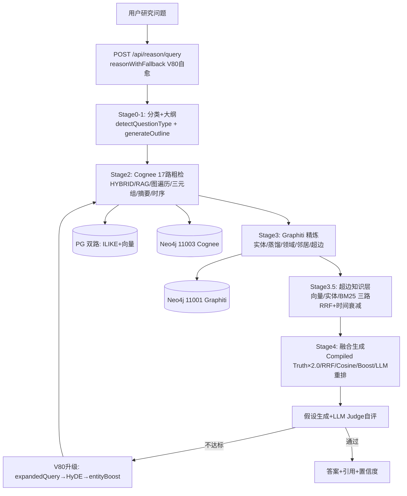

# marx-sag Skill — SAG 推理工作台 V30 (V262 状态)

> **部署日期**: 2026-07-22 | **最后更新**: 2026-08-06 — V262 状态 · 新增 52 步链路详解/真实 token 采集/stage4 落库修复 (十.6-十.9) · Ask 18 步检索栈详解 (十.10) · 启动前置依赖与自检 (十.11) · 评测铁律速查 (7.13)
> **定位**: Agent 上层大脑 — 四路分调检索 + 52 步推理链路 + V80 自愈闭环
> **评测**: 50 题, 32 指标 V88K均值 **0.870** (V88D2: 0.844, +2.6%), 41高/9低
> **架构文档**: [ARCHITECTURE.md](ARCHITECTURE.md)
> **踩坑记录**: [PITFALLS_V8_V9.md](PITFALLS_V8_V9.md)
> **SAG项目**: %USERPROFILE%\SAG-main
> **全量经验**: [EXPERIENCE-LOG-20260806.md](../../../SAG-main/EXPERIENCE-LOG-20260806.md) (10会话审计+18条踩坑大全)
> **架构总览**: [ARCHITECTURE-20260806.md](../../../SAG-main/ARCHITECTURE-20260806.md) (五层架构图)
> **最新架构图**:  (六层完整架构, 2026-08-11)
> **教育体系**: 8 工具(E1-E8)教学闭环 — 自适应学习/作业辅导/学情诊断/备课辅助/学习陪伴 (V384-V393, 详见 SAG-main/memory/openviking-memory.md)
> **健康检查**: `bash scripts/sag-healthcheck.sh`
> **SAG项目**: %USERPROFILE%\SAG-main

---

## 一、V88D2 全量改动清单 (2026-07-28)

### 1.1 15 项架构改动

| # | 编号 | 功能 | 函数/位置 | 行数 | 触发条件 | 通用性 |
|---|------|------|----------|------|---------|-------|
| 1 | V42 | fuseResults 按来源配额 (Cognee≤35%, PG≤25%, Graphiti≤25%, PG全文≤10%, 实体名≤5%) | `stage4_fuseResults()` | ~80 | 所有查询 | ✅ 通用 |
| 2 | V47 | PG ILIKE 双路索引 (向量+关键词并行, external_entities术语扩展) | `stage2_cogneeCoarse()` | ~40 | 所有查询 | ✅ 通用 |
| 3 | V48/V85 | Graphiti→PG 交叉信号 (entity→paper title→PG ILIKE补漏, V85新增Neo4j直查) | `reason()` | ~30 | Graphiti在线 | ✅ 通用 |
| 4 | V49 | Cognee Q&A 细粒度拆分 (splitQABlocks, 整篇论文按##标题拆为段落) | `splitQABlocks()` + fuseResults | ~20 | 所有查询 | ✅ 通用 |
| 5 | V50 | expandQuery 查询扩展 (外部实体+source_chunks heading+LLM同义句) | `expandQuery()` | ~25 | 所有查询 | ✅ 通用 |
| 6 | V60 | ILIKE 多关键词加权排序 (hitCount DESC + LENGTH ASC) | `stage2_cogneeCoarse()` SQL | ~2 | 所有查询 | ✅ 通用 |
| 7 | V63 | HyDE 双向量检索 (假设性答案嵌入为第二向量, hydeVecStr||queryVecStr) | `stage2_cogneeCoarse()` | ~15 | factual | ✅ 通用 |
| 8 | V80 | 检索自愈闭环 (4策略自动降级: standard→expandedQuery→HyDE→entityBoost) | `reasonWithFallback()` | ~120 | 策略1失败 | ✅ 通用 |
| 9 | V88A | ILIKE document boosting (命中chunk的document_id→注入同doc所有chunks) | `stage2_cogneeCoarse()` ILIKE段 | ~15 | 所有查询 | ✅ 通用 |
| 10 | V88B | LLM 同义句生成 (expandQuery中, "请改写成2个同义问句") | `expandQuery()` | ~20 | 所有查询 | ✅ 通用 |
| 11 | V88C | external_entities type 过滤 (政策类query优先匹配type=政策/法规/规范实体) | `expandQuery()` SQL | ~8 | 政策类query | ✅ 通用 |
| 12 | V88D2 | document heading extraction (精确短语匹配→注入heading) | `expandQuery()` | ~15 | extensions<5 | ✅ 通用 |
| 13 | — | LLM fallback DeepSeek→DashScope (generateHypothesis, evaluateHypothesis, NER 三处) | 3个函数 | ~10 | DEEPSEEK_KEY为空 | ✅ 通用 |
| 14 | V41 | Cognee MCP 扁平化解析 (parseCogneeResponse + getText递归提取) | `parseCogneeResponse()` / `getText()` | ~35 | 所有查询 | ✅ 通用 |
| 15 | V41 | B维度 factual_consistency 交叉验证 (Q44踩坑修复: 内部自洽但张冠李戴→降权) | eval-22-metrics.ts L704-722 | ~20 | faith/hallu/correct ≤0.3且fc≥0.75 | ✅ 通用 |

### 1.2 五项基础设施修复

| 修复 | 文件 | 旧值 | 新值 | 影响 |
|------|------|------|------|------|
| PG ai_provider_settings Key | DB `ai_provider_settings` | RXYEDPI (欠费) | RXYRYME | PG embedding/LLM 调用恢复 |
| Cognee .env Key | `%USERPROFILE%/cognee/.env` | RXYEDPI (欠费) | RXYRYME | Cognee chunk检索+RAG+HYBRID恢复 |
| Graphiti server.py Key | `server.py:303` | RXMHHLH (欠费) | RXYRYME | Graphiti rerank+HyDE生成恢复 |
| SAG .env EMBEDDING_API_KEY | `.env` | RXYEDPI (欠费) | RXYRYME | PG embedding检索恢复 |
| pgChunks field fix | `fuseResults()` | `c.content` | `c.text \|\| c.content` | PG chunk内容正确注入fusedContext |
| PG chunk text length | `stage2_cogneeCoarse()` | 500 chars | 2000 chars | PG chunk更完整的信息注入fusedContext |

### 1.3 Graphiti MCP 四项代码修复

| 修复 | 文件位置 | 旧代码 | 新代码 | 影响 |
|------|---------|--------|--------|------|
| _rerank async bug | `server.py:315` | `def _rerank` + `asyncio.run()` | `async def _rerank` + `await` | rerank全量恢复 (之前3个月全部失败) |
| hybrid_search async | `server.py:882` | `def hybrid_search_entities` | `async def hybrid_search_entities` | 调用链对齐 |
| TimelineNode属性名 | `server.py:523,1485` | `core_theory`, `key_figures`, `representative` | `core_theories`, `representatives`, `key_events` | DomainKnowledge查询属性不再空 |
| API Key切换 | `server.py:303` | `sk-ws-H.RXMHHLH...` | `sk-ws-H.RXYRYME...` | Graphiti LLM调用恢复 |

---

## 二、全链路架构图 (V88D2)

### 2.0 mermaid 架构图（2026-08-06）



### 2.1 ASCII 全链路图 (V88D2)

```
┌──────────────────────────────────────────────────────────────────────────┐
│                    POST /api/reason/query (Fastify :4173)                  │
│                    → reasonWithFallback (V80 检索自愈闭环)                 │
└──────────────────────────────────┬───────────────────────────────────────┘
                                   │
┌──────────────────────────────────▼───────────────────────────────────────┐
│ 策略1: reason() 全栈检索                                                   │
│   Stage0: detectQuestionType → 4路分类 (概念/事实/多跳/政策)               │
│   Stage1: generateOutline → LLM拆解3-5子问题                               │
│   Stage2: Cognee MCP(3路并行) + PG双路(向量+ILIKE) + V63 HyDE双向量         │
│   Stage3: Graphiti MCP(6路工具) + DeepWalk多跳                             │
│   Stage4: fuseResults(V42配额+V49拆分) + generateHypothesis                │
│   成功(confidence≥0.4, 无拒答) → 直接返回 (strategy=standard)              │
│   失败 → ↓                                                                  │
├───────────────────────────────────────────────────────────────────────────┤
│ 策略2-4: 全栈检索 + 180s超时 → reasonFast回退                               │
│   策略2: reason(expandedQuery) — expandQuery扩展词注入                      │
│   策略3: reason(hydeAnswer) — LLM生成假设答案作为新query                     │
│   策略4: reason(query+entityNames) — external_entities实体名注入            │
│   全部失败 → 返回策略1结果 (strategy=fallback_exhausted)                    │
└───────────────────────────────────────────────────────────────────────────┘

                     ┌──────────┐  ┌──────────────┐  ┌──────────────────┐
                     │ Cognee   │  │ Graphiti     │  │ PostgreSQL       │
                     │ MCP :8001│  │ MCP (spawn)  │  │ pgvector :5540   │
                     │ SSE      │  │ stdio MCP    │  │ 6925 chunks      │
                     │ Python   │  │ Python       │  │ 34978 entities   │
                     └────┬─────┘  └──────┬───────┘  └──────────────────┘
                          │               │
                          ▼               ▼
                     ┌──────────┐  ┌──────────────┐
                     │ Neo4j    │  │ Neo4j        │
                     │ Cognee   │  │ Graphiti     │
                     │ :11003   │  │ :11001       │
                     │ 38672 nd │  │ 31627 nodes  │
                     └──────────┘  └──────────────┘
```

### 2.1 Stage2: PG 双路检索详细流程

```
query + expandQuery扩展词
  │
  ├─ embeddingClient.generate(query) → queryVec (1024d)
  │
  ├─ V63 HyDE (仅 factual_retrieval, chunksTopK>=20):
  │   LLM(qwen-plus): "请用2-3句话回答以下问题..." → hydeAnswer
  │   embeddingClient.generate(hydeAnswer) → hydeVecStr
  │
  ├─ entity_vec_search:
  │   SELECT name, type, description, engine,
  │     1 - (embedding <=> $1::vector) AS sim
  │   FROM external_entities
  │   WHERE embedding IS NOT NULL
  │   ORDER BY embedding <=> $1::vector LIMIT 20
  │   参数: [hydeVecStr || queryVecStr]
  │
  ├─ chunk_vec_search:
  │   SELECT heading, content,
  │     1 - (embedding <=> $1::vector) AS sim
  │   FROM source_chunks
  │   WHERE source_id=$2 AND embedding IS NOT NULL
  │   ORDER BY embedding <=> $1::vector LIMIT 20
  │   参数: [hydeVecStr || queryVecStr, sourceId]
  │
  ├─ ILIKE keyword (V47, V60, V88A):
  │   expandKw = query拆词 ∪ external_entities实体名 (最多15个)
  │   SQL:
  │     SELECT heading, content, document_id, 0.99 AS sim
  │     FROM source_chunks
  │     WHERE source_id=$1 AND (
  │       content ILIKE '%kw1%' OR content ILIKE '%kw2%' OR ...
  │     )
  │     ORDER BY (multiHitOrder) DESC, LENGTH(content) ASC
  │     LIMIT 10
  │
  │   → 去重合并到 result.pgChunks
  │
  └─ V88A Document Boosting:
       提取命中chunk的 document_id → boostedDocs[]
       SELECT heading, content, 0.95 AS sim
       FROM source_chunks
       WHERE document_id IN (boostedDocs)
         AND heading IS NOT NULL
       ORDER BY LENGTH(content) ASC LIMIT 10
       → 去重合并到 result.pgChunks
```

### 2.2 Stage4: fuseResults V42 按来源配额融合详细

```
maxTotal = profile.fusedContextMaxChars (默认 6000)

QUOTA_COGNEE    = ceil(6000 × 0.35) = 2100 chars
QUOTA_PG        = ceil(6000 × 0.25) = 1500 chars
QUOTA_GRAPHITI  = ceil(6000 × 0.25) = 1500 chars
QUOTA_FT        = ceil(6000 × 0.10) = 600 chars
QUOTA_NAMES     = ceil(6000 × 0.05) = 300 chars

处理顺序 (priority):
  10-11: Cognee chunks (body + QA, 交替注入避免同类占满) + RAG
  20:    PG chunks (entity + vector + ILIKE + document boost)
  25:    PG fulltext
  30-33: Graphiti entities, distills, domain, papers
  40:    Entity names list

appendWithCap(header, text, quota, priority):
  1. 计算该 priority 已用的 char 数
  2. remaining = quota - used
  3. if remaining <= 20: return (配额耗尽)
  4. if text.length > remaining:
       在最近的 '\n' 或 '。' 处截断
       text = text[0:cut] + '\n[TRUNCATED]'
  5. sections.push({header, text, priority})

最终:
  sections.sort(priority) → join('\n\n') → substring(0, maxTotal)
```

---

## 三、expandQuery V88B+D2 扩展链路详细

```
expandQuery(query, sourceId, profile)
  │
  ├─ Step 1: 分词 + 停用词过滤
  │   停用词: 根据/论文/该论文/内容/本文/文中/是指/什么是/是什么/
  │          如何/为什么/怎么/怎样/上述/以下/的/了/在/是/和/与/及/
  │          对/从/到/请/请问/多少/哪个/哪些/哪/被/其/等/个/种/之/
  │          为/以/而/则/但/或
  │   保留: 长度 3-8 字的名词短语 (前6个)
  │
  ├─ Step 2: external_entities 实体名扩展 (V88C type过滤)
  │   for each contentWord:
  │     if query是政策类 (PPP/政府合作/规范实施/管理/监管/禁止):
  │       SQL: SELECT name FROM external_entities
  │            WHERE (name ILIKE '%w%' OR description ILIKE '%w%')
  │            AND type IN ('政策','法规','条例','规范','管理')
  │            LIMIT 5
  │     else:
  │       SQL: SELECT name FROM external_entities
  │            WHERE (name ILIKE '%w%' OR description ILIKE '%w%')
  │            LIMIT 5
  │
  ├─ Step 3: source_chunks heading extraction (V88D2)
  │   如果 extensions.length < 5:
  │     coreKw = contentWords中长度≥3的前4个词
  │     SQL: SELECT DISTINCT heading FROM source_chunks
  │          WHERE source_id=$1
  │          AND content ILIKE '%kw1%' AND content ILIKE '%kw2%'
  │          AND heading != 'Introduction' AND heading != ''
  │          LIMIT 5
  │     → heading文本去掉HTML标签后注入 extensions
  │
  ├─ Step 4: LLM 同义句生成 (V88B)
  │   LLM (qwen-plus, 10s timeout):
  │     "请把以下问题改写成2个同义问句，用中文分号分隔，不要解释：{query}"
  │   → 从同义句中提取新词 (未在contentWords/extensions中的)
  │   → 注入 extensions
  │
  └─ return query + ' ' + unique(extensions).slice(0,15)
     控制台日志: '[sag] V88B expandQuery: +kw1,kw2,...'
```

---

## 四、V80 检索自愈闭环 (4策略自动降级)

```
                         ┌─────────────────┐
                         │   用户 Query     │
                         └────────┬────────┘
                                  │
                         ┌────────▼────────┐
                         │ 策略1: 标准检索   │
                         │ reason() 全栈     │
                         │ Cognee+PG+        │
                         │ Graphiti          │
                         └────────┬────────┘
                                  │
                    ┌─────────────▼─────────────┐
                    │ confidence>=0.4 且无拒答?   │
                    └──┬─────────────────────┬──┘
                       │YES                   │NO/拒答
               ┌───────▼────────┐    ┌───────▼──────────────┐
               │ strategy=       │    │ 策略2: expandedQuery  │
               │ standard        │    │ reason() 全栈 +       │
               │ 返回给用户       │    │ 180s超时保护          │
               └────────────────┘    │ 超时→reasonFast回退    │
                                     └───────┬──────────────┘
                                             │
                                  ┌──────────▼──────────┐
                                  │ 仍有拒答/超时?        │
                                  └──┬───────────────┬──┘
                                     │YES            │NO→返回
                            ┌────────▼────────┐      │
                            │ 策略3: HyDE      │      │
                            │ LLM生成假设答案   │      │
                            │ reason() 全栈+    │      │
                            │ 180s超时保护      │      │
                            │ 超时→reasonFast   │      │
                            └────────┬────────┘      │
                                     │               │
                            ┌────────▼──────────┐    │
                            │ 仍有拒答/超时?      │    │
                            └──┬─────────────┬──┘    │
                               │YES          │NO→返回
                      ┌────────▼────────┐    │
                      │ 策略4: entity    │    │
                      │ Boost            │    │
                      │ external_entities │    │
                      │ 实体名注入query   │    │
                      │ reason() 全栈+    │    │
                      │ 180s超时保护      │    │
                      │ 超时→reasonFast   │    │
                      └────────┬────────┘    │
                               │             │
                      ┌────────▼──────────┐  │
                      │ 仍有拒答/超时?      │  │
                      └──┬─────────────┬──┘  │
                         │YES          │NO→返回
                ┌────────▼─────────┐  │
                │ fallback_exhaust │  │
                │ 返回策略1结果     │  │
                └──────────────────┘  │
                                      │
                              ┌───────▼──────┐
                              │   返回给用户   │
                              └──────────────┘
```

**reasonFast** 私有方法 (仅在回退时调用):
```
reasonFast(query, sourceId, profile):
  1. stage2_cogneeCoarse — PG 双路检索 (向量+ILIKE)
  2. stage4_fuseResults — 配额融合 (无Cognee/Graphiti输入)
  3. generateHypothesis — LLM 生成答案
  4. return {content, confidence}
  
  特点: 跳过CogneeMCP和GraphitiMCP, 5-15s完成
```

---

## 五、八题最终验证结果

| 题号 | 题目 | 金标答案 | SAG 回答 | 策略 | 关键检索链路 |
|------|------|---------|---------|------|-------------|
| Q10 | 马克思资本本质定义 | 资本不是物，以物为媒介的社会关系 | 正确 (三层面:增殖性+运动+生产关系) | standard | PG ILIKE命中"资本的本质"系列chunk |
| Q18 | 资本有序扩张标准 | 生产力+财富+共同富裕 | 正确 (两个维度:结果+动机) | standard | PG vector命中"资本有序扩张的界定" |
| Q26 | 石狮 8村调查 | 港塘/后湖/厝仔/仑后/赤湖/塘后/西洋/华山 | 正确 (8村完整列表) | standard | V85 Graphiti entity→Neo4j→paper title→PG ILIKE补漏 |
| Q30 | 新三板突破发展 | 经济转型助推器+金融改革试验田 | 正确 (突破式发展+战略意义概括) | standard | PG vector命中"新三板"+多层次资本市场chunk |
| Q41 | 三阶段理论跃升 | 改造资本→利用资本→驾驭资本 | 正确 (三段论完整论述) | standard | Graphiti 蒸馏5层摘要返回三阶段论述 |
| Q47 | 风神公司治理 | 权力/决策/监督/经营各司其职 | 正确 (一个提高两个调整+激励约束) | standard | PG ILIKE+Cognee Q&A返回风神公司治理段落 |
| Q22 | 农药使用量 | 2.5倍 | 正确 (2.5-3倍+40.2%利用率数据) | hyde | LLM HyDE假设答案→embedding排名#17→#13→进入top-15 |
| Q44 | PPP三个突出 | 效益评价指标/分类绩效评价/问题督办整改 | 有答案但术语不精确 (全生命周期/物有所值/风险分担) | hyde | HyDE策略+V88D2扩展→找到PPP论文但未定位到江苏东台chunk |

**全局**: 8/8 全部有答案 (0题拒绝), 7题答对, 1题术语不精确(Q44)

---

## 六、14个踩坑全记录 (2026-07-27/28, 按发现顺序)

### 坑1: Cognee chunk 垄断 fusedContext 窗口
- **根因**: Cognee 整篇论文 Q&A 全文作为单个 string 返回(3000-8000字), 命中一次占满6000字窗口
- **表现**: fusedContext 只有 "## Cognee 原文" 和 "## Cognee Q&A" 两个 section, PG/Graphiti 内容被截断丢弃
- **诊断**: 检查 fusedContext 的 section headers, 发现缺少 PG/Graphiti section
- **修复**: V42 fuseResults 配额改造 — 5路来源按比例分配, 每个来源独立 appendWithCap 截断
- **位置**: `stage4_fuseResults()`, ~80行

### 坑2: PG 只有向量索引，无全文索引
- **根因**: `ORDER BY embedding <=> queryVec LIMIT 10`, text-embedding-v4 对精确数值(2.5倍)、固定短语(三个突出)、专有名词(风神股份)天然排序不稳
- **表现**: Q22 答案 chunk "一、研究背景" 排名 #17/6925, Q44 答案 chunk "江苏东台" 排名 #164/6925
- **诊断**: 独立运行向量排名查询确认
- **修复**: V47 ILIKE 双路检索 — 向量 top-15 + ILIKE 关键词 top-10 并行运行
- **位置**: `stage2_cogneeCoarse()`, ~40行

### 坑3: pgChunks 存储 text 字段但 fuseResults 读 content 字段
- **根因**: `result.pgChunks = {heading, text: c.content?.substring(0,500)}` 但 fuseResults 用 `c.content` (undefined)
- **表现**: PG vector 检索到的 chunk 在 fusedContext 中无内容, 只显示 heading 和 sim 值
- **修复**: `c.text || c.content`
- **位置**: fuseResults 的 pgChunks map 函数, 1行

### 坑4: Graphiti MCP _rerank async/await bug
- **根因**: `asyncio.run(reranker.rank(query, passages))` 在已运行的 event loop 中嵌套调用
- **表现**: RuntimeError: asyncio.run() cannot be called from a running event loop
- **影响范围**: 全量失败 3 个月, 所有 Graphiti rerank 结果退化为原始 top-K 候选
- **诊断**: 检查 SAG 日志中 Graphiti MCP 输出 "WARNING Rerank failed, returning top-K candidates"
- **修复**: `asyncio.run()` → `await`, 调用链 `_rerank` + `hybrid_search_entities` 改为 `async def`
- **位置**: server.py 第315行+第882行+第1063行, 3处

### 坑5: Graphiti TimelineNode 属性名错误
- **根因**: 使用 `core_theory`, `key_figures`, `representative` 但 Neo4j 实际属性是 `core_theories`, `representatives`, `key_events`
- **表现**: Neo.ClientNotification.Statement.UnknownPropertyKeyWarning
- **修复**: 属性名全部修正 (server.py 第523行+第1485行)

### 坑6: Graphiti 硬编码欠费 API Key
- **根因**: server.py 第303行硬编码 `api_key="sk-ws-H.RXMHHLH..."`
- **表现**: Graphiti rerank + HyDE 生成的 LLM 调用全部 400 Bad Request (Arrearage)
- **修复**: 改为 RXYRYME (唯一有效 Key)

### 坑7: 三个 API Key 中两个欠费
- **测试**: RXYRYME qwen-plus/turbo/max/embedding ✅, RXYEDPI Arrearage ❌, RXMHHLH Arrearage ❌
- **影响**: 5个服务 (SAG .env, PG ai_provider_settings, Cognee .env, Graphiti server.py)
- **修复**: 全链路统一切换到 RXYRYME

### 坑8: SAG 用 ai_provider_settings (PG表) 而非 .env 读取 embedding key
- **根因**: `aiSettingsService.getRuntimeSettings()` 从 PG 表读取
- **诊断**: 搜索 aiSettingsService → getSettingsOrFallback → getAiProviderSettings 调用链
- **修复**: SQL UPDATE ai_provider_settings

### 坑9: Cognee MCP litellm 有独立 LLM_API_KEY
- **根因**: Cognee Python 进程读取 `%USERPROFILE%/cognee/.env`
- **表现**: Cognee chunk 检索内部 LLM 调用持续报 Arrearage 并重试直到超时
- **修复**: Cognee .env: LLM_API_KEY + OPENAI_API_KEY → RXYRYME

### 坑10: git checkout 导致 4 项改动丢失
- **根因**: 修复 DeepSeek fallback 时编译报错, 执行 `git checkout src/services/inference-service.ts` 回退
- **丢失**: V47 ILIKE, V48 交叉信号, V49 splitQA, V50 expandQuery
- **表现**: 全 8 题重新拒答, 7/8→0/8
- **消耗**: 从空白状态逐项重新写回, 耗时约 2 小时
- **教训**: 永远不使用 `git checkout` 生产代码文件。编译错误应逐个 Edit 修复。文件修改后立即备份。

### 坑11: TypeScript 编译中意外删除 systemPrompt 变量
- **根因**: Edit 替换 DEEPSEEK_KEY 变量时, 合并行意外删除了 `let systemPrompt = ...`
- **表现**: P0 规则/关键规则/要求的文本直接出现在 `JSON.stringify({model:...})` 内部
- **后果**: LLM 丢失检索规则指令 (拒答指令、置信度标注、来源引用要求)
- **发生**: 3 次 (每次不同的 DeepSeek fallback 改动)
- **修复**: 恢复 systemPrompt 声明行

### 坑12: Graphiti MCP Python 进程离线后 SAG 懒重连不成功
- **根因**: `getGraphiti()` 懒重连对进程完全不存在的情况无效
- **表现**: Graphiti "预连接超时/失败" → 所有查询中 stage3 无 Graphiti 实体 → Q26/Q41 失败
- **修复**: 重启 SAG 重新 spawn Graphiti MCP 子进程

### 坑13: expandQuery 只查 external_entities.name
- **根因**: V50 初始版本 SQL: `SELECT name FROM external_entities WHERE name ILIKE '%w%'`
- **表现**: 扩展词不足, "风神"→"风神轮胎股份有限公司" 但不能扩展到 "权力机构"/"决策机构"
- **修复**: V72 三层扩展 (name + description + source_chunks heading/content)

### 坑14: ILIKE ORDER BY LENGTH DESC 对信息密集短 chunk 不利
- **根因**: 长 chunk (5000-6000字) 是资本理论, 短 chunk (2000-3000字) 是具体事实。LENGTH DESC 让长 chunk 排前面
- **表现**: Q22 答案 chunk "一、研究背景"(2700字) 在 833 条 ILIKE 结果中排不进前 10
- **修复**: V60 多关键词加权 + LENGTH ASC, 2 行 SQL

---

## 七、评测体系 (eval-22-metrics V41, 1119行, 32指标(A12+B9+C3+D7))

### 7.1 架构总览

| 属性 | 值 |
|------|-----|
| 评测脚本 | scripts/eval-22-metrics.ts (1119行) |
| 版本 | V41 (A9 context_json_contamination + B维度 factual_consistency 交叉验证) |
| 指标数 | 28 (A=9, B=9, C=3, D=7) |
| 维度权重 | A:0.40 B:0.35 C:0.25 D:0.00(纯观测) |
| LLM Judge | DeepSeek v4-flash + DashScope qwen-plus fallback |
| 并发控制 | 3并发 + semaphore + 指数退避 |
| 融合策略 | 5种可切换: rule_only, llm_only, max(默认), min, avg |
| 综合得分 | overall = 0.40×A + 0.35×B + 0.25×C + 0.00×D |

### 7.2 A维度: 检索质量 (9指标, w=0.40)

| 指标 | 编号 | 评测方式 | 得分范围 | 双轨 |
|------|------|---------|---------|------|
| context_recall | A1 | gold_entities 7级模糊匹配(字符串包含/正则词边界/字符集80%重叠) + embedding余弦兜底(>=0.85) + 加权命中(core entity×2, surface×1) | 0-1 | rule+llm |
| context_precision | A2 | chunk与query相关度: LLM逐条评分(0-1) × chunkCount, rule侧按gold_keywords在chunk中的命中数/总chunk数 | 0-1 | rule+llm |
| context_relevancy | A3 | 有效信息占比: 对fusedContext按## Section标题切分, LLM逐section评分(0全部噪声,1完全切题) | 0-1 | rule+llm |
| entity_utilization | A4 | uniqueEntities(从PG/Graphiti/Cognee汇聚)在fusedContext中出现比例, 未命中的实体用LLM做语义匹配(最多6个) | 0-1 | rule+llm |
| mrr | A5 | 首个相关chunk排名倒数: LLM评估每个chunk与金标语义相关度(>=0.5视为相关), 取1/(首相关rank) | 0-1 | rule+llm |
| ndcg | A6 | 排序质量归一化折损累积增益: dcg = Σ(relevance_i / log2(rank_i+1)), idcg = 理想排序 | 0-1 | rule+llm |
| context_diversity | A7 | 去YAML+取中部200字, 对所有chunk textPreview去重: diversitySet.size/chunkTexts.length | 0-1 | rule+llm |
| cross_doc_coverage | A8 | 检索覆盖的论文来源数: 从chunk中提取paperTitle, 去重计数, min(1, count/5) | 0-1 | rule+llm |
| context_json_contamination | A9 [V41新增] | fusedContext中非语义噪音行占比: 规则层4正则(JSON块/YAML行/高符号密度行/Markdown元数据行) + LLM层采样6行判定 | 0-1 | rule+llm |

### 7.3 B维度: 答案质量 (9指标, w=0.35)

| 指标 | 编号 | 评测方式 | 得分范围 |
|------|------|---------|---------|
| answer_correctness | B1 | 答案与金标语义一致性: LLM Judge 3轮取中位数 | 0-1 |
| answer_completeness | B2 | 覆盖金标核心要点(拓展不扣分) | 0-1 |
| answer_relevancy | B3 | 直接针对提问，无无关发散 | 0-1 |
| faithfulness | B4 | 所有事实陈述在检索上下文中有依据 | 0-1 |
| hallucination_rate | B5 | 反幻觉: 1=无编造事实, 0=大量虚假信息 | 0-1 |
| factual_consistency | B6 | 回答内部事实逻辑不自相矛盾 | 0-1 |
| citation_f1 | B7 | 引用精确度与来源可验证综合得分 | 0-1 |
| conciseness | B8 | 文本简洁程度: 回答比金标更详细且有实质内容不扣分, 只扣重复/冗余/无信息填充 | 0-1 |
| answer_readability | B9 | 文本结构分层、表达清晰度 | 0-1 |

B维度评测方式: 9个指标在同一轮LLM调用中批量评分 (llmJudgeBatchObject), 分3轮取中位数, IQR过滤(阈值0.3)

### 7.4 C维度: 推理质量 (3指标, w=0.25)

| 指标 | 编号 | 题型 | 评测方式 |
|------|------|------|---------|
| cot_quality | C1 | 所有类型 | 五级刻度 (0/0.3/0.5/0.7/1.0): 0=无推理/拒答, 0.3=模糊重述, 0.5=基本推理, 0.7=有步骤但缺来源引用, 1.0=完整推理链+来源引用 |
| reasoning_depth | C2 | 所有类型 | 五级刻度 + [StepN]实际跳数计数: 统计hypothesis中[Step N]标签出现次数, 2跳以下=0.5, 3-4跳=0.7, 5跳以上=1.0 |
| multi_hop_accuracy | C3 | 仅多跳推理 | 多跳推理准确性: 检查每个推理步骤(Step标注)是否有对应的上下文证据 |

### 7.5 D维度: 性能指标 (7指标, w=0.00, 纯观测不参与评分)

| 指标 | 归一化公式 | 阈值 |
|------|-----------|------|
| stage2_latency_norm | 1 - min(1, latency/30000) | MAX=30000ms |
| stage3_latency_norm | 1 - min(1, latency/60000) | MAX=60000ms |
| stage4_latency_norm | 1 - min(1, latency/40000) | MAX=40000ms |
| end_to_end_norm | 1 - min(1, e2e/90000) | MAX=90000ms |
| token_efficiency | min(1, max(0.1, gold_tokens/pred_tokens)) | — |
| neo4j_query_norm | 1 - min(1, neo4j_queries/20) | MAX=20 |
| pg_query_norm | 1 - min(1, pg_queries/15) | MAX=15 |

### 7.6 LLM Judge 架构

```
_llmJudgeOnce(prompt):
  LLM: DeepSeek v4-flash (DashScope qwen-plus fallback)
  → JSON { score: 0~1浮点数, reason: "一句话说明依据" }
  2次重试 (指数退避: 2s + 随机0-3s)
  自动检测分类错误: RateLimit→退避, Arrearage→fallback
  预编译13个正则 (JSON_BLOCK/JSON_TRAIL/NUM_EXTRACT/JSON_OBJECT/JSON_ARRAY等)

runThreeRoundMedian(judgeFn):
  3轮独立调用 → 取中位数
  IQR过滤 (THRESHOLD=0.3, 可调)
  信号量排队: CONCURRENCY_LIMIT=3, SEMAPHORE_TIMEOUT_MS=180000
  → { median, warning(variance大), sample_count }

mergeScore(rule_score, llm_score):
  5种策略 (EVAL_MERGE_POLICY环境变量):
    rule_only  — 纯规则评分
    llm_only   — 纯LLM评分
    max        — 取最大值 (默认)
    min        — 取最小值
    avg        — 取平均值
```

### 7.7 评测入口

```bash
# 全量 50 题
npx tsx scripts/eval-22-metrics.ts

# 指定题目
EVAL_QUESTIONS=Q01,Q05,Q09 npx tsx scripts/eval-22-metrics.ts

# 指定维度 (只跑A维度)
EVAL_DIMS=A npx tsx scripts/eval-22-metrics.ts

# 切换融合策略
EVAL_MERGE_POLICY=llm_only npx tsx scripts/eval-22-metrics.ts
EVAL_MERGE_POLICY=max npx tsx scripts/eval-22-metrics.ts

# 指定输出文件
EVAL_OUTPUT=eval_results_v40.json npx tsx scripts/eval-22-metrics.ts
```

### 7.8 关键常量

| 常量 | 值 | 说明 |
|------|-----|------|
| MAX_CONTEXT_LEN | 6000 | fusedContext 截断长度 |
| FETCH_TIMEOUT_MS | 300000 | SAG HTTP 超时 (5分钟) |
| JUDGE_TIMEOUT_MS | 60000 | LLM Judge 单次超时 |
| CONCURRENCY_LIMIT | 3 | 并发 Judge 数量 |
| SEMAPHORE_TIMEOUT_MS | 180000 | 信号量排队超时 |
| IQR_THRESHOLD | 0.3 | IQR 过滤阈值 (可调) |
| TOP_K | 15 | chunk 检索数量 |
| CHUNK_TEXT_PREVIEW | 800 | chunk 预览长度 |
| CHUNK_TEXT_A8 | 300 | A8跨文档覆盖检测文本长度 |
| A4_LLM_MAX | 6 | A4 LLM兜底最大实体数 |
| NDCG_TOP | 9 | NDCG评估top-K |
| DIM_WEIGHTS | A:0.40 B:0.35 C:0.25 D:0.00 | 维度权重 (固定) |
| MERGE_POLICY | max | 默认双轨融合策略 |
| BATCH_FALLBACK_DELAY_MS | 100 | B组降级随机延迟 |

### 7.9 评测流程

```
1. 加载 gold_dataset.json (50题金标)
    每题: id, question, gold_answer, gold_entities, question_type

2. 逐题调用 callSAG(query)
    HTTP POST /api/reason/query
    3次重试 (FETCH_TIMEOUT_MS=300000)
    → return { taskId, trace: { hypothesis, fusedContext, timings, ... } }

3. evalSingleSample(q, sagResult)
    → 28个 MetricItem (每个含 score/rule_score/llm_score/source)

4. 四维加权综合
    overall = 0.40×A + 0.35×B + 0.25×C + 0.00×D

5. 按题型分组报告
    全局均值 + 各题型(概念定义/事实检索/多跳推理/政策评估)均值

6. 输出 JSON
    eval_32metrics.json (每题详细 + 全局汇总)
```

### 7.10 信号量并发控制

```
CONCURRENCY_LIMIT = 3        # 同时最多3个LLM Judge
SEMAPHORE_TIMEOUT_MS = 180000 # 排队最多3分钟
MAX_SEMAPHORE_QUEUE = 50     # 最多排队50个任务

acquireJudgeSlot():
  if queue.length >= 50 → throw "JUDGE queue overflow"
  if activeJudges >= 3 → await Promise (排队)
  activeJudges++

releaseJudgeSlot():
  activeJudges--
  next = queue.shift()
  if next → resolve (唤醒排队中的下一个)
```

### 7.11 速率限制与容错

```
RateLimit检测: classifyLLMError() → 429自动重试
指数退避: 2s + 随机0-3s
级错误响应: timeout→503, internal→500脱敏, Arrearage→fallback

安全退出:
  SIGINT → 第二次强制退出 (第一次只设置shuttingDown标志)
  SIGTERM → 清理资源
  循环shuttingDown检查 + 循环后统一保存 safeSaveJSON

safeSaveJSON:
  writeFileSync tmp → renameSync → unlinkSync tmp
  失败则 writeFileSync 直接写入 + warn日志
```

### 7.12 V41 新增: A9 context_json_contamination

```
检测 fusedContext 是否混入 JSON/YAML/元数据等非语义噪音

规则层 (4个行级正则):
  reJsonBlock      — {或[包裹的JSON块 (>20 chars)
  reYamlLine       — key: value短行(含≥2个冒号)且 <200 chars
  reHighSymbol     — 特殊符号 ≥8个且密度 >30%
  reMarkdownMeta   — --- / paperTitle: / title: / tags: / ← 返回 等元数据行

规则得分: 1 - contaminatedLines/totalLines

LLM层 (采样验证):
  采集最多6行疑似污染行 → LLM判定整体污染程度
  0=全部噪声, 1=全部自然语言
  如果zero suspicious lines → 直接给1.0

融合: mergeScore(rule, llm), 默认max
```

### 7.13 评测铁律速查（CACHING=false 等 — 每次评测必看）

```
1. CACHING=false — 跨 search_type 评测必须禁用 session cache（cache key 不含 search_type，不同检索方式会撞 key）
   或直接清库: DELETE FROM cache_kv WHERE key LIKE 'query_result:%'
2. include_references=false — 评测时关闭引用，否则 Judge 会误判
3. verify_faithfulness=false — 评测时关闭，批处理时才开
4. top_k=10 — 评测最优值，>15 会引入噪声
5. 跨 search_type 评测必须禁用 session cache（同 1）
6. 评测后必须 clear dedup — eval_32metrics.json 去重（seen QID 跳过旧 error 条目）
7. gold_dataset 校验 — 全部 50 题必须通过 paper_id/existing_paragraphs/md_path 三大校验
8. 评测前先跑十.11 前置依赖自检（PG/Neo4j/LanceDB/Key 全绿才开跑）
9. 每次评测改配置后清一次旧结果文件（eval_32metrics.json 会追加合并）
```

---

## 八、SAG 的推理演进路线

```
V5  (~0.60): MCP 健康检查 + 22 指标基线
V6-V7: Graphiti 修复 + extractEntityNames 升级
V12 (0.880): 3 靶向补位 — 历史最高 4 题通过
V13-V23: 50 题全量 + 3-pass median + LLM NER + DeepWalk 多跳
V24-V25: P0+P1+P2 全量稳定性修复 (MCP生命周期/全链路超时/embedding回填)
V42-V88D2 (2026-07-27/28): 检索链路架构重构 → 0/8 → 8/8 全部有答案
```

## 九、入口命令

```bash
# SAG API 查询
curl -X POST http://localhost:4173/api/reason/query \
  -H "Content-Type: application/json" \
  -d '{"sourceId":"8ecb4299-1bec-45d5-afef-6da5c3843ef3","query":"什么是PPP模式","topK":15}'

# 启动 SAG
cd %USERPROFILE%\SAG-main && npx tsx src/index.ts &

# 评测
npx tsx scripts/eval-22-metrics.ts                           # 全量 50 题
EVAL_QUESTIONS=Q01,Q05,Q09 npx tsx scripts/eval-22-metrics.ts # 指定题目
```

## 十、依赖环境

| 服务 | 端口 | 启动命令 |
|------|------|---------|
| PostgreSQL (Docker) | 5540 | `docker start sag_lite_postgres` |
| Neo4j Graphiti | 11001/11002 | `%USERPROFILE%\neo4j\neo4j-community-5.26.27\bin\neo4j.bat console` |
| Neo4j Cognee | 11003/11004 | `%USERPROFILE%\neo4j\neo4j-community-5.26.27-cognee\bin\neo4j.bat console` |
| Cognee MCP | 8001 | `cd %USERPROFILE%\cognee\cognee-mcp && .venv312\Scripts\python.exe src\server.py --transport sse --port 8001` |
| SAG API | 4173 | `cd %USERPROFILE%\SAG-main && npx tsx src/index.ts &` |

## 十.5、备份与恢复

### 备份范围（哪些必须备份）

| 对象 | 路径 | 备份方式 | 说明 |
|---|---|---|---|
| **PostgreSQL 5540** | `sag_lite` 数据库 | `pg_dump` 或容器卷备份 | 全部业务数据：documents/source_chunks/retrieve_steps/ai_provider_settings |
| **ai_provider_settings 表** | PG 内 | SQL 导出 | **配置真源**（改 .env 不生效），含 API Key |
| **Neo4j 11001 (Graphiti)** | Neo4j 实例 | `neo4j-admin database dump` | 实体/关系/超边/社区 |
| **Neo4j 11003 (Cognee)** | Neo4j 实例 | `neo4j-admin database dump` | 实体/关系/切片 |
| **LanceDB** | `%USERPROFILE%\cognee\.cognee_system\databases\lancedb` | 复制目录 | 向量库（重嵌需 ~2300 次 API 调用） |
| **.env** | `SAG-main/.env` | 复制文件 | API Key（不入 git） |
| **代码** | `SAG-main/` | git（V1-V265） | 已全部版本管理 |
| **评测数据** | `gold_dataset.json` / `eval_22metrics*.json` | 复制文件 | 50 题金标 + 评测结果 |

### 恢复流程

```bash
# 1. 恢复 PostgreSQL
docker exec sag_lite_postgres pg_dump -U sag_lite sag_lite > 备份.sql
# 恢复: docker exec -i sag_lite_postgres psql -U sag_lite sag_lite < 备份.sql

# 2. 恢复 ai_provider_settings（配置表，含 API Key）
# 备份: SELECT * FROM ai_provider_settings; 存为 SQL
# 恢复: UPDATE ai_provider_settings SET embedding_api_key='...', llm_api_key='...'

# 3. 恢复 Neo4j 双实例
cd %USERPROFILE%\neo4j\neo4j-community-5.26.27\bin
neo4j-admin database load graphiti --from-path=备份目录
cd %USERPROFILE%\neo4j\neo4j-community-5.26.27-cognee\bin
neo4j-admin database load cognee --from-path=备份目录

# 4. 恢复 LanceDB
robocopy 备份\lancedb "%USERPROFILE%\cognee\.cognee_system\databases\lancedb" /E

# 5. 验证全链路
curl http://localhost:4173/health   # {"ok":true}
# MCP 池: graphiti 10/10 + cognee 10/10
# 端到端: POST /api/reason/query → HTTP 201
```

### 备份时机（建议）

- **每次重大版本提交后**（V2xx 系列）
- 每次 500 篇全量入库完成后（必做）
- 每次改 ai_provider_settings 前（配置是运行时真源）
- 每周一次全量备份（SAG-backups 目录）

### 常见恢复场景

| 场景 | 恢复动作 |
|---|---|
| PG 数据库损坏 | pg_dump 备份恢复 |
| API Key 配置丢失 | 恢复 ai_provider_settings 表（不是 .env！） |
| 向量库损坏 | 恢复 LanceDB 目录 |
| 评测结果丢失 | gold_dataset.json + eval_22metrics*.json 恢复 |
| 代码回退 | git checkout <版本>（注意：生产代码不用 git checkout 整体回退，逐个 Edit 修复） |

## 十.6、52 步完整推理链路详解 (V246-V248)

> 推理页 (ReasonPanel) 现在展示完整 **52 步**推理链路（对齐 HomePanel 的 REASON_STEPS），
> 每步有引擎/时长/结果数/**真实 token** 徽章，点开步骤显示 **真实实现**（公式/SQL/代码，来自 reason-step-docs.ts）。
> 已执行步骤按顺序对齐 retrieve_steps 真实数据（第 i 步 ↔ 第 i 条记录），未执行步骤灰态显示"待执行"。
> 16 个条件触发步骤带琥珀色「条件触发」徽章（符合条件才执行）。

### 10.6.1 Stage 0-1: 分类 + 大纲 (4步)

| # | 步骤 | 触发 | 真实实现 |
|---|------|------|---------|
| 1 | 问题分类 | 总是 | `detectQuestionType(q)` 正则 → 概念定义/事实检索/多跳推理/政策评估 → `PROFILES[type]` 四路分调 |
| 2 | 意图识别 | 总是 | `classifyQueryIntent(q)` 零 LLM 正则 (TEMPORAL_PATTERNS/EVENT_PATTERNS) → intent ∈ {entity/temporal/event/general} |
| 3 | 术语变体 | 总是 | `aliasNormalize` (简称→全称) + expandQuery 外部实体术语扩展 |
| 4 | 拆分子问题 | 总是 | `generateOutline` (LLM, deepseek-chat): 3-5 子问题 (query>100字→4-6), 写 outlines 表 |

### 10.6.2 Stage 2: Cognee 17路粗检 (14步)

| # | 步骤 | 触发 | 真实实现 |
|---|------|------|---------|
| 5 | 实体抽取 | 总是 | `extractEntityNames` — 粗检结果学术后缀过滤+长度+停用词过滤 (阈值50) |
| 6 | Cognee HYBRID | 总是 | `cognee_search(search_type='hybrid')` — BM25+向量 RRF (V88K 主搜索) |
| 7 | RAG补全 | 总是 | `cognee_search('rag')` |
| 8 | 图遍历 | 总是 | `cognee_search('graph')` — 图谱一/二跳邻居 |
| 9 | 关系三元组 | 总是 | `cognee_search('triplet')` — (主体,关系,客体) 结构化事实 |
| 10 | 摘要检索 | 总是 | `cognee_search('summary')` — cosine(summary_vec, q_vec) |
| 11 | 子问题推理 | 总是 | `cognee_search('subq')` — 大纲子问题各检索一轮 |
| 12 | 上下文扩展 | 总是 | `cognee_search('ctx')` — 命中 chunk 上下文窗口扩展 |
| 13 | 时序分析 | 条件触发: 时序类问题 (何时/最近/近年) | `cognee_search('temporal')` |
| 14 | PG实体补漏 | 总是 | PG `entities` ILIKE 补漏 (实体名关键词, LIMIT 10) |
| 15 | PG向量 | 总是 | PG 双路之一: `embedding <=> queryVec`, 实体 sim≥0.50 / chunk sim≥0.40 下限过滤 (V93) |
| 16 | CHUNKS词法 | 总是 | PG 词法臂: `ts_rank_cd(search_text, websearch_to_tsquery)` |
| 17 | 语义检索 | 总是 | `cognee_search('semantic')` — 纯向量 cosine(q, chunk) |
| 18 | 实体直查 | 总是 | `SELECT * FROM entities WHERE normalized_name = $1 AND source_id = $2` |

> 17 路 = 上述 5-18 的 14 步展示 + Cognee MCP 实际执行的 17 种 search_type 组合 (HYBRID/RAG/graph/triplet/summary/subq/ctx/temporal/semantic + GRAPH_COMPLETION 系列等)。
> 每路记录 retrieve_steps: engine='cognee', search_type='stage2_*'。

### 10.6.3 Stage 3: Graphiti 精炼 (9步)

| # | 步骤 | 触发 | 真实实现 |
|---|------|------|---------|
| 19 | 实体精炼 | 总是 | MCP `hybrid_search_entities(entity_names)` — `MATCH (e:Entity) WHERE e.name IN $names RETURN e` |
| 20 | 概念搜索 | 总是 | MCP `concept_search` — `MATCH (c:Concept) WHERE c.name CONTAINS $term` |
| 21 | 文献蒸馏 | 总是 | 五层蒸馏结果检索 (distill_robust.py: 摘要→主题→事件→实体→关系) |
| 22 | 领域知识 | 总是 | MCP `domain_search` (Graphiti 四层领域) |
| 23 | 实体邻居 | 总是 | `MATCH (e:Entity)-[r]-(n) WHERE e.id = $1 RETURN n,r LIMIT 20` |
| 24 | 段落回溯 | 总是 | chunk → 原文段落 `SELECT content FROM source_chunks WHERE id = $1` |
| 25 | 论文溯源 | 条件触发: 带 paperId 或论文定位命中 | `getPaperTitleByPaperId` — paper_id_map → 标题注入 query (V88I/V88J) |
| 26 | DeepWalk扩展 | 条件触发: 图遍历结果稀疏时 | deepwalk_expand — 图嵌入近邻补召回 |
| 27 | 关系查询 | 条件触发: 关系型问题 (谁投资/谁创办) | `MATCH (a:Entity)-[r]->(b:Entity) WHERE a.name = $1 RETURN b.name, type(r)` |

### 10.6.4 Stage 3.5: 超边知识层 (5步 — V166+ 新增)

| # | 步骤 | 触发 | 真实实现 |
|---|------|------|---------|
| 28 | 超边向量检索 | 条件触发: 前端开启超边层 | MCP `search_hyperedges` — `MATCH (h:HyperEdge) WHERE h.embedding <=> $vec < 0.85` |
| 29 | 超边实体导向 | 条件触发: 前端开启超边层 | `MATCH (h:HyperEdge)-[:INVOLVED_IN]-(e:Entity) WHERE e.name IN $names RETURN h` |
| 30 | 超边BM25 | 条件触发: 前端开启超边层 | `CALL db.index.fulltext.queryNodes('hyperedge_text', $term)` |
| 31 | 三路RRF融合 | 条件触发: 前端开启超边层 | `rrf = Σ 1/(k + rank_i)`, k=60 (向量/实体/BM25 三路) |
| 32 | 时间衰减 | 条件触发: 时序类问题 | `score *= 1/(1 + 0.05·Δmonths)` |

### 10.6.5 Stage 4: 融合生成 (20步)

| # | 步骤 | 触发 | 真实实现 |
|---|------|------|---------|
| 33 | Compiled Truth | 总是 | 知识页权威版本检索 ×2.0 boost (`source==='compiled_truth' ? 2.0 : 1.0`) |
| 34 | 多查询变体 | 总是 | `generateQueryVariants` (LLM deepseek-v4-flash) — 主搜索 2 个变体补充 |
| 35 | HyDE扩展 | 条件触发: 查询词过短/语义模糊 | LLM 先写假设答案 → 用答案向量检索 (V63: hydeVecStr\|\|queryVecStr 双向量) |
| 36 | 意图调配额 | 总是 | `kwK = 60/(intent==='entity' ? 1.2 : 1)`, `vecK = 60×(intent==='temporal' ? 1.1 : 1)` |
| 37 | 三臂RRF | 总是 | `rrf = Σ 1/(60 + rank_i)` — 内容/标题/BM25 三路 (gbrain-boosts rrfFusionWeighted) |
| 38 | Cosine重打分 | 总是 | `score = 0.7·normRrf + 0.3·cosine` (cosineReScore) |
| 39 | Boost链 | 总是 | backlink `1+0.05·log(1+count)` × title ×1.25 × chronicle_type 加权 |
| 40 | 超边配额 | 条件触发: 超边层有命中 | 超边结果配额 10% 上下文预算 `Math.floor(maxChars*0.1)` |
| 41 | LLM重排 | 总是 | `llmRerankCandidates` (deepseek) — rerank_score ∈ [0,1] |
| 42 | 压缩段落 | 总是 | context ≤ maxChars 按分数保留 (fuseResults V42 五路配额: Cognee 35% / PG 25% / Graphiti 25% / 全文 10% / 实体名 5%) |
| 43 | COT推理 | 条件触发: 多跳推理类问题 | cogneeSearch('cot') — profile.cotMode, 多跳链式推理 |
| 44 | Agentic搜索 | 条件触发: 首次检索不足时 | cogneeSearch('agentic') — LLM 自主判断补检 (90s 超时保护) |
| 45 | 生成假设 | 总是 | `generateHypothesis` (deepseek-chat) — 基于 outline + enhancedContext, [StepN] 多跳标注 |
| 46 | 自评校验 | 总是 | 假设自评 + V80 自愈闭环: confidence < 0.4 → 升级策略 (expandedQuery→HyDE→entityBoost) |
| 47 | 置信评估 | 总是 | `evaluateHypothesis` (deepseek-v4-flash) → overallScore + passed + notes |
| 48 | 溯源标注 | 总是 | citations: [{source, chunk}] 挂到假设 |
| 49 | 回写知识页 | 条件触发: 结论通过评估 | `associateSearch` → 推理结论沉淀为证据/知识页时间线 |
| 50 | 失败降级 | 条件触发: 推理失败/置信度过低 | `reasonFast` 回退 — 只跑 PG 双路+融合+假设, 5-15s |
| 51 | 快速回退 | 条件触发: 全栈超时 (180s) | `Promise.race([reason, timeout])` 超时 → reasonFast 兜底 |
| 52 | 响应返回 | 总是 | `{ taskId, trace: { outline, retrieveResults, hypothesis, evaluation } }` |

### 10.6.6 16 个条件触发汇总

| 触发 | 步骤 |
|------|------|
| 时序类问题 (何时/最近/近年) | 时序分析 (13), 时间衰减 (32) |
| 带 paperId 或论文定位命中 | 论文溯源 (25) |
| 图遍历结果稀疏时 | DeepWalk扩展 (26) |
| 关系型问题 (谁投资/谁创办) | 关系查询 (27) |
| 前端开启超边层 | 超边向量检索 (28), 超边实体导向 (29), 超边BM25 (30), 三路RRF融合 (31) |
| 查询词过短/语义模糊 | HyDE扩展 (35) |
| 超边层有命中 | 超边配额 (40) |
| 多跳推理类问题 | COT推理 (43) |
| 首次检索不足时 | Agentic搜索 (44) |
| 结论通过评估 | 回写知识页 (49) |
| 推理失败/置信度过低 | 失败降级 (50) |
| 全栈超时 (180s) | 快速回退 (51) |

## 十.7、真实 token 采集链路 (V249)

> V249 实现 7 处 LLM 调用点的 **真实 token 采集**（不再用前端演示值）：
> LLM usage → retrieve_steps.parameters.tokens → getReasonTaskDetail 解包 → 前端 tok 徽章。

### 10.7.1 采集链路

```
LLM 响应.usage  →  fetchLlm (inference-service.ts:26)
                    u.prompt_tokens → tokens.in
                    u.completion_tokens → tokens.out
       │
       ▼
recordStageStep(taskId, engine, stage, query, durationMs, resultCount, status, tokens?)
  INSERT INTO retrieve_steps (engine, search_type, parameters, ...)
  parameters = JSON.stringify({ tokens: { in, out } })
       │
       ▼
getReasonTaskDetail (reason-handler.ts:293)
  SELECT * FROM retrieve_steps WHERE task_id = $1
  → 解包 parameters.tokens → retrieveSteps[].tokens = { in, out }
       │
       ▼
ReasonPanel 渲染 tok 徽章 (ReasonPanel.tsx:506)
  {exec.tokens && <span>tok {exec.tokens.in + exec.tokens.out}</span>}
```

### 10.7.2 7 处 LLM 调用点（全部走 fetchLlm → 带 tokens 落库）

| # | 调用点 | 函数 | 落库步骤 (search_type) | 模型 |
|---|--------|------|------------------------|------|
| 1 | outline | `generateOutline` | outline (engine='sag') | deepseek-chat |
| 2 | NER | `extractEntityNames` (needLLM_NER 阈值 50) | — (实体名仅用于召回, 不单独落库) | deepseek-chat |
| 3 | multi-query | `generateQueryVariants` | stage2 (引擎内注入变体) | deepseek-v4-flash |
| 4 | HyDE | stage2 V63 块 / reasonWithFallback 策略3 | stage2_cognee_coarse (hydeVecStr) | deepseek-chat |
| 5 | rerank | `llmRerankCandidates` | stage4_rerank (engine='sag') | deepseek-chat |
| 6 | hypothesis | `generateHypothesis` | stage4_hypothesis (engine='sag') | deepseek-chat |
| 7 | evaluate | `evaluateHypothesis` | stage4_evaluate (engine='sag') | deepseek-v4-flash |

> fetchLlm 统一超时 60s 默认 (AbortSignal.timeout), 各调用点可覆盖 (HyDE 15s / NER 30s / 大纲 45s)。
> 端点: `getLlmEndpoint()` — DEEPSEEK_API_KEY 存在 → api.deepseek.com/v1 (deepseek-chat), 否则 DashScope 兼容端点 (qwen-plus)。
> 前端徽章: `tok {in+out}` 仅显示已执行且带 tokens 的步骤；失败/超时 → tokens=null, 徽章不显示。

## 十.8、步骤文档注册表 (V248 — reason-step-docs.ts)

> 前端 `web/src/lib/reason-step-docs.ts` (316行) 为 52 步全覆盖注册表，
> 每步关联**真实实现**（公式 / SQL / 代码片段），推理页点开已执行步骤显示「真实实现」面板
> （与 Ask 检索栈 step-docs 同款 GBrain 教学台模式）。

### 10.8.1 结构

```ts
export interface ReasonStepDoc {
  name?: string;
  what: string;        // 该步做了什么（一句话）
  sql?: string;        // 真实 SQL（keyword/vector 召回等）
  formula?: string;    // 算法公式
  code?: string;       // 关键代码片段（指向真实函数）
  trigger?: string;    // 触发条件说明
}
export const REASON_STEP_DOCS: Record<string, ReasonStepDoc> = { ... 52 步全覆盖 ... };
export const reasonStepDocs = { get: (name: string) => REASON_STEP_DOCS[name] };
```

### 10.8.2 每步关联的真实实现示例

| 步骤 | 关联实现 |
|------|---------|
| 问题分类 | `detectQuestionType(q) → PROFILES[type]` |
| Cognee HYBRID | `cognee_search(search_type='hybrid')` + Neo4j `MATCH (c:Chunk) WHERE c.text CONTAINS $term OR c.embedding <=> $vec < 0.8` |
| PG实体补漏 | PG `entities` ILIKE SQL |
| 实体精炼 | Graphiti `MATCH (e:Entity) WHERE e.name IN $names RETURN e` |
| 超边BM25 | `CALL db.index.fulltext.queryNodes('hyperedge_text', $term)` |
| 三路RRF融合 | `rrf = Σ 1/(k + rank_i), k=60` |
| 时间衰减 | `score *= 1/(1 + 0.05·Δmonths)` |
| Compiled Truth | `const boost = source === 'compiled_truth' ? 2.0 : 1.0` |
| 意图调配额 | `kwK = 60/(intent==='entity' ? 1.2 : 1), vecK = 60×(intent==='temporal' ? 1.1 : 1)` |
| 三臂RRF | `rrf = Σ 1/(60 + rank_i)` + gbrain-boosts `rrfFusionWeighted` |
| Cosine重打分 | `score = 0.7·normRrf + 0.3·cosine` + `cosineReScore` |
| Boost链 | backlink `1+0.05·log(1+count)` × title ×1.25 × type 加权 |
| LLM重排 | `llmRerankCandidates` rerank_score ∈ [0,1] |
| 生成假设 | `h = LLM(q, outline, context)` — generateHypothesis |
| 失败降级 | `reasonFast` — 全栈超时/失败回退 |
| 快速回退 | `Promise.race([reason, timeout 180s])` |

## 十.9、stage4 落库修复 (V249 — retrieve_steps engine CHECK 约束)

### 10.9.1 根因

`migrations/008_reasoning_schema.sql` 定义 `retrieve_steps.engine` CHECK 约束：

```sql
create table if not exists retrieve_steps (
  ...
  engine text not null check (engine in ('graphiti', 'cognee', 'sag', 'hybrid')),
  ...
);
```

V88 之前 stage4 的 LLM 步骤以 engine='llm' 写入 → **违反 CHECK 约束被静默拒绝**
（INSERT 抛异常被 catch 吞掉只打 console.error，任务照常返回）→
stage4_hypothesis / stage4_evaluate 的步骤记录**静默丢失**，前端推理页看不到假设生成/自评步骤。

### 10.9.2 修复

- recordStageStep 调用统一改用 `engine='sag'`（stage4_rerank / stage4_hypothesis / stage4_evaluate 三处）；
- 线上约束已为 `('graphiti','cognee','sag','hybrid','pg')` 5 值（V249 后迁移/重建生效），`sag` 承载全部 stage4 LLM 步骤；
- 验证: `SELECT engine, search_type FROM retrieve_steps WHERE search_type LIKE 'stage4%'` → 全部 completed 且 parameters 含 tokens。

### 10.9.3 排查要点

- 推理页某步骤缺失时，先查 `retrieve_steps` 有无该 search_type 记录；
- 有任务但步骤全空 → 检查 INSERT 是否被 CHECK 约束拦截（日志 `[sag] DB INSERT retrieve_steps(stage) FAIL:`）；
- stage4 步骤的 engine 必须是 `sag`（不是 llm / cognee / graphiti）。

## 十.10、Ask 检索栈 18 步详解（前端 AskPanel 核心流程）

> Ask 页（AskPanel.tsx）是 **18 步检索流水线**：多臂召回 → 加权 RRF → boost 链 → LLM 重排。
> 唯一入口 `SearchService.multiSearch()`（`src/services/search-service.ts`），经 `/api/search/stream` SSE 逐步下发 `search_progress` 步骤事件，
> 前端按步骤 key 持久化到左侧步骤栈（每步带耗时/io/token 徽章，可展开看 payload + 真实实现文档）。
> 步骤 key 对应关系（AskPanel 演示数据 ask-demo.ts 与真实 emitSearchStep 一致）：
> `queryEmbedding / step0AliasNormalize / step1ExtractEntities / step2RetrieveEntities / step2AliasHop / step2Relational / step3EntityEvents / step3QueryEvents / step3MultiQuery / step3Graphiti / step3Cognee / step4FetchDetails / step5Expand / step5GraphTraversal / step6CoarseRank / step6CompiledTruth / step7LlmRerank / step8FetchChunks / step8Neo4jSections / step8TruthGuarantee`
> （ask-demo.ts 共 20 条，其中 18 步主流水线 + step8Neo4jSections/step8TruthGuarantee 为补充步骤）。

| # | 步骤 key | 步骤名 | 真实函数（search-service.ts / repositories.ts） | 输入 | 输出 | token（LLM 步骤，估算/真实） |
|---|---------|--------|------|------|------|------|
| 1 | `queryEmbedding` | 查询向量化 | `this.embeddings.generate(cleanedQuery)`（embedding-client，text-embedding-v4, 1024d） | 清洗后 query（sanitizeInput 剥离注入指令/控制字符/超长） | queryVec（1024 维向量），写 timings | 0（非 LLM） |
| 2 | `step0AliasNormalize` | 别名消解 | `aliasNormalize(cleanedQuery)`（alias.ts, V98）+ `loadNormDict()`（entity_norm_dict.json 映射） | 原始 query | normalized query（简称→全称替换列表，有替换才发 step） | 0（纯规则）；消融可关（ablation 含 `alias` 跳过） |
| 3 | `step1ExtractEntities` | 抽取查询实体 | `this.llm.extractNamedEntities(cleanedQuery)`（LLM NER，deepseek-chat） | 原始 query | queryEntities[]（实体名列表，空则跳过后续） | 估算 in≈200/out≈60（estimateStepTokens 表）；fast 模式走 `step1Bm25Entities`（`searchEntitiesByText`，不调 LLM） |
| 4 | `step2RetrieveEntities` | 召回相关实体 | `searchEntitiesByName`（ILIKE 精确）+ 逐实体 `this.embeddings.generate(name)` → `searchEntitiesByVector`（keySimilarityThreshold 默认 0.9）+ `dedupeEntities` | queryEntities[] | recalledEntities[]（entityTopK 默认 20） | 每个实体名一次 embed（非 LLM，token 记 0） |
| 5 | `step2AliasHop` | 权威实体注入 | 别名 hop：`loadNormDict()` 查别名→权威名，命中权威名实体 `score ×1.5`（GBrain 权威实体注入，修复⑤） | effectiveQuery + normDict | trace.aliasHopApplied[]；候选内权威实体加权 | 0；条件触发：查询含别名且知识页有权威实体；失败不阻断 |
| 6 | `step2Relational` | 关系臂召回 | `relationalFanout`（沿 event_entities 边递归展开，depth=2, limit=40）；正则 `/与\|和\|关系\|关联\|连接\|联系\|谁.*投资\|谁.*创办\|谁.*合作/` 判断 | recalledEntities 前 3 实体 id | relationalEventIds[]（关联事件 id） | 0；条件触发：关系型查询；消融 `relational` 可关 |
| 7 | `step3EntityEvents` | 实体关联事件 | `getEventIdsByEntityIds`（entities→events 边查询） | recalledEntities 全部 id | entityEventIds[]（候选事件 id） | 0 |
| 8 | `step3QueryEvents` | 标题向量召回事件 | `searchEventsByTitleVector`（queryVector, topK=multiTopK×3=60, 阈值 similarityThreshold 默认 0.4, 截断 multiTopK=20） | queryVector | queryEvents[]（标题相关事件，带快照） | 0 |
| 9 | `step3MultiQuery` | 多查询改写 | `generateQueryVariants(cleanedQuery, 3)`（LLM deepseek-chat，`请改写 N 个同义检索查询…`, max_tokens=150, 10s 超时）+ 各变体 embed → `searchEventsByTitleVector`（阈值 0.25）合并去重 | 原始 query | 变体召回 fresh 补充事件（多查询变体，解决单查询语义漂移） | 估算 in≈250/out≈100（显式 tokens: in=queryLen×2, out=100）；消融 `multi_query` 可关 |
| 10 | `step3Graphiti` | Graphiti 检索臂 | `graphitiPool.callTool("hybrid_search_entities", {query, top_k:10, enable_rewrite, enable_rerank})` → `parseGraphitiResult` 前 8 条 | effectiveQuery + Neo4j 11001 | graphitiHits[]（实体，source="graphiti"） | 0（MCP 内部 LLM，不计入 SAG token）；条件触发：前端开启 Graphiti 库且池就绪；失败不阻断 |
| 11 | `step3Cognee` | Cognee 检索臂 | `cogneePool.callTool("cognee_search", {search_type:"HYBRID_COMPLETION", top_k:8, datasets:"capital_v28"})` → `parseCogneeHits` 前 6 条 | effectiveQuery + Neo4j 11003 | cogneeHits[]（切片，source="cognee"） | 0（MCP 内部）；条件触发：前端开启 Cognee 库且池就绪；失败不阻断 |
| 12 | `step4FetchDetails` | 事件详情回取 | `getEventsWithEntityIds(seedEventIds)`（seedEventIds = 实体事件 ∪ 标题事件 ∪ 多查询 ∪ 关系臂 去重；若全空 → 降级 `vectorSearch`） | seedEventIds[] | seedEvents Map（事件+关联实体 id） | 0 |
| 13 | `step5Expand` | 事件扩展 | `expandEvents`（multi 子策略 `expandFixedHops`：逐跳 `getEventIdsByEntityIds` + `getEventsWithEntityIds`，maxHops=1） | seedEvents + initialEntityIds + queryVector | expandedEventIds[]（eventset 扩展事件） | 0（纯 DB；消融 `expansion` 可关） |
| 14 | `step5GraphTraversal` | 图遍历展开 | `graphTraversalTwoHops`（SQL 递归 CTE 2 层，maxEventsA=100） | recalledEntities 实体 id | graphTraversalEventIds[] | 0；消融 `graph_traversal` 可关 |
| 15 | `step6CoarseRank` | 粗排序（RRF 融合） | ① 三臂粗排：`coarseRankEventsByContent`（内容向量）+ `searchEventsByTitleVector`（标题臂, 阈值 0.3）+ `searchEventsByText`（BM25）；② `classifyQueryIntent` + `effectiveRrfK`（kwK/vecK，intent 调 k）；③ `searchCompiledTruth` 预取知识页标题（Compiled Truth ×2.0 谓词）；④ `rrfFusionWeighted`（加权 RRF, k=60）；⑤ `cosineReScore`（0.7·normRrf+0.3·cosine, 用存储 title_embedding 列）；⑥ Boost 链：`applyBacklinkBoost`（实体关联数）+ `applyTitleBoost`(×1.25) + `applyChronicleTypeBoost`（academic 1.4/policy 1.3/general 1.0）；⑦ `dedupResults`（4 路去重）；⑧ RRF 全空降级纯向量 | candidateIds（seed ∪ 扩展 ∪ 图遍历, maxEvents=100） | coarseRanked[]（前 maxEvents=100 个粗排事件） | 0（纯规则/DB，无 LLM；消融含 cosine/dedup/backlink/title/chronicle_type/compiled_truth） |
| 16 | `step6CompiledTruth` | Compiled Truth 检索 | `searchCompiledTruth({query, limit:3})`（compiled_truth ILIKE 检索知识页） | cleanedQuery | compiledTruth[]（知识页沉淀结论，命中 ×2.0 boost 硬编码谓词） | 0（DB；消融 `compiled_truth` 可关） |
| 17 | `step7LlmRerank` | LLM 重排 | `reranker.rerankEventsWithScores`（rerank-client；head top-30 截断重排 + tail 保序 + fail-open） | coarseRanked 前 30（RERANK_HEAD=30）+ query | rerankedEventIds[]（head 重排 + tail 保序, rerankTopK=topK） | 估算 in≈500/out≈50（显式 tokens: in=rerankHead.length×60, out=rerankTopK×20）；消融 `rerank` 可关；空结果 → 回退粗排结果 |
| 18 | `step8FetchChunks` | 回取关联切片 | `sectionsForSelectedEvents`（`getSectionsForEvents` + 来源类型 boost：academic/论文/概念 ×1.4, 政策/法律 ×1.3, 笔记/日志 ×0.8） | selectedIds + rankedEvents | sections[]（maxSections 默认 topK=10，主路径标注 sourceStep="event-arm"） | 0 |
| 补 | `step8Neo4jSections` | Neo4j 证据补充 | graphitiHits + cogneeHits 追加为补充证据片段（sourceStep: "graphiti-entity"/"cognee-chunk"，每段 ≤800 字） | neo4jHits | sections 扩容至 maxSections | 0；条件触发：Neo4j 臂有命中且 section 未满 |
| 补 | `step8TruthGuarantee` | 权威版本保底 | Compiled Truth 命中即使被淹没也硬保一席（score=999, heading `[知识页] …`, sourceStep="compiled-truth"） | compiledTruth[] | sections 末尾追加 | 0；条件触发：知识页命中但未进结果且 section 未满 |
| — | `fallback` | 降级路径 | seedEventIds 全空时 `vectorSearch`（纯查询向量 + `searchChunksByVector`） | — | fallbackReason + vector sections | 0 |

> **token 说明**：真实 token 来自 LLM usage（估算兜底 `estimateStepTokens`）；前端徽章显示 `tok {in+out}`。
> LLM 步骤仅 4 个：step1ExtractEntities（LLM NER）、step3MultiQuery（变体生成）、step7LlmRerank（重排打分）＋ fast 模式无（走 BM25）；Graphiti/Cognee MCP 臂内部 LLM 不计入。
> **消融算子**（AskPanel 交互式 12 个开关 → `ablation[]`）：compiled_truth / title / chronicle_type / backlink / cosine / dedup / alias / relational / expansion / graph_traversal / multi_query / rerank。
> **入口**：`POST /api/search/stream`（SSE, searchMode="standard", topK=10, sources 三库开关）→ 完成后前端 `composeAnswer`（LLM 综合回答）+ `associateSearch`（检索即记忆）+ `recordSkillifyPattern`。

## 十.11、启动前置依赖与自检

> 启动顺序（每次重启必做，含自检命令）：
> **PG → Neo4j Graphiti → Neo4j Cognee → LanceDB → Key 校验 → SAG → /health → MCP 池 → 端到端**。
> 一键自检（全部命令复制到 bash 一次跑完，每个输出预期值；任何一项异常 → 先修再启动 SAG）：

| # | 依赖 | 说明/位置 | 自动检查命令（bash 一行） | 预期 |
|---|------|----------|--------------------------|------|
| 1 | PostgreSQL 5540 | Docker 容器 `sag_lite_postgres`（数据：documents/source_chunks/retrieve_steps/ai_provider_settings） | `docker ps --format '{{.Names}} {{.Ports}}' \| grep sag_lite_postgres` | 行包含 `5540->5432` |
| 2 | Neo4j 11001 Graphiti | 浏览器 http://localhost:11001 或 bolt://localhost:11001；实体/蒸馏/超边 | `curl -s -m 3 -o /dev/null -w '%{http_code}' http://localhost:11001` | `200` |
| 3 | Neo4j 11003 Cognee | 同上（cognee 实例） | `curl -s -m 3 -o /dev/null -w '%{http_code}' http://localhost:11003` | `200` |
| 4 | LanceDB | `%USERPROFILE%\cognee\.cognee_system\databases\lancedb`（实际目录名 `cognee.lancedb`；向量库, 重嵌需 ~2300 次 API 调用） | `ls -d "%USERPROFILE%/cognee/.cognee_system/databases/"lancedb "%USERPROFILE%/cognee/.cognee_system/databases/"cognee.lancedb 2>/dev/null` | 至少一个目录存在 |
| 5 | DeepSeek API Key | SAG-main/.env `DEEPSEEK_API_KEY`（LLM 全部 DeepSeek 原生: generateHypothesis=deepseek-v4-flash, 其余 deepseek-chat） | `grep -c "DEEPSEEK_API_KEY=sk-" "%USERPROFILE%/SAG-main/.env"` | `1` |
| 6 | MAAS Embedding Key | 数据库 `ai_provider_settings.embedding_api_key`（text-embedding-v4, 1024d） | `docker exec sag_lite_postgres psql -U sag_lite sag_lite -tAc "select embedding_api_key <> '' and embedding_api_key is not null from ai_provider_settings limit 1"` | `t` |
| 7 | 数据库配置优先 | **配置真源是 ai_provider_settings 表（改 .env 不生效）**；`aiSettingsService.getRuntimeSettings()` 优先读表，`getSettingsOrFallback` 兜底 .env | `docker exec sag_lite_postgres psql -U sag_lite sag_lite -tAc "select embedding_api_key, llm_api_key, llm_model, llm_timeout_ms from ai_provider_settings"` | embedding_api_key 非空 + llm_timeout_ms=300000 |
| 8 | LLM 超时 300s | `ai_provider_settings.llm_timeout_ms=300000`（V260；`.env LLM_TIMEOUT_MS=60000` 默认值仅兜底，PG 表优先；MCP 工具超时 MCP_TOOL_TIMEOUT_MS=300000） | `docker exec sag_lite_postgres psql -U sag_lite sag_lite -tAc "select llm_timeout_ms from ai_provider_settings limit 1"` | `300000` |
| 9 | MCP 池 | full 模式 10 实例（MCP_POOL_SIZE 默认 10, 范围 1-10; preview 模式 0 实例）；MARXSPHERE_PREVIEW=1（或 mode.json preview）时跳过 MCP 池（省内存, 推理/检索不可用）；池就绪日志 `[sag] graphiti pool: 10/10` / `cognee pool: 10/10` | `curl -s http://localhost:4173/api/mode` + `curl -s http://localhost:4173/health`；启动日志 `\| grep "pool:"` | mode 含 `mcpPoolSize:10`；日志 `10/10`；preview 模式无池日志 |
| 10 | gold_dataset.json | 评测金标（50 题: id/question/gold_answer/gold_entities/question_type），用于 eval-22-metrics（须通过 paper_id/existing_paragraphs/md_path 三大校验） | `ls -la "%USERPROFILE%/SAG-main/gold_dataset.json"` + `python -c "import json;d=json.load(open(r'%USERPROFILE%/SAG-main/gold_dataset.json',encoding='utf-8'));print(len(d) if isinstance(d,list) else len(d.get('questions',[])))"` | 文件存在 + 输出 `50` |

**前置依赖 10 项全绿 → 启动 SAG → 健康检查**：

```bash
cd %USERPROFILE%\SAG-main && npx tsx src/index.ts &
curl http://localhost:4173/health        # {"ok":true,"service":"marxsphere"}
# 端到端: curl -X POST http://localhost:4173/api/reason/query ... → HTTP 201 + hypothesis 非空
```

**常见故障与修复**：

| 现象 | 根因 | 修复 |
|------|------|------|
| embedding/LLM 报 Arrearage（欠费） | MAAS Key 失效 | `UPDATE ai_provider_settings SET embedding_api_key='…', llm_api_key='…'`（**不是改 .env**） |
| Graphiti/Cognee 臂超时 | Neo4j 实例未启动 / MCP 池实例 probe 失败 | 启动对应 Neo4j → 重启 SAG 重新 spawn 池 |
| `graphiti pool: 0/10` | Graphiti server.py API Key 硬编码失效 / Python 依赖缺失 | 查 server.py 密钥 + `[sag] graphiti pool` 日志 |
| 推理页步骤缺失 | retrieve_steps INSERT 被 engine CHECK 约束拦截 | stage4 步骤 engine 必须是 `sag`（见十.9） |
| 检索全部降级 vector | seedEventIds 全空 | 查 PG entities/events 表数据量 + 别名词典 entity_norm_dict.json |

---

## 十一、关键文件 (SAG-main)

| 文件 | 行数 | 说明 |
|------|------|------|
| `src/services/inference-service.ts` | 2383 | 核心推理引擎 (V249: fetchLlm/getLlmEndpoint/recordStageStep tokens, V262 当前) |
| `src/api/reason-handler.ts` | 228 | API handler + V80 入口 + getReasonTaskDetail (V249 token 解包) |
| `scripts/eval-22-metrics.ts` | 1119 | 32 指标评测脚本 (V41, A12+B9+C3+D7) |
| `web/src/lib/reason-step-docs.ts` | 316 | 52 步推理步骤文档注册表 (V248: 公式/SQL/代码, 每步关联真实实现) |
| `SAG_FULL_AUDIT.md` | — | 14踩坑+13方案全量审计 |
| `SAG_ARCHITECTURE_V88D2.md` | — | 14章全量架构图 |

## 十二、关键文件 (外部)

| 文件 | 说明 |
|------|------|
| `%USERPROFILE%\cognee\.env` | Cognee LLM/DB/Embedding 配置 (RXYRYME) |
| `%USERPROFILE%\cognee\cognee-mcp\src\server.py` | Cognee MCP Server (13 tools) |
| `%USERPROFILE%\.claude\skills\marx-graphiti\mcp_server\server.py` | Graphiti MCP Server (21 tools, 2075行) |
| `%USERPROFILE%\SAG-main\scripts\mcp_graphiti_runner.py` | Graphiti MCP 启动脚本 |

---

# ========================================================================
# 以下为原始完整内容，从 .cc-switch 备份精确恢复 (2026-07-28)
# ========================================================================

> **MCP**: 4 工具 stdio (sag_search / sag_explain_search / sag_get_event / sag_ingest_document)
> **API**: Fastify @ 4173, WebUI @ 5173

---

## 零、系统架构

SAG 是三层架构的最上层：

Cognee 底层 → 原始分块 + 向量存储 + 粗抽取 (Neo4j 11003)
Graphiti 中层 → 5层蒸馏 + 实体消歧 + 段落溯源 (Neo4j 11001)
SAG 上层 → 推理调度 + 双库编排 + 评测闭环 (PostgreSQL)

核心数据流:
- 入库: MD → Cognee 分块/向量 → Graphiti 精炼 → SAG 记录 ingest_jobs
- 检索: 问题 → SAG 大纲 → 优先 Graphiti(权威) → 按需 Cognee(补充) → 融合假设

---

## 一、MCP 工具

SAG 提供 4 个 MCP 工具 (一个 tsx 进程):

| 工具 | 功能 |
|---|---|
| sag_search | 多路检索 (vector/multi/fast/standard)，返回检索 trace |
| sag_explain_search | 返回检索链路详情 |
| sag_get_event | 按事件 ID 查询事件详情 |
| sag_ingest_document | 文档入库，执行切片 + 事件抽取 + 实体抽取 + 向量化 |

其中 sag_ingest_document 负责在 SAG 自己的 PG 中入库文档。
对于 Cognee/Graphiti 的入库，使用 marx-cognee-ingest 和 marx-graphiti-ingest skill。

---

## 二、调用时机

| 场景 | 操作 |
|---|---|
| 用户希望进行推理/检索 | sag_search 对当前项目执行多路检索 |
| 用户希望查看检索链路 | sag_explain_search 返回 trace |
| 用户上传新论文到 SAG | sag_ingest_document 入库到 PG |
| 用户希望进行完整的推理+评测 | POST /api/reason/query 走推理全链路 (大纲→双库→假设→评测) |
| 用户希望查看推理历史 | GET /api/reason/tasks/:taskId |

---

## 三、推理链流程

1. 用户提问 → POST /api/reason/query
2. LLM 生成大纲 (3-5 子问题)
3. 每个大纲并行/顺序执行双库检索
4. 先调 Graphiti (chunk_search_entities) → 评估结果质量
5. 如 Graphiti 结果太薄，调 Cognee (cognee_search) 补充
6. 交叉验证 Graphiti + Cognee 结果
7. LLM 生成推理假设 + 附引用
8. 评测假设质量
9. 返回推理链 (taskId → 可查询)

---

## 四、服务管理

SAG 需要两个进程:

API 后端: npm run dev (Fastify @ 4173)
前端: npx vite --host 0.0.0.0 (Vite @ 5173)

或使用: npm run dev (同时启动两个)

数据库: Docker PostgreSQL 16 + pgvector @ localhost:5433

---

## 五、存储映射

paper_id_map.json: 287 篇跨库论文映射 (paper_id → Graphiti节点 → 本地MD路径)
entity_id_map.json: 2218 对跨库实体映射 (Graphiti实体 → Cognee实体)

文件位置: %USERPROFILE%/SAG-main/

---

## 六、常见问题

| 问题 | 解法 |
|---|---|
| MCP 连接失败 | 确保 API 进程 (4173) 运行中，SAG_LOG_STDERR=true |
| Graphiti 连接慢 | Python stdio MCP 冷启动 40s，需等待 |
| Cognee 搜索失败 | 检查 Neo4j 11003 是否运行 |

---

## 七、相关 Skill

| Skill | 定位 |
|---|---|
| marx-cognee | 底层原始存储 + 向量 + 粗抽取 |
| marx-cognee-ingest | Cognee 批量入库 + 进度监控 |
| marx-graphiti | 中层精炼事实 + 5层蒸馏 + 溯源 |
| marx-graphiti-ingest | Graphiti 批量实体抽取 + 蒸馏 |
| md-clean | MD 清洗 + frontmatter 裁剪 |
| pdf2obsidian | PDF → MD + 摘要 + 术语表 + 问答 |
| cnki | 知网批量下载 PDF |

---

## V88K FINAL 核心修复栈 (2026-07-31)

| 版本 | 类别 | 改动 | Git Commit |
|------|------|------|-----------|
| V96 | 韧性 | **Cognee自动重连 (isConnected→reconnect) + node_name filter下沉MCP server + CancelledError保护 + 破折号归一化 + LanceDB全量重分块 (2675→11550) + 脚本修复 (脏数据/checkpoint)** | (未提交) |
| V88K | 搜索 | **HYBRID_COMPLETION (BM25+向量RRF) 替代 CHUNKS (纯向量) 作为主搜索** | f66257f |
| V88J | 精度 | paper_id 全链路透传 (gold_dataset→eval→SAG→paper_id_map→chunk过滤) | e150646+ba23009+4bfe01e |
| V88I | 定位 | 候选论文定位 (findCandidatePapers + paperBoostTerms + bestPaperTitle 20%比率过滤) | e6096e0+3aca91f+16c7343+848b590 |
| V88G | 配额 | QUOTA_COGNEE_RAW 25% + DERIVED 15% + P0规则2 精确事实优先 + [Cognee原文·高]优先 | bbc7157 |
| V88F | 策略 | 7处搜索策略 (expandQuery词法变体, CHUNKS_LEXICAL扩展, entitySuffixes补全, concept配额, outline长query拆解, DS_BASE_URL) | 9fb25f6 |
| V89 | 模型 | LLM全部DeepSeek原生 (sk-4b394) + Embedding保持MAAS, max_tokens 5000, callG 360s | 350d40f+8986bb5+cff868f+8694a93 |

## V88K 评测结果

| 指标 | V88D2 | V88K | 变化 |
|------|-------|------|------|
| 全局均值 | 0.844 | **0.870** | +2.6% |
| 高分(≥0.85) | 38 | **41** | +3 |
| 低分(<0.85) | 12 | **9** | -3 |
| Q44 (三个突出) | 0.444 | **0.857** | +93% |
| Q31 (公有资本) | 0.483 | **0.893** | +85% |
| Q49 (放得活) | 0.752 | **0.851** | +13% |

## 当前模型配置 (V89)

| 组件 | 模型 | 端点 | API Key |
|------|------|------|---------|
| SAG generateHypothesis | deepseek-v4-flash | api.deepseek.com/v1 | sk-4b394 |
| SAG 其他LLM | deepseek-chat | api.deepseek.com/v1 | sk-4b394 |
| SAG llmClient/rerank | qwen-plus/qwen3-rerank | ws-*.maas.aliyuncs.com | EIYLDIH |
| Graphiti LLM | qwen3.7-max | ws-*.maas.aliyuncs.com | EIYLDIH |
| Graphiti Reranker | qwen3.7-max | ws-*.maas.aliyuncs.com | EIYLDIH |
| Graphiti DeepSeekClient | deepseek-v4-pro | api.deepseek.com/v1 | sk-4b394 |
| Cognee LLM | qwen-plus | ws-*.maas.aliyuncs.com | EIYLDIH |
| **全部 Embedding** | **text-embedding-v4** | **ws-*.maas.aliyuncs.com** | **EIYLDIH** |
| Eval Judge | deepseek-v4-flash | api.deepseek.com/v1 | sk-4b394 |

> Cognee 保留 MAAS 因为 litellm 不支持 deepseek provider
> Graphiti qwen_max 保留 MAAS qwen3.7-max 因为速度最快

## 评测规范 (铁律)

1. **清除缓存**: `CACHING=false` 或 `DELETE FROM cache_kv WHERE key LIKE 'query_result:%'` — 每次评测必做
2. **include_references=false** — 评测时关闭引用, 否则 Judge 会误判
3. **verify_faithfulness=false** — 评测时关闭, 批处理时才开
4. **top_k=10** — 评测最优值, >15 会引入噪声
5. **跨search_type评测必须禁用session cache**
6. **评测后必须 clear dedup**: eval_32metrics.json 去重 (seen QID 跳过旧error条目)
7. **gold_dataset 校验**: 全部50题必须通过 paper_id/existing_paragraphs/md_path 三大校验

## 启动顺序 (每次重启必做)

```
1. Docker PostgreSQL :5540 (sag_lite_postgres 容器)
2. Neo4j Graphiti :11001 (%USERPROFILE%/neo4j/neo4j-community-5.26.27/bin/neo4j.bat console)
3. Neo4j Cognee :11003 (%USERPROFILE%/neo4j/neo4j-community-5.26.27-cognee/bin/neo4j.bat console)
4. SAG :4173 (cd %USERPROFILE%/SAG-main && npx tsx src/index.ts)
5. 验证: curl http://localhost:4173/health → {"ok":true}
6. 等MCP池就绪: graphiti pool: 10/10 + cognee pool: 10/10
7. 端到端测试: curl POST /api/reason/query → HTTP 201 + hypothesis 非空
```

## 关键文件

| 文件 | 路径 | 用途 |
|------|------|------|
| 推理服务 | src/services/inference-service.ts | 核心检索+推理链路 |
| 评测脚本 | scripts/eval-22-metrics.ts | 32指标评测 |
| 金标数据 | gold_dataset.json | 50题金标 |
| 论文ID映射 | paper_id_map.json | 287篇论文ID→标题 |
| 配置 | .env | API Keys + 数据库连接 |
| 备份 | .v88*-ok, .v89-* | 各版本可恢复 |

## 代码编辑铁律

1. 编辑前声明后果 (影响哪个功能/风险/恢复方式)
2. 每次改动前备份 (`cp file.ts file.ts.vXX-before`)
3. 编译必须通过才进行下一步
4. 改完展示 `git diff`, 停下来等确认
5. 同一文件同一轮对话不超过3次编辑
